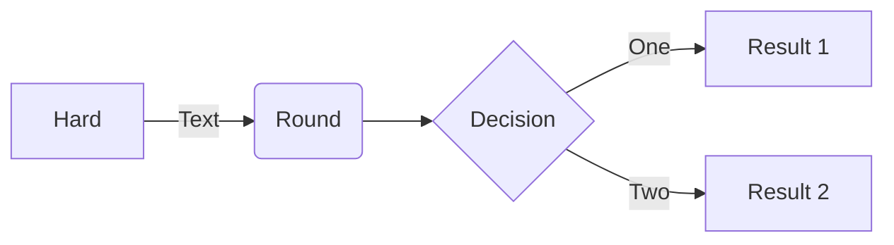

## Exemple d'utilisation dans un fichier `md`

NB : Le cartouche du fichier doit contenir : `mermaid: true` pour que le js de mermaid qui effectue la transformation du schéma en SVG soit inclus avec la page.

````md

````

## Rendu


