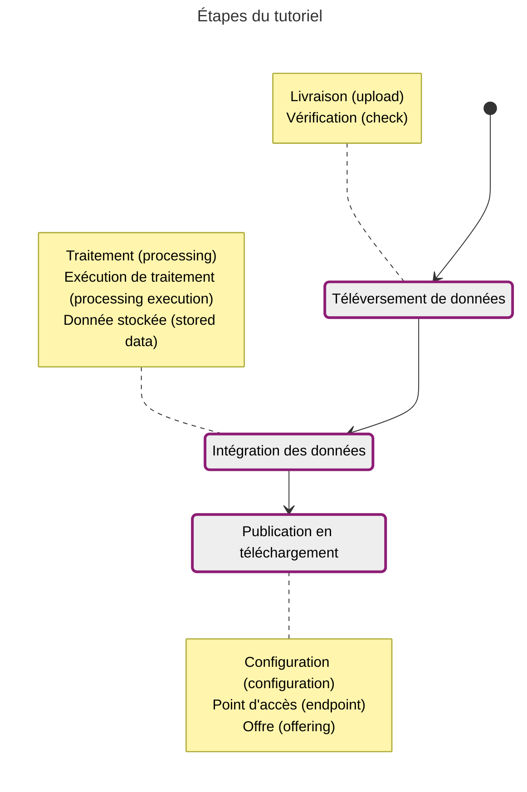
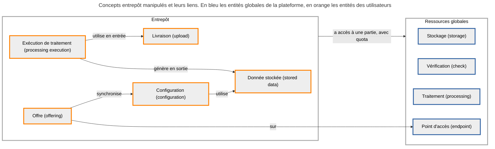



Le but de ce tutoriel est de diffuser des données archive en téléchargement. Le type de données archive est le plus simple géré par la plateforme : les fichiers de cette donnée sont simplement hébergés pour une diffusion en l'état. Aucune contrainte n'est appliquée aux fichiers d'une telle donnée.

Les concepts de l'entrepôt manipulés lors de chaque étape sont détaillés dans les notes, avec le terme français et celui technique entre parenthèses.

## Données du tutoriel

Les données de l'exemple sont 10 fichiers, données brutes des limites départementales, en Shapefile :

{{ component("download", {
    title: "DEPARTEMENT.cpg",
    href: "/data/tutoriels/archives/DEPARTEMENT.cpg",
    detail: "cpg - 6 octets"
}) }}
{{ component("download", {
    title: "DEPARTEMENT.dbf",
    href: "/data/tutoriels/archives/DEPARTEMENT.dbf",
    detail: "dbf - 16.8 Ko"
}) }}
{{ component("download", {
    title: "DEPARTEMENT.prj",
    href: "/data/tutoriels/archives/DEPARTEMENT.prj",
    detail: "prj - 449 octets"
}) }}
{{ component("download", {
    title: "DEPARTEMENT.shp",
    href: "/data/tutoriels/archives/DEPARTEMENT.shp",
    detail: "shp - 3 Mo"
}) }}
{{ component("download", {
    title: "DEPARTEMENT.shx",
    href: "/data/tutoriels/archives/DEPARTEMENT.shx",
    detail: "shx - 868 octets"
}) }}

{{ component("download", {
    title: "LIMITE_DEPARTEMENT.cpg",
    href: "/data/tutoriels/archives/LIMITE_DEPARTEMENT.cpg",
    detail: "cpg - 6 octets"
}) }}
{{ component("download", {
    title: "LIMITE_DEPARTEMENT.dbf",
    href: "/data/tutoriels/archives/LIMITE_DEPARTEMENT.dbf",
    detail: "dbf - 1.9 Mo"
}) }}
{{ component("download", {
    title: "LIMITE_DEPARTEMENT.prj",
    href: "/data/tutoriels/archives/LIMITE_DEPARTEMENT.prj",
    detail: "prj - 449 octets"
}) }}
{{ component("download", {
    title: "LIMITE_DEPARTEMENT.shp",
    href: "/data/tutoriels/archives/LIMITE_DEPARTEMENT.shp",
    detail: "shp - 2.4 Mo"
}) }}
{{ component("download", {
    title: "LIMITE_DEPARTEMENT.shx",
    href: "/data/tutoriels/archives/LIMITE_DEPARTEMENT.shx",
    detail: "shx - 70.9 Ko"
}) }}

## Outil de requête

Une [collection Bruno](https://github.com/Geoplateforme/clients-configurations/tree/master/bruno/entrepot/archive) est préconfigurée avec les requêtes de ce tutoriel. Vous pouvez lire [cette documentation](https://github.com/Geoplateforme/clients-configurations?tab=readme-ov-file#collections-bruno) pour voir comment l'utiliser.

Il y a également une [collection Bruno](https://github.com/Geoplateforme/clients-configurations/tree/master/bruno/diffusion/telechargement) pour faciliter l'utilisation du service de téléchargement.