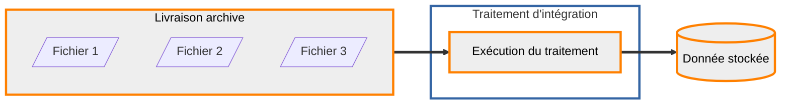

## Intégration des données

Les données déposées sur la plateforme sont systématiquement transformées et stockées sur des espaces dédiés pour pouvoir être diffusées. Dans le cas des données archive, il n'y aucune modification des données, une simple copie sur le stockage pérenne. L'entité qui correspond à cette donnée pérenne est une donnée stockée.

Pour recopier la donnée livrée en donnée stockée, des traitements sont mis à disposition de l'entrepôt.



### Consultation des traitements disponibles

??? GET "{{ urls.api_entrepot }}/datastores/{datastore}/processings"

``` title="Contenu" 
{{ urls.api_entrepot }}/datastores/{datastore}/processings
```

```json
{{ "public/data/tutoriels/alimentation-diffusion-simple/globales/production/processings.json" | readJSON | safe }}
```
???
<br>

### Consultation du traitement qui nous intéresse

Le détail sur un traitement permet de voir les types de données (livrées ou stockées) attendus en entrée, le type de donnée en sortie, les paramètres et les vérifications requises pour les livraisons en entrée.

??? GET "{{ urls.api_entrepot }}/datastores/{datastore}/processings/{{ ids.processings['archive-to-archive'] }}"

``` title="Contenu" 
{{ urls.api_entrepot }}/datastores/{datastore}/processings/{{ ids.processings['archive-to-archive'] }}
```

```json
{
    "name": "Recopie d'une archive livrée",
    "description": "Génération ou mise à jour d'une donnée stockée ARCHIVE à partir d'une archive livrées. Si un fichier livré existait déjà dans la donnée en sortie, celui ci va écraser l'ancienne version",
    "priority": "STANDARD",
    "input_types": {
        "upload": [
            "ARCHIVE"
        ],
        "stored_data": []
    },
    "output_type": {
        "stored_data": "ARCHIVE",
        "storage": [
            "S3"
        ]
    },
    "parameters": [],
    "_id": "{{ ids.processings['archive-to-archive'] }}",
    "required_checks": [
        {
            "name": "Vérification archive",
            "description": "Contrôle de l'absence de conflit dans le nommage des fichiers livrés",
            "_id": "{{ ids.checks.archive }}"
        },
        {
            "name": "Vérification standard",
            "description": "La vérification standard contrôle les signatures MD5 fournies",
            "_id": "{{ ids.checks.standard }}"
        }
    ]
}
```
???
<br>

### Configuration d'une exécution de ce traitement

On distingue le traitement, ressource de la plateforme mise à disposition de l'entrepôt, et son exécution. Une exécution appartient à un entrepôt et a en entrée et en sortie des données spécifiques.

??? POST "{{ urls.api_entrepot }}/datastores/{datastore}/processings/executions"

``` title="Contenu" 
{{ urls.api_entrepot }}/datastores/{datastore}/processings/executions
```

```json
{
    "processing": "{{ ids.processings['archive-to-archive'] }}",
    "inputs": {
        "upload": [
            "{upload}"
        ]
    },
    "output": {
        "stored_data": {
            "name": "Données départementales",
            "storage_tags": ["ARCHIVE"]
        }
    }
}
```

```json
{
    "processing": {
        "name": "Recopie d'une archive livrée",
        "_id": "{{ ids.processings['archive-to-archive'] }}"
    },
    "status": "CREATED",
    "creation": "2023-07-03T18:21:07.051091271Z",
    "inputs": {
        "upload": [
            {
                "type": "ARCHIVE",
                "name": "Données départementales",
                "status": "CLOSED",
                "srs": "EPSG:2154",
                "_id": "{upload}"
            }
        ],
        "stored_data": []
    },
    "output": {
        "stored_data": {
            "name": "Données départementales",
            "type": "ARCHIVE",
            "status": "CREATED",
            "_id": "{stored data}"
        }
    },
    "parameters": {},
    "_id": "{execution}"
}
```
???
<br>


### Déclenchement de cette exécution

??? POST "{{ urls.api_entrepot }}/datastores/{datastore}/processings/executions/{execution}/launch"

``` title="Contenu" 
{{ urls.api_entrepot }}/datastores/{datastore}/processings/executions/{execution}/launch
```

???
<br>

### Consultation de l'état de l'exécution

Une exécution va avoir les statuts dans l'ordre suivant :

* CREATED : créée mais non lancée
* WAITING : lancée mais pas encore pris en charge par le cluster de calcul
* PROGRESS : en cours d'exécution sur le cluster de calcul
* SUCCESS ou FAILURE : terminé

??? GET "{{ urls.api_entrepot }}/datastores/{datastore}/processings/executions/{execution}"

```json
{
    "processing": {
        "name": "Recopie d'une archive livrée",
        "_id": "{{ ids.processings['archive-to-archive'] }}"
    },
    "status": "PROGRESS",
    "creation": "2023-07-03T18:21:07.051091Z",
    "launch": "2023-07-03T18:24:45.729741Z",
    "start": "2023-07-03T18:24:53.775580Z",
    "inputs": {
        "upload": [
            {
                "type": "ARCHIVE",
                "name": "Données départementales",
                "status": "CLOSED",
                "srs": "EPSG:2154",
                "_id": "{upload}"
            }
        ],
        "stored_data": []
    },
    "output": {
        "stored_data": {
            "name": "Données départementales",
            "type": "ARCHIVE",
            "status": "GENERATING",
            "_id": "{stored data}"
        }
    },
    "parameters": {},
    "_id": "{execution}"
}
```
???
<br>

## Ajout d'informations sur la donnée stockée

À la fin du traitement, des informations concernant la donnée finale sont remontées afin d'apparaître au niveau de l'API (taille, nombre de fichiers, système de coordonnées).

Cependant, les données de type ARCHIVE peuvent correspondre à n'importe quel format, potentiellement des fichiers compressés. C'est pourquoi le traitement d'intégration n'extraie pas d'étendue à partir des données. Nous allons pouvoir la préciser (géométrie en GeoJSON avec au plus 5000 points), ainsi que des dates d'édition.


??? PATCH "{{ urls.api_entrepot }}/datastores/{datastore}/stored_data/{stored data}"

``` title="Contenu" 
{{ urls.api_entrepot }}/datastores/{datastore}/stored_data/{stored data}
```

```json
{
    "edition": {
        "from": "2021-09-01",
        "to": "2022-09-30"
    },
    "extent": {
        "coordinates": [
            [
                [
                    [
                        9.09172851408212,
                        42.891159356697806
                    ],
                    [
                        9.12915130955157,
                        43.24501059849895
                    ],
                    [
                        9.614543958378645,
                        43.37599636208283
                    ],
                    [
                        9.854320084958184,
                        42.280240576304614
                    ],
                    [
                        9.592633508880377,
                        41.27883529423985
                    ],
                    [
                        9.178955074159093,
                        41.2061106613512
                    ],
                    [
                        8.576063864948232,
                        41.52172702328653
                    ],
                    [
                        8.375150614642578,
                        42.18155292864851
                    ],
                    [
                        8.60679353153616,
                        42.88081313277626
                    ],
                    [
                        9.09172851408212,
                        42.891159356697806
                    ]
                ]
            ],
            [
                [
                    [
                        -5.117145473970938,
                        48.69143915590575
                    ],
                    [
                        -5.119042952652279,
                        48.70361360210381
                    ],
                    [
                        -3.5309016874750982,
                        49.071440364066696
                    ],
                    [
                        -2.059814349744761,
                        48.92176625032917
                    ],
                    [
                        -2.3926614456695128,
                        49.618367150870654
                    ],
                    [
                        -1.4430402563081728,
                        49.97518134652256
                    ],
                    [
                        -0.2879095272499074,
                        49.71802865844267
                    ],
                    [
                        1.1655486707155254,
                        50.22539847864755
                    ],
                    [
                        1.2106405024112281,
                        51.10547173387939
                    ],
                    [
                        2.6832703738122063,
                        51.20324649446573
                    ],
                    [
                        4.369961191061163,
                        50.3902928076883
                    ],
                    [
                        5.121080283855325,
                        50.52630512392335
                    ],
                    [
                        5.365666143586103,
                        50.0207185705844
                    ],
                    [
                        7.448646709934957,
                        49.521898369226534
                    ],
                    [
                        8.757956067570934,
                        49.11102170594131
                    ],
                    [
                        8.465992443524918,
                        48.646275954892076
                    ],
                    [
                        7.999412827127011,
                        47.832579252629614
                    ],
                    [
                        7.557250786370223,
                        47.1390034009496
                    ],
                    [
                        6.896856015275753,
                        46.70928797246637
                    ],
                    [
                        7.383940199365435,
                        46.33582437160696
                    ],
                    [
                        7.648726966882258,
                        45.69932198712552
                    ],
                    [
                        7.591990856895008,
                        44.805715847816096
                    ],
                    [
                        8.107041204855248,
                        44.40261849798405
                    ],
                    [
                        8.14445802636489,
                        43.87311823212847
                    ],
                    [
                        7.465542685995979,
                        43.216328972531734
                    ],
                    [
                        6.555346024805751,
                        42.85813836396115
                    ],
                    [
                        5.3265229840211195,
                        42.92854218422597
                    ],
                    [
                        4.048553704514048,
                        43.18116210272271
                    ],
                    [
                        3.5929667059597055,
                        42.793014657061306
                    ],
                    [
                        3.9004571935188777,
                        42.26485024864461
                    ],
                    [
                        3.2576615567699996,
                        42.10938675211995
                    ],
                    [
                        0.4538191658169931,
                        42.38499265420783
                    ],
                    [
                        -2.105060044400617,
                        43.12661714629205
                    ],
                    [
                        -1.605106753748771,
                        43.995366854149545
                    ],
                    [
                        -1.4934224571705246,
                        45.59517122861893
                    ],
                    [
                        -2.8817642699559314,
                        46.80885968178077
                    ],
                    [
                        -4.867035018924175,
                        47.65004168016924
                    ],
                    [
                        -5.332540084006794,
                        48.29493047269286
                    ],
                    [
                        -5.117145473970938,
                        48.69143915590575
                    ]
                ]
            ]
        ],
        "type": "MultiPolygon"
    }
}
```


```json
{
    "name": "Données départementales",
    "type": "ARCHIVE",
    "srs": "EPSG:2154",
    "contact": "contact@ign.fr",
    "last_event": {
        "title": "Génération",
        "date": "2023-07-03T18:24:45.712017",
        "initiator": {
            "last_name": "Lopper",
            "first_name": "Dave",
            "_id": "{user}"
        }
    },
    "tags": {},
    "storage": {
        "type": "S3",
        "labels": []
    },
    "size": 7786298,
    "status": "GENERATED",
    "_id": "{stored data}",
    "type_infos": {
        "files_number": 10
    },
    "edition": {
        "from": "2021-09-01",
        "to": "2022-09-30"
    },
    "extent": {
        "coordinates": [
            [
                [
                    [
                        9.09172851408212,
                        42.891159356697806
                    ],
                    [
                        9.12915130955157,
                        43.24501059849895
                    ],
                    [
                        9.614543958378645,
                        43.37599636208283
                    ],
                    [
                        9.854320084958184,
                        42.280240576304614
                    ],
                    [
                        9.592633508880377,
                        41.27883529423985
                    ],
                    [
                        9.178955074159093,
                        41.2061106613512
                    ],
                    [
                        8.576063864948232,
                        41.52172702328653
                    ],
                    [
                        8.375150614642578,
                        42.18155292864851
                    ],
                    [
                        8.60679353153616,
                        42.88081313277626
                    ],
                    [
                        9.09172851408212,
                        42.891159356697806
                    ]
                ]
            ],
            [
                [
                    [
                        -5.117145473970938,
                        48.69143915590575
                    ],
                    [
                        -5.119042952652279,
                        48.70361360210381
                    ],
                    [
                        -3.5309016874750982,
                        49.071440364066696
                    ],
                    [
                        -2.059814349744761,
                        48.92176625032917
                    ],
                    [
                        -2.3926614456695128,
                        49.618367150870654
                    ],
                    [
                        -1.4430402563081728,
                        49.97518134652256
                    ],
                    [
                        -0.2879095272499074,
                        49.71802865844267
                    ],
                    [
                        1.1655486707155254,
                        50.22539847864755
                    ],
                    [
                        1.2106405024112281,
                        51.10547173387939
                    ],
                    [
                        2.6832703738122063,
                        51.20324649446573
                    ],
                    [
                        4.369961191061163,
                        50.3902928076883
                    ],
                    [
                        5.121080283855325,
                        50.52630512392335
                    ],
                    [
                        5.365666143586103,
                        50.0207185705844
                    ],
                    [
                        7.448646709934957,
                        49.521898369226534
                    ],
                    [
                        8.757956067570934,
                        49.11102170594131
                    ],
                    [
                        8.465992443524918,
                        48.646275954892076
                    ],
                    [
                        7.999412827127011,
                        47.832579252629614
                    ],
                    [
                        7.557250786370223,
                        47.1390034009496
                    ],
                    [
                        6.896856015275753,
                        46.70928797246637
                    ],
                    [
                        7.383940199365435,
                        46.33582437160696
                    ],
                    [
                        7.648726966882258,
                        45.69932198712552
                    ],
                    [
                        7.591990856895008,
                        44.805715847816096
                    ],
                    [
                        8.107041204855248,
                        44.40261849798405
                    ],
                    [
                        8.14445802636489,
                        43.87311823212847
                    ],
                    [
                        7.465542685995979,
                        43.216328972531734
                    ],
                    [
                        6.555346024805751,
                        42.85813836396115
                    ],
                    [
                        5.3265229840211195,
                        42.92854218422597
                    ],
                    [
                        4.048553704514048,
                        43.18116210272271
                    ],
                    [
                        3.5929667059597055,
                        42.793014657061306
                    ],
                    [
                        3.9004571935188777,
                        42.26485024864461
                    ],
                    [
                        3.2576615567699996,
                        42.10938675211995
                    ],
                    [
                        0.4538191658169931,
                        42.38499265420783
                    ],
                    [
                        -2.105060044400617,
                        43.12661714629205
                    ],
                    [
                        -1.605106753748771,
                        43.995366854149545
                    ],
                    [
                        -1.4934224571705246,
                        45.59517122861893
                    ],
                    [
                        -2.8817642699559314,
                        46.80885968178077
                    ],
                    [
                        -4.867035018924175,
                        47.65004168016924
                    ],
                    [
                        -5.332540084006794,
                        48.29493047269286
                    ],
                    [
                        -5.117145473970938,
                        48.69143915590575
                    ]
                ]
            ]
        ],
        "type": "MultiPolygon"
    }
}
```
???
<br>

## Nettoyage de la livraison

Maintenant que la donnée a été stockée de manière pérenne, on peut supprimer la livraison et son contenu :

??? DELETE "{{ urls.api_entrepot }}/datastores/{datastore}/uploads/{upload}"

``` title="Contenu" 
{{ urls.api_entrepot }}/datastores/{datastore}/uploads/{upload}
```

???
<br>