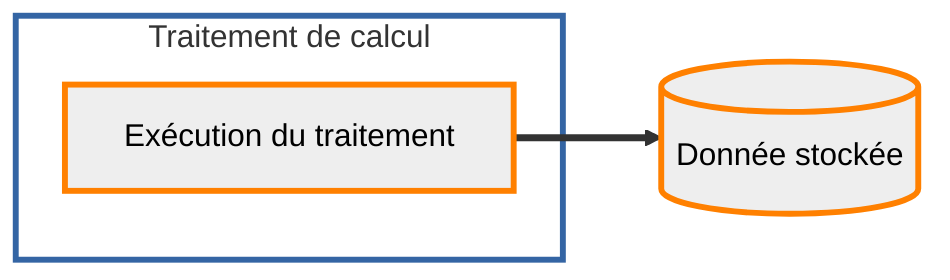

## Calcul de la pyramide raster par moissonnage WMS

Il existe une autre possibilité pour générer une pyramide raster dans l'entrepôt sans avoir à déposer de données : le moissonnage WMS. Le traitement prendra uniquement des paramètres précisant le service et les couches à moissonner, ainsi que la zone sur laquelle faire ce moissonnage.



### Consultation des traitements disponibles

??? GET "{{ urls.api_entrepot }}/datastores/{datastore}/processings"

```title="Contenu"
{{ urls.api_entrepot }}/datastores/{datastore}/processings
```

```json
{{ "public/data/tutoriels/alimentation-diffusion-simple/globales/production/processings.json" | readJSON | safe }}
```

???
<br>

### Consultation du traitement qui nous intéresse

??? GET "{{ urls.api_entrepot }}/datastores/{datastore}/processings/{{ ids.processings['wms-to-pyramid'] }}"

```title="Contenu"
{{ urls.api_entrepot }}/datastores/{datastore}/processings/{{ ids.processings['wms-to-pyramid'] }}
```

```json
{
    "name": "Calcul ou mise à jour de pyramide raster par moissonnage WMS",
    "description": "Il n'y a pas besoin de donnée en entrée. Sont fournis en paramètres toutes les informations sur le service WMS et le jeu de données à moissonner, ainsi que la zone sur laquelle faire le moissonnage",
    "input_types": {
        "upload": [],
        "stored_data": ["ROK4-PYRAMID-RASTER"]
    },
    "output_type": {
        "stored_data": "ROK4-PYRAMID-RASTER",
        "storage": ["S3"]
    },
    "parameters": [
        {
            "name": "harvest_layers",
            "description": "Couches à moisonner (séparées par des virgules)",
            "mandatory": true,
            "constraints": {
                "type": "string"
            }
        },
        {
            "name": "top",
            "description": "Le niveau du haut de la pyramide en sortie ",
            "mandatory": false,
            "constraints": {
                "type": "string"
            }
        },
        {
            "name": "harvest_dimensions",
            "description": "Deux entiers positifs, dimensions pixel maximales de moisonnage, devra être un diviseur de la taille pixel des dalles",
            "mandatory": false,
            "constraints": {
                "type": "array",
                "items": {
                    "type": "integer"
                },
                "maxItems": 2,
                "minItems": 2
            }
        },
        {
            "name": "compression",
            "description": "La compression des données en sortie (valeurs possibles: raw, jpg, png, zip, jpg90)",
            "mandatory": false,
            "constraints": {
                "enum": ["raw", "jpg", "png", "zip", "jpg90"],
                "type": "string"
            }
        },
        {
            "name": "samplesperpixel",
            "description": "Nombre de canaux dans les dalles en sortie (entier de 1 à 4)",
            "mandatory": false,
            "constraints": {
                "type": "integer",
                "maximum": 4,
                "minimum": 1
            }
        },
        {
            "name": "parallelization",
            "description": "Le niveau de parallélisation du calcul (défaut à 1, entier >= 1)",
            "mandatory": false,
            "default_value": 1
        },
        {
            "name": "tms",
            "description": "L identifiant du quadrillage à utiliser (Tile Matrix Set)",
            "mandatory": false,
            "constraints": {
                "enum": ["PM"],
                "type": "string"
            }
        },
        {
            "name": "height",
            "description": "Le nombre de tuile par dalle en hauteur (entier >= 1)",
            "mandatory": false,
            "default_value": 16
        },
        {
            "name": "harvest_levels",
            "description": "Identifiants des niveaux pour lesquels on moissonne les dalles (celui le plus bas sera le niveau du bas de la pyramide). On considère que les niveaux sont précisés de bas en haut.",
            "mandatory": true,
            "constraints": {
                "type": "array",
                "items": {
                    "type": "string"
                }
            }
        },
        {
            "name": "sampleformat",
            "description": "Format des canaux dans les dalles en sortie (UINT8 ou FLOAT32)",
            "mandatory": false,
            "constraints": {
                "enum": ["UINT8", "FLOAT32"],
                "type": "string"
            }
        },
        {
            "name": "harvest_threshold",
            "description": "Taille minimale en octet des dalles moissonnées",
            "mandatory": false,
            "constraints": {
                "type": "integer",
                "minimum": 0
            }
        },
        {
            "name": "harvest_extras",
            "description": "Paramètres de requêtes GetMap additionnels, hors layers, bbox, format et srs",
            "mandatory": false,
            "constraints": {
                "type": "string"
            }
        },
        {
            "name": "width",
            "description": "Le nombre de tuile par dalle en largeur (entier >= 1)",
            "mandatory": false,
            "default_value": 16
        },
        {
            "name": "harvest_area",
            "description": "WKT de la zone sur laquelle le moissonnage doit se faire, en EPSG:4326",
            "mandatory": true,
            "constraints": {
                "type": "string"
            }
        },
        {
            "name": "harvest_format",
            "description": "Format des images téléchargées",
            "mandatory": true,
            "constraints": {
                "enum": [
                    "image/png",
                    "image/tiff",
                    "image/jpeg",
                    "image/x-bil;bits=32",
                    "image/tiff&format_options=compression:deflate",
                    "image/tiff&format_options=compression:lzw",
                    "image/tiff&format_options=compression:packbits",
                    "image/tiff&format_options=compression:raw"
                ],
                "type": "string"
            }
        },
        {
            "name": "harvest_url",
            "description": "URL du service WMS, avec le protocole et le chemin",
            "mandatory": true,
            "constraints": {
                "type": "string"
            }
        },
        {
            "name": "bottom",
            "description": "Le niveau du bas de la pyramide en sortie ",
            "mandatory": true,
            "constraints": {
                "type": "string"
            }
        },
        {
            "name": "nodata",
            "description": "Valeur de nodata pour compléter les images",
            "mandatory": false,
            "constraints": {
                "type": "array",
                "items": {
                    "type": "integer"
                },
                "minItems": 1
            }
        }
    ],
    "_id": "{{ ids.processings['wms-to-pyramid'] }}",
    "required_checks": []
}
```

???
<br>

Le traitement n'attend pas de livraison en entrée. Si on fournit une pyramide en entrée, c'est pour préciser que l'on veut la mettre à jour par référencement (une nouvelle pyramide est créée, en référençant les images de celle en entrée).

### Configuration d'une exécution de ce traitement

On distingue le traitement, la ressource de la plateforme mise à disposition de l'entrepôt, et son exécution. Une exécution appartient à un entrepôt et possède en entrée et en sortie des données spécifiques.

??? POST "{{ urls.api_entrepot }}/datastores/{datastore}/processings/executions"

```title="Contenu"
{{ urls.api_entrepot }}/datastores/{datastore}/processings/executions
```

```json
{
    "processing": "{{ ids.processings['wms-to-pyramid'] }}",
    "inputs": {},
    "output": {
        "stored_data": {
            "name": "Photographies aériennes de la Corse",
            "storage_tags": ["PYRAMIDE"]
        }
    },
    "parameters": {
        "tms": "PM",
        "compression": "jpg",
        "harvest_layers": "ORTHOIMAGERY.ORTHOPHOTOS",
        "harvest_url": "https://wxs.ign.fr/essentiels/geoportail/r/wms",
        "samplesperpixel": 3,
        "sampleformat": "UINT8",
        "bottom": "14",
        "harvest_levels": ["14", "10"],
        "harvest_area": "POLYGON((8.507 41.338,8.507 43.004,9.591 43.004,9.591 41.338,8.507 41.338))",
        "harvest_format": "image/jpeg"
    }
}
```

```json
{
    "processing": {
        "name": "Calcul ou mise à jour de pyramide raster par moissonnage WMS",
        "_id": "{{ ids.processings['wms-to-pyramid'] }}"
    },
    "status": "CREATED",
    "creation": "2023-05-30T14:48:14.997796818Z",
    "inputs": {
        "upload": [],
        "stored_data": []
    },
    "output": {
        "stored_data": {
            "name": "Photographies aériennes de la Corse",
            "type": "ROK4-PYRAMID-RASTER",
            "status": "CREATED",
            "_id": "{stored data moissonnage}"
        }
    },
    "parameters": {
        "tms": "PM",
        "compression": "jpg",
        "harvest_layers": "ORTHOIMAGERY.ORTHOPHOTOS",
        "harvest_url": "https://wxs.ign.fr/essentiels/geoportail/r/wms",
        "samplesperpixel": 3,
        "sampleformat": "UINT8",
        "bottom": "14",
        "harvest_levels": ["14", "10"],
        "harvest_area": "POLYGON((8.507 41.338,8.507 43.004,9.591 43.004,9.591 41.338,8.507 41.338))",
        "harvest_format": "image/jpeg"
    },
    "_id": "{execution moissonnage}"
}
```

???
<br>

La zone de moissonnage est à fournir en WKT, en EPSG:4326 (longitude en premier).

:::warning "Points d'attentions"
Les flux sortant des nœuds de calcul sont contraints. Télécharger depuis `data.geopf.fr` est autorisé. Dans le cas d'un usage avec d'autres sources, il est nécessaire de contacter la Géoplateforme pour ouvrir les flux nécessaires.
:::

:::warning "Données privées"
Pour les données vecteurs privées, il faut ajouter le paramètre `harvest_extras` en précisant une apikey : "harvest_extras": "apikey={apikey}"
:::

### Déclenchement de cette exécution

??? POST "{{ urls.api_entrepot }}/datastores/{datastore}/processings/executions/{execution moissonnage}/launch"

```title="Contenu"
{{ urls.api_entrepot }}/datastores/{datastore}/processings/executions/{execution moissonnage}/launch
```

???
<br>

## Consultation de la donnée stockée en sortie

À la fin du traitement, des informations concernant la donnée finale sont remontées afin d'apparaître au niveau de l'API (taille, étendue, système de coordonnées et niveaux).

??? GET "{{ urls.api_entrepot }}/datastores/{datastore}/stored_data/{stored data moissonnage}"

```title="Contenu"
{{ urls.api_entrepot }}/datastores/{datastore}/stored_data/{stored data moissonnage}
```

```json
{
    "name": "Photographies aériennes de la Corse",
    "type": "ROK4-PYRAMID-RASTER",
    "srs": "EPSG:3857",
    "contact": "contact@ign.fr",
    "extent": {
        "type": "Polygon",
        "coordinates": [
            [
                [9.591, 41.338],
                [9.591, 43.004],
                [8.507, 43.004],
                [8.507, 41.338],
                [9.591, 41.338]
            ]
        ]
    },
    "last_event": {
        "title": "Génération",
        "date": "2023-05-30T09:44:03.025623",
        "initiator": {
            "_id": "{user}"
        }
    },
    "tags": {},
    "storage": {
        "type": "S3",
        "labels": []
    },
    "size": 66724708,
    "status": "GENERATED",
    "_id": "{stored data moissonnage}",
    "type_infos": {
        "tms": "PM",
        "levels": ["11", "12", "13", "14", "0", "1", "2", "3", "4", "5", "6", "7", "8", "9", "10"],
        "channels_format": "UINT8",
        "channels_number": 3,
        "compression": "JPG",
        "nodata_value": "255,255,255"
    }
}
```

???
<br>

## Diffusion en WMS

### Création de la configuration

??? POST "{{ urls.api_entrepot }}/datastores/{datastore}/configurations"

```title="Contenu"
{{ urls.api_entrepot }}/datastores/{datastore}/configurations
```

```json
{
    "type": "WMS-RASTER",
    "name": "Orthos Corse",
    "layer_name": "ortho",
    "attribution": {
        "title": "IGN",
        "url": "https://www.ign.fr/",
        "logo": {
            "format": "image/jpeg",
            "url": "https://www.geoportail.gouv.fr/depot/producers/ign.jpg",
            "width": 220,
            "height": 110
        }
    },
    "metadata": [
        {
            "format": "application/xml",
            "url": "https://geoservices.ign.fr/sites/default/files/2021-07/IGNF_BDORTHOr_2-0.xml",
            "type": "ISO19115:2003"
        }
    ],
    "type_infos": {
        "bbox": {
            "north": 43.0475237,
            "west": 8.35476935,
            "east": 9.75281343,
            "south": 41.23486116
        },
        "title": "Ortho-photographies Corse",
        "abstract": "Photographies aériennes sur la Corse",
        "keywords": ["Tutoriel", "Raster"],
        "used_data": [
            {
                "bottom_level": "13",
                "top_level": "0",
                "stored_data": "{stored data moissonnage}"
            }
        ],
        "getfeatureinfo": {
            "stored_data": true
        }
    }
}
```

???
<br>

### Publication

??? POST "{{ urls.api_entrepot }}/datastores/{datastore}/configurations/{configuration wms moissonnage}/offerings"

```title="Contenu"
{{ urls.api_entrepot }}/datastores/{datastore}/configurations/{configuration wms moissonnage}/offerings
```

```json
{
    "endpoint": "{{ ids.endpoints.open.wmsr }}",
    "open": true
}
```

???
<br>

On peut vérifier la présence de notre couche `ortho` dans le [getCapabilities du service]({{ urls.public.wmsr }}?REQUEST=GetCapabilities&SERVICE=WMS&VERSION=1.3.0)

### Visualisation des données

On peut visualiser nos données dans QGis en WMS.

{.fr-responsive-img .frx-border-img .frx-img-contained}

La donnée moissonnée est plus large que la zone voulue car l'intégralité des dalles intersectant la zone est calculée et stockée.
