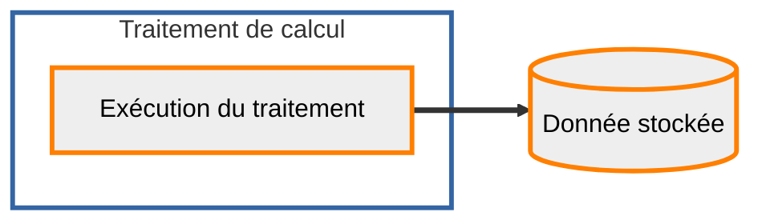

### Calcul de la pyramide raster par moissonnage WMS

Il existe une autre possibilité pour générer une pyramide raster dans l’entrepôt sans avoir à déposer de données : le moissonnage WMS. Le traitement prendra uniquement des paramètres précisant le service et les couches à moissonner, ainsi que la zone sur laquelle faire ce moissonnage.

:::info
Cette méthode est aussi particulièrement recommandée lorsque vous souhaitez diffuser une donnée vecteur en WMS mais que cette dernière est complexe en termes de rendu et/ou va être particulièrement consultée par les utilisateurs.

Dans ce cas vous publierez votre donnée en flux WMS-Vecteur privé. Ce flux sera uniquement accessible au traitement de moissonnage et à sa configuration pour le `GetFeatureInfo`.
:::


```mermaid
flowchart LR
    ds[(Donnée stockée)]

    subgraph tra[Traitement de calcul]
        exe[Exécution du traitement]
    end

    exe ==> ds

    classDef indiv fill:#eee,stroke:#ff8000,stroke-width:3px,color:#000;
    classDef global fill:#fff,stroke:#3465a4,stroke-width:3px;

    class exe,ds indiv
    class tra global
```

#### Consultation des traitements disponibles

??? GET "{{ urls.api_entrepot }}/datastores/{datastore}/processings"
```plain
{{ urls.api_entrepot }}/datastores/{datastore}/processings
```
```json
{{ "public/data/tutoriels/alimentation-diffusion-simple/globales/production/processings.json" | readFILE | safe }}
```
???
<br>

#### Consultation du traitement qui nous intéresse

??? GET "{{ urls.api_entrepot }}/datastores/{datastore}/processings/{{ ids.processings['wms_to_pyramid'] }}"
```plain
{{ urls.api_entrepot }}/datastores/{datastore}/processings/{{ ids.processings['wms_to_pyramid'] }}
```
```json
{
    "name": "Calcul ou mise à jour de pyramide raster par moissonnage WMS",
    "description": "Il n’y a pas besoin de donnée en entrée. Sont fournis en paramètres toutes les informations sur le service WMS et le jeu de données à moissonner, ainsi que la zone sur laquelle faire le moissonnage",
    "input_types": {
        "upload": [],
        "stored_data": ["ROK4-PYRAMID-RASTER"]
    },
    "output_type": {
        "stored_data": "ROK4-PYRAMID-RASTER",
        "storage": ["S3"]
    },
    "parameters": [
        {
            "name": "harvest_layers",
            "description": "Couches à moissonner (séparées par des virgules)",
            "mandatory": true,
            "constraints": {
                "type": "string"
            }
        },
        {
            "name": "top",
            "description": "Le niveau du haut de la pyramide en sortie ",
            "mandatory": false,
            "constraints": {
                "type": "string"
            }
        },
        {
            "name": "harvest_dimensions",
            "description": "Deux entiers positifs, dimensions pixel maximales de moissonnage, devront être des diviseurs de la taille pixel des dalles",
            "mandatory": false,
            "constraints": {
                "type": "array",
                "items": {
                    "type": "integer"
                },
                "maxItems": 2,
                "minItems": 2
            }
        },
        {
            "name": "compression",
            "description": "La compression des données en sortie (valeurs possibles: raw, jpg, png, zip, jpg90)",
            "mandatory": false,
            "constraints": {
                "enum": ["raw", "jpg", "png", "zip", "jpg90"],
                "type": "string"
            }
        },
        {
            "name": "samplesperpixel",
            "description": "Nombre de canaux dans les dalles en sortie (entier de 1 à 4)",
            "mandatory": false,
            "constraints": {
                "type": "integer",
                "maximum": 4,
                "minimum": 1
            }
        },
        {
            "name": "parallelization",
            "description": "Le niveau de parallélisation du calcul (défaut à 1, entier >= 1)",
            "mandatory": false,
            "default_value": 1
        },
        {
            "name": "tms",
            "description": "L’identifiant du quadrillage à utiliser (Tile Matrix Set)",
            "mandatory": false,
            "constraints": {
                "enum": ["PM"],
                "type": "string"
            }
        },
        {
            "name": "height",
            "description": "Le nombre de tuiles par dalle en hauteur (entier >= 1)",
            "mandatory": false,
            "default_value": 16
        },
        {
            "name": "harvest_levels",
            "description": "Identifiants des niveaux pour lesquels on moissonne les dalles (celui le plus bas sera le niveau du bas de la pyramide). On considère que les niveaux sont précisés de bas en haut.",
            "mandatory": true,
            "constraints": {
                "type": "array",
                "items": {
                    "type": "string"
                }
            }
        },
        {
            "name": "sampleformat",
            "description": "Format des canaux dans les dalles en sortie (UINT8 ou FLOAT32)",
            "mandatory": false,
            "constraints": {
                "enum": ["UINT8", "FLOAT32"],
                "type": "string"
            }
        },
        {
            "name": "harvest_threshold",
            "description": "Taille minimale en octet des dalles moissonnées",
            "mandatory": false,
            "constraints": {
                "type": "integer",
                "minimum": 0
            }
        },
        {
            "name": "harvest_extras",
            "description": "Paramètres de requêtes GetMap additionnels, hors layers, bbox, format et srs",
            "mandatory": false,
            "constraints": {
                "type": "string"
            }
        },
        {
            "name": "width",
            "description": "Le nombre de tuiles par dalle en largeur (entier >= 1)",
            "mandatory": false,
            "default_value": 16
        },
        {
            "name": "harvest_area",
            "description": "WKT de la zone sur laquelle le moissonnage doit se faire, en EPSG:4326",
            "mandatory": true,
            "constraints": {
                "type": "string"
            }
        },
        {
            "name": "harvest_format",
            "description": "Format des images téléchargées",
            "mandatory": true,
            "constraints": {
                "enum": [
                    "image/png",
                    "image/tiff",
                    "image/jpeg",
                    "image/x-bil;bits=32",
                    "image/tiff&format_options=compression:deflate",
                    "image/tiff&format_options=compression:lzw",
                    "image/tiff&format_options=compression:packbits",
                    "image/tiff&format_options=compression:raw"
                ],
                "type": "string"
            }
        },
        {
            "name": "harvest_url",
            "description": "URL du service WMS, avec le protocole et le chemin",
            "mandatory": true,
            "constraints": {
                "type": "string"
            }
        },
        {
            "name": "bottom",
            "description": "Le niveau du bas de la pyramide en sortie ",
            "mandatory": true,
            "constraints": {
                "type": "string"
            }
        },
        {
            "name": "nodata",
            "description": "Valeur de nodata pour compléter les images",
            "mandatory": false,
            "constraints": {
                "type": "array",
                "items": {
                    "type": "integer"
                },
                "minItems": 1
            }
        }
    ],
    "_id": "{{ ids.processings['wms_to_pyramid'] }}",
    "required_checks": []
}
```
???
<br>

Le traitement n’attend pas de livraison en entrée. Si on fournit une pyramide en entrée, c’est pour préciser que l’on veut la mettre à jour par référencement (une nouvelle pyramide est créée, en référençant les images de celle en entrée).

#### Configuration d’une exécution de ce traitement

On distingue le traitement, la ressource de la plateforme mise à disposition de l’entrepôt, et son exécution. Une exécution appartient à un entrepôt et possède en entrée et en sortie des données spécifiques.

???? POST "{{ urls.api_entrepot }}/datastores/{datastore}/processings/executions"
```plain
{{ urls.api_entrepot }}/datastores/{datastore}/processings/executions
```
??? Corps de requête JSON
```json
{
    "processing": "{{ ids.processings['wms_to_pyramid'] }}",
    "inputs": {},
    "output": {
        "stored_data": {
            "name": "Photographies aériennes de la Corse",
            "storage_tags": ["PYRAMIDE"]
        }
    },
    "parameters": {
        "tms": "PM",
        "compression": "jpg",
        "harvest_layers": "ORTHOIMAGERY.ORTHOPHOTOS",
        "harvest_url": "https://wxs.ign.fr/essentiels/geoportail/r/wms",
        "samplesperpixel": 3,
        "sampleformat": "UINT8",
        "bottom": "14",
        "harvest_levels": ["14", "10"],
        "harvest_area": "POLYGON((8.507 41.338,8.507 43.004,9.591 43.004,9.591 41.338,8.507 41.338))",
        "harvest_format": "image/jpeg"
    }
}
```
???
??? Corps de réponse JSON
```json
{
    "processing": {
        "name": "Calcul ou mise à jour de pyramide raster par moissonnage WMS",
        "_id": "{{ ids.processings['wms_to_pyramid'] }}"
    },
    "status": "CREATED",
    "creation": "2023-05-30T14:48:14.997796818Z",
    "inputs": {
        "upload": [],
        "stored_data": []
    },
    "output": {
        "stored_data": {
            "name": "Photographies aériennes de la Corse",
            "type": "ROK4-PYRAMID-RASTER",
            "status": "CREATED",
            "_id": "{stored data moissonnage}"
        }
    },
    "parameters": {
        "tms": "PM",
        "compression": "jpg",
        "harvest_layers": "ORTHOIMAGERY.ORTHOPHOTOS",
        "harvest_url": "https://wxs.ign.fr/essentiels/geoportail/r/wms",
        "samplesperpixel": 3,
        "sampleformat": "UINT8",
        "bottom": "14",
        "harvest_levels": ["14", "10"],
        "harvest_area": "POLYGON((8.507 41.338,8.507 43.004,9.591 43.004,9.591 41.338,8.507 41.338))",
        "harvest_format": "image/jpeg"
    },
    "_id": "{execution moissonnage}"
}
```
???
??? Plus d’aide sur la configuration de l’exécution du traitement de calcul de pyramide raster par moissonnage WMS
Description des paramètres en entrée :
- `inputs` : Ce paramètre est laissé vide puisqu’il n’y a pas à proprement parler, de donnée stockée ou de livraison Géoplateforme en point d’entrée de ce traitement
- `output.stored_data.name` : Le nom défini ici est un nommage libre. **Cette information n’est lisible que par un autre utilisateur membre de cet entrepôt, pas par l’utilisateur final. Vous êtes donc invité à renseigner ici des informations parlantes pour vous - producteur de donnée.** Cette information est modifiable après coup.
- `output.stored_data.storage_tags` : Il s’agit ici d’une liste (présence des caractères « `[ ]` ») qui prend comme valeur au moins un tag associé au stockage qui va accueillir la donnée de sortie. Vous pouvez retrouver ces tags via la route `GET /datastores/{datastore}/storages` (rubrique « Entrepôt » du <span lang="en">_swagger_</span>) dans l’attribut de réponse `labels` associé à chaque stockage. Pour une donnée raster en entrée, c’est un stockage S3 qui sera mobilisé. Or il existe sur votre entrepôt au moins deux stockages S3 différents : un dédié au raster et l’autre au téléchargement. Ils ont chacun des quotas différents, il convient donc de pointer vers le bon. Pour ce faire, il faut pointer sur le label, donc le `"storage_tags": ["PYRAMIDE"]`.
- `parameters.tms` : Ce paramètre obligatoire permet de définir quelle matrice de tuilage va être utilisée pour fabriquer la pyramide. Vous retrouvez la liste des matrices de tuilage associées au traitement via l’étape « [Consultation du traitement qui nous intéresse](./#consultation-du-traitement-qui-nous-interesse) ». Le détail de chaque matrice est consultable via la route `GET {{ urls.api_entrepot }}/statics/tms/{tms}`. Cette route permet notamment d’identifier la projection de la matrice de tuilage et les niveaux de tuilage disponibles avec leur résolution associée.
- `parameters.compression` : Ce paramètre obligatoire est des plus conditionnant dans la pyramide qui va être générée mais la valeur à mobiliser dépend aussi du type de raster fourni en entrée :
    - `jpg` : C’est la valeur adaptée et hautement recommandée à la grande majorité des usages valorisant en entrée des dalles raster encodées sur 3 canaux (Rouge - Vert - Bleu).

        **Avantages** : la pyramide fabriquée reste très légère ce qui garantit une diffusion fluide et une consommation d’espace très optimisée sur votre <span lang="en">_datastore_</span>.

        **Inconvénients** : le JPG ne gère pas la transparence, les pixels no data de votre donnée en entrée seront donc rendus comme de l’image (soit en blanc, soit en noir compte tenu des réglages généralement appliqués sur les données en entrée).
    - `png` : Lorsqu’il est absolument essentiel que les pixels non data soient rendus transparents côté serveur. Cette compression peut être mobilisée.

        **Avantages** : la pyramide présente par défaut (opération réalisée en dur côté serveur) les pixels non data en transparence.

        **Inconvénients** : la pyramide PNG est, à donnée d’entrée identique, 10 fois plus lourde à stocker et à diffuser que son équivalent en JPG. Elle nécessite aussi une donnée adaptée en entrée (livraison de fichiers de masque en entrée) qui est plus lourde et complexe à mettre en œuvre. Un tel choix n’est donc pas recommandé dans l’absolu et ne doit être réservé qu’à des cas très spécifiques.
    - `zip` : Compression réservée aux raster encodés sur un seul canal et pour lesquels, la valeur du pixel vaut mesure du phénomène rendu sous forme raster : une altitude, une concentration de polluant, une classe d’occupation du sol.

        **Avantages** : la pyramide conserve strictement la valeur pixellaire en entrée et s’avère extrêmement légère.

        **Inconvénients** : cette compression ne permet pas un rendu image direct côté client et nécessite de mobiliser un ou plusieurs fichiers de style de rendu pour être visualisée. Voir le tutoriel « [Gestion de données MNT](../../mnt/) » pour plus de détail sur cet aspect.
- `parameters.parallelization` : Définit le nombre de cœur de calcul qui vont être dédiés au traitement de calcul de la pyramide. Vous pouvez monter cette valeur jusqu’à 4. Plus la valeur est élevée, plus le calcul est rapide. Rappelez-vous toutefois que vous êtes sur une plateforme mutualisée, vous êtes donc fortement invités à adapter cette valeur aux réalités de votre exigence de production, sans forcément pousser systématiquement le paramètre à son maximum.
- `parameters.top` et/ou `parameters.bottom` : Il s’agit des niveaux de tuilage haut (`top` à fort dé-zoom) et/ou bas (`bottom` à fort zoom) auxquels la pyramide va être calculée. Vous êtes invités à choisir des niveaux de tuilage pertinents avec votre donnée d’entrée : inutile de « surtuiler » à fort zoom un raster de résolution moyenne : cela n’améliorera pas la résolution et consommera inutilement de l’espace de stockage.

<br>

Ces paramètres sont facultatifs, s’ils ne sont pas fournis, le système adaptera les niveaux de tuilage en fonction de la couverture spatiale de la livraison fournie en entrée.
- `parameters.harvest_layers` : Définit le `layer_name` de la couche qui va être moissonnée, tel qu’il est mentionné au `GetCapabilities` du service distant.
- `parameters.harvest_url` : Définit l’URL du service distant à moissonner. Seul le préfixe de cette URL doit être mentionné, **inutile de construire une URL `GetCapabilities` ou `GetMap`**.
- `parameters.harvest_levels` : Définit sous forme d’un ensemble (notation `[niveau_min, niveau_max]`) le niveau de tuilage minimum et maximum sur lesquels le flux va être moissonné.
- `parameters.harvest_area` : Zone de moissonnage définie en WKT, en EPSG:4326 (longitude en premier).
- `parameters.harvest_format` : Format d’image à appeler sur le service distant pour procéder au moissonnage. **Le format image est à préciser sous une forme type `MIME` et vous devez vous assurer en amont des formats image de sortie supportés par le service distant.**
- `parameters.samplesperpixel` : Nombre de canaux dans les dalles en sortie (entier de 1 à 4), cette valeur est dépendante du paramètre compression. Ainsi une pyramide générée en JPG prendra au maximum une valeur 3, du fait de la non gestion du canal de transparence par le format JPG.
- `parameters.sampleformat` : Format des canaux dans les dalles en sortie (`UINT8` ou `FLOAT32`). Pour une sortie image classique, la valeur sera, en règle générale, `UINT8`.

:::info
Comme pour la livraison il vous est possible de configurer l’envoi d’un courriel automatique à la fin du traitement.

Pour ce faire, il suffit d’ajouter l’élément JSON ci-dessous après l’élément `parameters` dans le corps de requête de déclaration d’exécution.
```json
"callback": {
    "type": "email",
    "to_address": [
        "example@mail.fr"
    ]
}
```
Vous êtes invités à vous référer au <span lang="en">_swagger_</span> pour avoir les détails et options complètes sur cette partie.
:::
???
????
<br>

La zone de moissonnage est à fournir en WKT, en EPSG:4326 (longitude en premier).

:::warning
- Les flux sortant des nœuds de calcul sont contraints. Télécharger depuis `data.geopf.fr` est autorisé. Dans le cas d’un usage avec d’autres sources, il est nécessaire de contacter la Géoplateforme pour ouvrir les flux nécessaires.
- Pour les données vecteur privées, il faut ajouter le paramètre `harvest_extras` en précisant une apikey : `"harvest_extras": "apikey={apikey}"`
:::

#### Déclenchement de cette exécution

??? POST "{{ urls.api_entrepot }}/datastores/{datastore}/processings/executions/{execution moissonnage}/launch"
```plain
{{ urls.api_entrepot }}/datastores/{datastore}/processings/executions/{execution moissonnage}/launch
```
???
<br>

### Consultation de la donnée stockée en sortie

À la fin du traitement, des informations concernant la donnée finale sont remontées afin d’apparaître au niveau de l’API (taille, étendue, système de coordonnées et niveaux).

???? GET "{{ urls.api_entrepot }}/datastores/{datastore}/stored_data/{stored data moissonnage}"
```plain
{{ urls.api_entrepot }}/datastores/{datastore}/stored_data/{stored data moissonnage}
```
??? Corps de réponse JSON
```json
{
    "name": "Photographies aériennes de la Corse",
    "type": "ROK4-PYRAMID-RASTER",
    "srs": "EPSG:3857",
    "contact": "contact@ign.fr",
    "extent": {
        "type": "Polygon",
        "coordinates": [
            [
                [9.591, 41.338],
                [9.591, 43.004],
                [8.507, 43.004],
                [8.507, 41.338],
                [9.591, 41.338]
            ]
        ]
    },
    "last_event": {
        "title": "Génération",
        "date": "2023-05-30T09:44:03.025623",
        "initiator": {
            "_id": "{user}"
        }
    },
    "tags": {},
    "storage": {
        "type": "S3",
        "labels": []
    },
    "size": 66724708,
    "status": "GENERATED",
    "_id": "{stored data moissonnage}",
    "type_infos": {
        "tms": "PM",
        "levels": ["11", "12", "13", "14", "0", "1", "2", "3", "4", "5", "6", "7", "8", "9", "10"],
        "channels_format": "UINT8",
        "channels_number": 3,
        "compression": "JPG",
        "nodata_value": "255,255,255"
    }
}
```
???
??? Plus d’aide sur l’identification de la donnée stockée de sortie
Dès le lancement de l’exécution du traitement, dans le corps de réponse ou à chaque interrogation de la requête d’état d’exécution vous disposez dans le corps de réponse de ces requêtes de l’élément JSON :
```json
"output": {
    "stored_data": {
        "name": "Photographies aériennes de la Corse",
        "type": "ROK4-PYRAMID-RASTER",
        "status": "CREATED",
        "_id": "{stored data moissonnage}"
    }
}
```
Ce qui vous donne l’élément `_id` à isoler pour identifier ensuite votre `stored_data` de sortie.

:::info
La `stored_data` de sortie n’est exploitable et interrogeable qu’une fois l’exécution du traitement terminée avec succès.
:::
???
????
<br>

### Diffusion en WMS

#### Création de la configuration

???? POST "{{ urls.api_entrepot }}/datastores/{datastore}/configurations"
```plain
{{ urls.api_entrepot }}/datastores/{datastore}/configurations
```
??? Corps de requête JSON
```json
{
    "type": "WMS-RASTER",
    "name": "Orthos Corse",
    "layer_name": "ortho",
    "attribution": {
        "title": "IGN",
        "url": "https://www.ign.fr/",
        "logo": {
            "format": "image/jpeg",
            "url": "https://data.geopf.fr/annexes/ressources/logos/ign.jpg",
            "width": 400,
            "height": 400
        }
    },
    "metadata": [
        {
            "format": "application/xml",
            "url": "https://data.geopf.fr/csw?REQUEST=GetRecordById&SERVICE=CSW&VERSION=2.0.2&OUTPUTSCHEMA=http://standards.iso.org/iso/19115/-3/mdb/2.0&elementSetName=full&ID=IGNF_BD-ORTHO",
            "type": "ISO19115:2003"
        }
    ],
    "type_infos": {
        "bbox": {
            "north": 43.0475237,
            "west": 8.35476935,
            "east": 9.75281343,
            "south": 41.23486116
        },
        "title": "Ortho-photographies Corse",
        "abstract": "Photographies aériennes sur la Corse",
        "keywords": ["Tutoriel", "Raster"],
        "used_data": [
            {
                "bottom_level": "13",
                "top_level": "0",
                "stored_data": "{stored data moissonnage}"
            }
        ],
        "getfeatureinfo": {
            "stored_data": true
        }
    }
}
```
???
??? Pour plus d’aide sur la création d’une configuration WMS-Raster
Description des paramètres en entrée :
- `type` : La valeur est contrainte par une liste de valeurs définies à tout moment dans le <span lang="en">_swagger_</span>. `WMS-RASTER` pour une publication WMS à partir de données raster. La définition de cette valeur est sensible à la casse.
- `name` : Permet de nommer cette configuration. **Cette information n’est lisible que par un autre utilisateur membre de cet entrepôt, pas par l’utilisateur final. Vous êtes donc invité à renseigner ici des informations parlantes pour vous - producteur de donnée.** Cette information est modifiable après coup.
- `layer_name` : Définit le nom technique par lequel le flux sera rendu disponible au sein du webservice. **Cette information est visible de l’utilisateur final.** Cette valeur est l’objet d’un contrôle d’unicité sur l’ensemble de la plateforme.
- `metadata` : Lien vers une fiche de métadonnée associée déjà publiée sur la Géoplateforme. Voir le tutoriel « [Gestion des métadonnées](../../../gestion-des-donnees-complementaires/gestion-des-metadonnees/) ».
- `type_infos` : L’essentiel des spécificités de la configuration liées à vos données est à retrouver ici :
    - `title` : Permet de définir un « joli libellé » (espaces, accents et caractères spéciaux autorisés) permettant à l’utilisateur de découvrir la donnée. **Cette information est visible de l’utilisateur final.**
    - `abstract` : Présente une courte description informative en toutes lettres de la couche publiée (ou du lot de couche publié). **Cette information est visible de l’utilisateur final.**
    - `keywords` : Il s’agit d’une liste de mots clés, chaque mot ou expression clé étant placée entre doubles quotes, pour permettre à un utilisateur de retrouver plus facilement une donnée. **Cette information est visible de l’utilisateur final.**
    - `interpolation` : Le WMS permet la reprojection des données par l’utilisateur final. Dans cette perspective vous devez définir une méthode d’interpolation de rendu des pixels, dans le cas où la projection choisie par les utilisateurs finaux ne correspond pas à la projection native de la pyramide.
    - `bbox` : Permet de forcer une `bbox` lors de la publication. Les valeurs de coordonnées sont systématiquement à renseigner en EPSG:4326.
        :::info
        L’élément `bbox` est optionnel, s’il n’est pas mentionné dans la configuration, le système calcule automatiquement l’emprise du service publié à partir de l’emprise de la `stored_data` renseignée plus bas.
        :::
    - `used_data` : Permet de définir, au sein d’une `stored_data` placée comme dernier paramètre de l’élément, les couches de données qui seront publiées. Ainsi une offre WMTS peut permettre de publier plusieurs couches raster de données unitaires pour publier des données de résolution différentes s’adaptant à l’échelle de visualisation. Par exemple : SCAN1000 en vue France et Régionale puis SCAN100 en vue départementale et locale :
        - `bottom_level` : Il s’agit du niveau de tuilage le plus détaillé (parmi ceux disponibles dans la `stored_data` associée) qui sera disponible pour l’utilisateur final dans le service diffusé.
        - `top_level` : Il s’agit du niveau de tuilage le plus généralisé (parmi ceux disponibles dans la `stored_data` associée) qui sera disponible pour l’utilisateur final dans le service diffusé.
        - `stored_data` : Il s’agit ici de l’identifiant entrepôt de la `stored_data` qui va être publiée.
    - `getfeatureinfo` : Permet de rendre le WMTS interrogeable côté utilisateur :
        - `"stored_data": true` : Il s’agit du réglage par défaut qui permettra à l’utilisateur final d’avoir accès à la valeur du pixel interrogé (valeur numérique de la bande rouge, verte et bleue).
        - `server_url: "https://mon_url"` : Dans le cas où la pyramide diffusée en WMS est en réalité issue d’une donnée vecteur ou associable à une donnée vecteur (de l’occupation du sol par exemple), il peut être intéressant de donner accès aux attributs de cette donnée vecteur via une URL de flux WMS-V par exemple. Dans le cas d’un flux porté par la Géoplateforme `mon_url` sera de la forme `https://data.geopf.fr/wms-v/ows?service=wms&version=1.3.0&QUERY_LAYERS={layer_name_wms_v}&LAYERS={layer_name_wms_v}`.
???
????
<br>

#### Publication

???? POST "{{ urls.api_entrepot }}/datastores/{datastore}/configurations/{configuration wms moissonnage}/offerings"
```plain
{{ urls.api_entrepot }}/datastores/{datastore}/configurations/{configuration wms moissonnage}/offerings
```
??? Corps de requête JSON
```json
{
    "endpoint": "{{ ids.endpoints.open.wmsr }}",
    "open": true
}
```
???
??? Plus d’aide sur le choix de son point de diffusion
Cette étape est l’étape clé pour décider si le flux que vous vous apprêtez à publier va être publié en <span lang="en">_open data_</span> ou au contraire seulement aux utilisateurs accrédités. Dans l’écosystème Géoplateforme on appelle ce dernier mode, le mode privé.

Si vous souhaitez publier en <span lang="en">_open data_</span>, vous allez chercher, dans la réponse ci-dessus, un <span lang="en">_endpoint_</span> du type de la configuration créée (pour le tutoriel, `WMTS-TMS`) dont **l’élément `open` est à `true`**.

Si vous souhaitez publier en mode **privé**, vous allez chercher, dans la réponse ci-dessus, un <span lang="en">_endpoint_</span> du type de la configuration créée (pour le tutoriel, `WMTS-TMS`) dont **l’élément `open` est à `false`**.

Le tutoriel est déroulé en mode <span lang="en">_open data_</span>. Pour accéder à une donnée publiée en privé, référez vous au [tutoriel sur le contrôle des accès](../../../controle-des-acces/service-de-diffusion/).
???
????
<br>

On peut vérifier la présence de notre couche `ortho` dans le [`GetCapabilities` du service]({{ urls.public.wmsr }}?REQUEST=GetCapabilities&SERVICE=WMS&VERSION=1.3.0).

#### Visualisation des données

On peut visualiser nos données dans QGIS en WMS.

{.fr-responsive-img .frx-border-img .frx-img-contained}

La donnée moissonnée est plus large que la zone voulue car l’intégralité des dalles intersectant la zone est calculée et stockée.