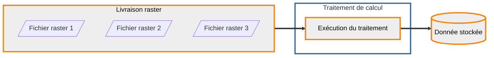

## Calcul de la pyramide raster

Les données déposées sur la plateforme sont systématiquement transformées et stockées sur des espaces dédiés pour pouvoir être diffusées. Dans le cas des données raster, ce stockage est une pyramide d'images (la donnée est calculée dans plusieurs résolutions) sur du stockage S3. L'entité qui correspond à cette donnée pérenne est une donnée stockée.

Pour transformer la donnée livrée en donnée stockée, des traitements sont mis à disposition de l'entrepôt.



### Consultation des traitements disponibles

??? GET "{{ urls.api_entrepot }}/datastores/{datastore}/processings"

``` title="Contenu" 
{{ urls.api_entrepot }}/datastores/{datastore}/processings
```

```json
{{ "public/data/tutoriels/alimentation-diffusion-simple/globales/production/processings.json" | readJSON | safe }}
```
???
<br>

### Consultation du traitement qui nous intéresse

Le détail d'un traitement permet de voir les types de données (livrées ou stockées) attendus en entrée, le type de données en sortie, ainsi que les paramètres et les vérifications requises pour les livraisons en entrée.

??? GET "{{ urls.api_entrepot }}/datastores/{datastore}/processings/{{ ids.processings['raster-to-pyramid'] }}"

``` title="Contenu" 
{{ urls.api_entrepot }}/datastores/{datastore}/processings/{{ ids.processings['raster-to-pyramid'] }}
```

```json
{
    "name": "Calcul de pyramide raster",
    "description": "Génération ou mise à jour d'une pyramide de tuiles raster à partir d'une livraison d'images géo-référencées",
    "input_types": {
        "upload": [
            "RASTER"
        ],
        "stored_data": [
            "ROK4-PYRAMID-RASTER"
        ]
    },
    "output_type": {
        "stored_data": "ROK4-PYRAMID-RASTER",
        "storage": [
            "S3"
        ]
    },
    "parameters": [
        {
            "name": "bottom",
            "description": "Niveau du bas de la pyramide. Attention à ne pas sur-échantillonner les données utilisées. En ne précisant pas de niveau, le traitement prendra le niveau de la grille dont la résolution est la plus proche des images livrées",
            "mandatory": false
        },
        {
            "name": "tms",
            "description": "Tile Matrix Set, grille de définition des tuiles. Dans le cas d'une génération initiale, il est obligatoire",
            "mandatory": false,
            "constraints": {
                "type": "string",
                "enum": [
                    "PM"
                ]
            }
        },
        {
            "name": "width",
            "description": "Nombre de tuiles dans une dalle, dans le sens de la largeur",
            "mandatory": false,
            "default_value": 16
        },
        {
            "name": "compression",
            "description": "Compression des données dans les tuiles",
            "mandatory": false,
            "constraints": {
                "type": "string",
                "enum": [
                    "jpg",
                    "png"
                ]
            }
        },
        {
            "name": "interpolation",
            "description": "Interpolation",
            "mandatory": false,
            "constraints": {
                "type": "string",
                "enum": [
                    "nn",
                    "linear",
                    "bicubic"
                ]
            }
        },
        {
            "name": "parallelization",
            "description": "Nombre de scripts d'écriture des dalles en parallèle",
            "mandatory": false,
            "default_value": 1
        },
        {
            "name": "top",
            "description": "Niveau du haut de la pyramide. Par défaut, on remonte jusqu'au niveau le plus haut de la grille",
            "mandatory": false
        },
        {
            "name": "mask",
            "description": "Écriture des masques de données dans la pyramide en sortie",
            "mandatory": false,
            "default_value": "false"
        },
        {
            "name": "height",
            "description": "Nombre de tuiles dans une dalle, dans le sens de la hauteur",
            "mandatory": false,
            "default_value": 16
        }
    ]
    "_id": "{{ ids.processings['raster-to-pyramid'] }}",
    "required_checks": [
        {
            "name": "Vérification raster",
            "description": "La vérification raster contrôle que les fichiers sont bien lisibles et en extraie le géoréférencement",
            "_id": "{{ ids.checks.vector }}"
        },
        {
            "name": "Vérification standard",
            "description": "La vérification standard contrôle les signatures MD5 fournies",
            "_id": "{{ ids.checks.standard }}"
        }
    ]
}
```
???
<br>

### Configuration d'une exécution de ce traitement

On distingue le traitement, la ressource de la plateforme mise à disposition de l'entrepôt, et son exécution. Une exécution appartient à un entrepôt et possède en entrée et en sortie des données spécifiques.

??? POST "{{ urls.api_entrepot }}/datastores/{datastore}/processings/executions"

``` title="Contenu" 
{{ urls.api_entrepot }}/datastores/{datastore}/processings/executions
```

```json
{
    "processing": "{{ ids.processings['raster-to-pyramid'] }}",
    "inputs": {
        "upload": [
        "{upload}"
        ]
    },
    "output": {
        "stored_data": {
            "name": "SCAN1000 de la Corse",
            "storage_tags": ["PYRAMIDE"]
        }
    },
    "parameters": {
        "tms": "PM",
        "compression": "jpg",
        "interpolation": "bicubic"
    }
}
```

```json
{
    "processing": {
        "name": "Calcul de pyramide raster",
        "_id": "{{ ids.processings['raster-to-pyramid'] }}"
    },
    "status": "CREATED",
    "creation": "2023-05-22T09:15:50.353341276Z",
    "inputs": {
        "upload": [
            {
                "type": "RASTER",
                "name": "SCAN1000 - Corse",
                "status": "CLOSED",
                "srs": "EPSG:2154",
                "_id": "{upload}"
            }
        ],
        "stored_data": []
    },
    "output": {
        "stored_data": {
            "name": "SCAN1000 de la Corse",
            "type": "ROK4-PYRAMID-RASTER",
            "status": "CREATED",
            "_id": "{stored data}"
        }
    },
    "parameters": {
        "tms": "PM",
        "compression": "jpg",
        "interpolation": "bicubic",
        "parallelization": 1,
        "mask": "false",
        "width": 16,
        "height": 16
    },
    "_id": "{execution}"
}
```
???
<br>

:::warning "Points d'attention"
    Si votre pyramide est destinée à être mise à jour (voir [l'alimentation raster par mise à jour](../mise-a-jour/index.md)), il peut être important de préciser que l'on souhaite calculer les masques de données (paramètre `"mask": true`).
:::

### Déclenchement de cette exécution

??? POST "{{ urls.api_entrepot }}/datastores/{datastore}/processings/executions/{execution}/launch"

``` title="Contenu" 
{{ urls.api_entrepot }}/datastores/{datastore}/processings/executions/{execution}/launch
```

???
<br>

### Consultation de l'état de l'exécution

Une exécution va avoir les statuts dans l'ordre suivant :

* CREATED : créée mais non lancée
* WAITING : lancée mais pas encore prise en charge par le cluster de calcul
* PROGRESS : en cours d'exécution sur le cluster de calcul
* SUCCESS ou FAILURE : terminé

??? GET "{{ urls.api_entrepot }}/datastores/{datastore}/processings/executions/{execution}"

``` title="Contenu" 
{{ urls.api_entrepot }}/datastores/{datastore}/processings/executions/{execution}
```

```json
{
    "processing": {
        "name": "Calcul de pyramide raster",
        "_id": "{{ ids.processings['raster-to-pyramid'] }}"
    },
    "status": "PROGRESS",
    "creation": "2023-05-22T09:15:50.353341276Z",
    "launch": "2023-05-22T11:30:32.650969Z",
    "inputs": {
        "upload": [
            {
                "type": "RASTER",
                "name": "SCAN1000 - Corse",
                "status": "CLOSED",
                "srs": "EPSG:2154",
                "_id": "{upload}"
            }
        ],
        "stored_data": []
    },
    "output": {
        "stored_data": {
            "name": "SCAN1000 de la Corse",
            "type": "ROK4-PYRAMID-RASTER",
            "status": "CREATED",
            "_id": "{stored data}"
        }
    },
    "parameters": {
        "tms": "PM",
        "compression": "jpg",
        "interpolation": "bicubic",
        "parallelization": 1,
        "mask": "false",
        "width": 16,
        "height": 16
    },
    "_id": "{execution}"
}
```
???
<br>

## Consultation de la donnée stockée en sortie

À la fin du traitement, des informations concernant la donnée finale sont remontées afin d'apparaître au niveau de l'API (taille, étendue, système de coordonnées et niveaux).

??? GET "{{ urls.api_entrepot }}/datastores/{datastore}/stored_data/{stored data}"

``` title="Contenu" 
{{ urls.api_entrepot }}/datastores/{datastore}/stored_data/{stored data}
```

```json
{
    "name": "SCAN1000 de la Corse",
    "type": "ROK4-PYRAMID-RASTER",
    "srs": "EPSG:3857",
    "contact": "contact@ign.fr",
    "extent": {
        "type": "Polygon",
        "coordinates": [
            [
                [
                    43.0475237,
                    8.35476935
                ],
                [
                    43.0475237,
                    9.75281343
                ],
                [
                    41.23486116,
                    9.75281343
                ],
                [
                    41.23486116,
                    8.35476935
                ],
                [
                    43.0475237,
                    8.35476935
                ]
            ]
        ]
    },
    "last_event": {
        "title": "Génération",
        "date": "2023-05-22T11:30:32.630725",
        "initiator": {
            "_id": "{user}"
        }
    },
    "tags": {},
    "storage": {
        "type": "S3",
        "labels": []
    },
    "size": 5104340,
    "status": "GENERATED",
    "_id": "{stored data}",
    "type_infos": {
        "tms": "PM",
        "levels": [
            "0",
            "1",
            "2",
            "3",
            "4",
            "5",
            "6",
            "7",
            "8",
            "9",
            "10"
        ],
        "channels_format": "UINT8",
        "channels_number": 3,
        "compression": "JPG",
        "nodata_value": "255,255,255"
    }
}
```
???
<br>

## Nettoyage de la livraison

Maintenant que la donnée a été stockée de manière pérenne, on peut supprimer la livraison et son contenu :

??? DELETE "{{ urls.api_entrepot }}/datastores/{datastore}/uploads/{upload}"

``` title="Contenu" 
{{ urls.api_entrepot }}/datastores/{datastore}/uploads/{upload}
```

???
<br>