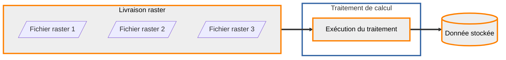

### Calcul de la pyramide

Les données déposées sur la plateforme sont systématiquement transformées et stockées sur des espaces dédiés pour pouvoir être diffusées. Dans le cas des données raster, ce stockage est une pyramide d’images (la donnée est calculée dans plusieurs résolutions) sur du stockage S3. L’entité qui correspond à cette donnée pérenne est une donnée stockée.

Pour transformer la donnée livrée en donnée stockée, des traitements sont mis à disposition de l’entrepôt.


```mermaid
flowchart LR
    ds[(Donnée stockée)]

    subgraph liv[Livraison raster]
        direction TB
        fic1[/Fichier raster 1/]
        fic2[/Fichier raster 2/]
        fic3[/Fichier raster 3/]
    end

    subgraph tra[Traitement de calcul]
        exe[Exécution du traitement]
    end

    liv ==> exe ==> ds

    classDef indiv fill:#eee,stroke:#ff8000,stroke-width:3px,color:#000;
    classDef global fill:#fff,stroke:#3465a4,stroke-width:3px;

    class liv,exe,ds indiv
    class tra global
```

#### Consultation des traitements disponibles

???? GET "{{ urls.api_entrepot }}/datastores/{datastore}/processings"
```plain
{{ urls.api_entrepot }}/datastores/{datastore}/processings
```
??? Corps de réponse JSON
```json
{{ "public/data/tutoriels/alimentation-diffusion-simple/globales/production/processings.json" | readFILE | safe }}
```
???
????
<br>

#### Consultation du traitement qui nous intéresse

Le détail d’un traitement permet de voir les types de données (livrées ou stockées) attendus en entrée, le type de données en sortie, ainsi que les paramètres et les vérifications requises pour les livraisons en entrée.

???? GET "{{ urls.api_entrepot }}/datastores/{datastore}/processings/{{ ids.processings['raster_to_pyramid'] }}"
```plain
{{ urls.api_entrepot }}/datastores/{datastore}/processings/{{ ids.processings['raster_to_pyramid'] }}
```
??? Corps de réponse JSON
```json
{
    "name": "Calcul de pyramide raster",
    "description": "Génération ou mise à jour d’une pyramide de tuiles raster à partir d’une livraison d’images géoréférencées",
    "input_types": {
        "upload": [
            "RASTER"
        ],
        "stored_data": [
            "ROK4-PYRAMID-RASTER"
        ]
    },
    "output_type": {
        "stored_data": "ROK4-PYRAMID-RASTER",
        "storage": [
            "S3"
        ]
    },
    "parameters": [
        {
            "name": "bottom",
            "description": "Niveau du bas de la pyramide. Attention à ne pas sur-échantillonner les données utilisées. En ne précisant pas de niveau, le traitement prendra le niveau de la grille dont la résolution est la plus proche des images livrées",
            "mandatory": false
        },
        {
            "name": "tms",
            "description": "Tile Matrix Set, grille de définition des tuiles. Dans le cas d’une génération initiale, il est obligatoire",
            "mandatory": false,
            "constraints": {
                "type": "string",
                "enum": [
                    "PM"
                ]
            }
        },
        {
            "name": "width",
            "description": "Nombre de tuiles dans une dalle, dans le sens de la largeur",
            "mandatory": false,
            "default_value": 16
        },
        {
            "name": "compression",
            "description": "Compression des données dans les tuiles",
            "mandatory": false,
            "constraints": {
                "type": "string",
                "enum": [
                    "jpg",
                    "png"
                ]
            }
        },
        {
            "name": "interpolation",
            "description": "Interpolation",
            "mandatory": false,
            "constraints": {
                "type": "string",
                "enum": [
                    "nn",
                    "linear",
                    "bicubic"
                ]
            }
        },
        {
            "name": "parallelization",
            "description": "Nombre de scripts d’écriture des dalles en parallèle",
            "mandatory": false,
            "default_value": 1
        },
        {
            "name": "top",
            "description": "Niveau du haut de la pyramide. Par défaut, on remonte jusqu’au niveau le plus haut de la grille",
            "mandatory": false
        },
        {
            "name": "mask",
            "description": "Écriture des masques de données dans la pyramide en sortie",
            "mandatory": false,
            "default_value": "false"
        },
        {
            "name": "height",
            "description": "Nombre de tuiles dans une dalle, dans le sens de la hauteur",
            "mandatory": false,
            "default_value": 16
        }
    ],
    "_id": "{{ ids.processings['raster_to_pyramid'] }}",
    "required_checks": [
        {
            "name": "Vérification raster",
            "description": "La vérification raster contrôle que les fichiers sont bien lisibles et en extrait le géoréférencement",
            "_id": "{{ ids.checks.vector }}"
        },
        {
            "name": "Vérification standard",
            "description": "La vérification standard contrôle les signatures MD5 fournies",
            "_id": "{{ ids.checks.standard }}"
        }
    ]
}
```
???
????
<br>

#### Configuration d’une exécution de ce traitement

On distingue le traitement, la ressource de la plateforme mise à disposition de l’entrepôt, et son exécution. Une exécution appartient à un entrepôt et possède en entrée et en sortie des données spécifiques.

???? POST "{{ urls.api_entrepot }}/datastores/{datastore}/processings/executions"
```plain
{{ urls.api_entrepot }}/datastores/{datastore}/processings/executions
```
??? Corps de requête JSON
```json
{
    "processing": "{{ ids.processings['raster_to_pyramid'] }}",
    "inputs": {
        "upload": ["{upload}"]
    },
    "output": {
        "stored_data": {
            "name": "SCAN1000 de la Corse",
            "storage_tags": ["PYRAMIDE"]
        }
    },
    "parameters": {
        "tms": "PM",
        "compression": "jpg",
        "interpolation": "bicubic"
    }
}
```
???
??? Corps de réponse JSON
```json
{
    "processing": {
        "name": "Calcul de pyramide raster",
        "_id": "{{ ids.processings['raster_to_pyramid'] }}"
    },
    "status": "CREATED",
    "creation": "2023-05-22T09:15:50.353341276Z",
    "inputs": {
        "upload": [
            {
                "type": "RASTER",
                "name": "SCAN1000 - Corse",
                "status": "CLOSED",
                "srs": "EPSG:2154",
                "_id": "{upload}"
            }
        ],
        "stored_data": []
    },
    "output": {
        "stored_data": {
            "name": "SCAN1000 de la Corse",
            "type": "ROK4-PYRAMID-RASTER",
            "status": "CREATED",
            "_id": "{stored data}"
        }
    },
    "parameters": {
        "tms": "PM",
        "compression": "jpg",
        "interpolation": "bicubic",
        "parallelization": 1,
        "mask": "false",
        "width": 16,
        "height": 16
    },
    "_id": "{execution}"
}
```
???
??? Plus d’aide sur la configuration de l’exécution du traitement de calcul de pyramide raster
Description des paramètres en entrée :
- `inputs`/`upload` : Il s’agit ici d’une liste (présence des caractères « `[ ]` ») qui prend comme valeur au moins un identifiant entrepôt de **livraison** (voir étape précédente).
- `output`/`stored_data`/`name` : Le nom défini ici est un nommage libre.

    **Cette information n’est lisible que par un autre utilisateur membre de cet entrepôt, pas par l’utilisateur final. Vous êtes donc invité à renseigner ici des informations parlantes pour vous - producteur de donnée.**

    Cette information est modifiable après coup.
- `output`/`stored_data`/`storage_tags` : Il s’agit ici d’une liste (présence des caractères « `[ ]` ») qui prend comme valeur au moins un tag associé au stockage qui va accueillir la donnée de sortie.

    Vous pouvez retrouver ces tags via la route `GET /datastores/{datastore}/storages` (rubrique « Entrepôt » du swagger) dans l’attribut de réponse `labels` associé à chaque stockage.

    Pour une donnée raster en entrée, c'est un stockage S3 qui sera mobilisé. Or il existe sur votre entrepôt au moins deux stockages S3 différents : un dédié au raster et l'autre au téléchargement. Il sont chacun des quotas différents, il convient donc de pointer vers le bon. Pour ce faire, il faut pointer sur le label, donc le `storage_tag` : `PYRAMIDE`.
- `parameters`/`tms` : ce paramètre obligatoire permet de définir quelle matrice de tuilage va être utiliser pour fabriquer la pyramide. Vous retrouvez la liste des matrices de tuilage associées au traitement via l'étape "Consultation du traitement qui nous intéresse". Le détail de chaque matrice est consultable via la route GET "{{ urls.api_entrepot }}/statics/tms/{tms}". Cette route permet notamment d'identifier la projection de la matrice de tuilage et les niveaux de tuilage disponible avec leur résolution associée.
- `parameters`/`compression` : ce paramètre obligatoire est des plus conditionnant dans la pyramide qui va être générée mais la valeur à mobiliser dépend aussi du type de raster fourni en entrée :
    - `jpg` : c'est la valeur adaptée et hautement recommandée à la grande majorité des usages valorisant en entrée des dalles raster encodées sur 3 canaux (Rouge - Vert - Bleu). 
    
        **Avantages** : la pyramide fabriquée reste très légère ce qui garantit une diffusion fluide et une consommation d'espace très optimisée sur votre datastore. 
    
        **Inconvénients** : Le jpg ne gère pas la transparence, les pixels no data de votre donnée en entrée seront donc rendus comme de l'image (soit en blanc, soit en noir compte tenu des réglages généralement appliqués sur les données en entrée).

    - `png` : Lorsqu'il est absolument essentiel que les pixels non data soient rendus transparents côté serveur. Cette compression peut être mobilisée.

        **Avantages** : la pyramide présente par défaut (opération réalisée en dur côté serveur) les pixels non data en transparence.
    
        **Inconvénients** : la pyramide png est, à donnée d'entrée identique, 10 fois plus lourde à stocker et à diffuser que son équivalent en jpg. Elle nécessite aussi une donnée adaptée en entrée (livraison de fichiers de masque en entrée) qui est plus lourde et complexe à mettre en oeuvre. Une tel choix n'est donc pas recommandé dans l'absolu et ne doit être réservée qu'à des cas très spécifiques.

    - `zip` : Compression réservée aux raster encodés sur un seul canal et pour lesquels, la valeur du pixel vaut mesure du phénomène rendu sous forme raster : une altitude, une concentration de polluant, une classe d'occupation du sol.

        **Avantages** : la pyramide conserve strictement la valeur pixellaire en entrée et s'avère extrêmement légère.
    
        **Inconvénients** : Cette compression ne permet pas un rendu image direct côté client et nécessite de mobiliser un ou plusieurs fichier de style de rendu pour être visualisée. Voir le tutoriel [Gestion de données MNT](https://cartes.gouv.fr/aide/fr/guides-developpeur/tutoriels/gestion-des-donnees-raster/mnt/) pour plus de détail sur cet aspect

- `parameters`/`interpolation` : Dans le cas où la projection des données de la livraison (donnée d'entrée) et celle du paramètre `tms` diffèrent, il faut sélectionner ici une méthode d'interpolation des valeurs de pixel qui seront transformées par la reprojection. Les paramètres d'interpolation disponibles sont listés dans la route de détail du traitement. Pour en savoir plus sur le comportement de telle ou telle méthode d'interpolation, vous êtes invités à vous référer à al littérature existante et abondante sur le sujet.

- `parameters`/`parallelization` : Définit le nombre de coeur de calcul qui vont être dédiés au traitement de calcul de la pyramide. Vous pouvez monter cette valeur jusqu'à 4. Plus la valeur est élevée, plus le calcul est rapide. Rappelez vous toutefois que vous êtes sur une plateforme mutualisée, vous êtes donc fortement invités à adapter cette valeur aux réalités de votre exigence de production, sans forcément pousser systématiquement le paramètre à son maximum.

- `parameters`/`mask` : Ce paramètre devra être placé à `true` dans deux cas :

    - si vous générez une pyramide en compression `png` avec des rasters en entrée sur  4 canaux associés à des fichiers de masque

    - si la pyramide que vous êtes en train de déclarée, quelle que soit sa compression ou le type de ses données en entrée est destinée à être fusionnée avec d'autres pyramides existantes ou à venir pour composer une territoire plus vaste où une composition de raster de résolutions différentes pour différentes échelles de visualisation.

-  `parameters`/`top` et/ou `parameters`/`bottom` : Il s'agit des niveaux de tuilage haut (`top` à fort dé-zoom) et/ou bas (`bottom` à fort zoom) auxquels la pyramide va être calculée. Vous êtes invités à choisir des niveaux de tuilage pertinents avec votre donnée d'entrée : inutile de "surtuiler" à fort zoom un raster de résolution moyenne : cela n'améliorera pas la résolution et consommera inutilement de l'espace de stockage.

Ces paramètres sont facultatifs, s'ils ne sont pas fournis, le système adaptera les niveaux de tuilage en fonction de la couverture spatiale de la livraison fournie en entrée.

- `parameters`/`width` et/ou `parameters`/`height` : taille de chaque dallette interne de la pyramide en sortie. En pixel. Par défaut à 16, cette valeur ne doit être modifiée que sur les conseils du support.
:::info
Comme pour la livraison il vous est possible de configurer l’envoi d’un courriel automatique à la fin du traitement.

Pour ce faire, il suffit d’ajouter l’élément JSON ci-dessous après l’élément `parameters` dans le corps de requête de déclaration d’exécution.
```json
"callback": {
    "type": "email",
    "to_address": [
        "example@mail.fr"
    ]
}
```
Vous êtes invités à vous référer au swagger pour avoir les détails et options complètes sur cette partie.
:::
???
????
<br>

:::warning
Si votre pyramide est destinée à être mise à jour (voir l’[alimentation par mise à jour raster](../../alimentation-mise-a-jour-raster)), il peut être important de préciser que l’on souhaite calculer les masques de données (paramètre `"mask": true`).
:::

#### Déclenchement de cette exécution

??? POST "{{ urls.api_entrepot }}/datastores/{datastore}/processings/executions/{execution}/launch"
```plain
{{ urls.api_entrepot }}/datastores/{datastore}/processings/executions/{execution}/launch
```
???
<br>

#### Consultation de l’état de l’exécution

Une exécution va avoir les statuts dans l’ordre suivant :
- `CREATED` : créée mais non lancée
- `WAITING` : lancée mais pas encore prise en charge par le cluster de calcul
- `PROGRESS` : en cours d’exécution sur le cluster de calcul
- `SUCCESS` ou `FAILURE` : terminé

<br>

???? GET "{{ urls.api_entrepot }}/datastores/{datastore}/processings/executions/{execution}"
```plain
{{ urls.api_entrepot }}/datastores/{datastore}/processings/executions/{execution}
```
??? Corps de réponse JSON
```json
{
    "processing": {
        "name": "Calcul de pyramide raster",
        "_id": "{{ ids.processings['raster_to_pyramid'] }}"
    },
    "status": "PROGRESS",
    "creation": "2023-05-22T09:15:50.353341276Z",
    "launch": "2023-05-22T11:30:32.650969Z",
    "inputs": {
        "upload": [
            {
                "type": "RASTER",
                "name": "SCAN1000 - Corse",
                "status": "CLOSED",
                "srs": "EPSG:2154",
                "_id": "{upload}"
            }
        ],
        "stored_data": []
    },
    "output": {
        "stored_data": {
            "name": "SCAN1000 de la Corse",
            "type": "ROK4-PYRAMID-RASTER",
            "status": "CREATED",
            "_id": "{stored data}"
        }
    },
    "parameters": {
        "tms": "PM",
        "compression": "jpg",
        "interpolation": "bicubic",
        "parallelization": 1,
        "mask": "false",
        "width": 16,
        "height": 16
    },
    "_id": "{execution}"
}
```
???
????
<br>

### Consultation de la donnée stockée en sortie

À la fin du traitement, des informations concernant la donnée finale sont remontées afin d’apparaître au niveau de l’API (taille, étendue, système de coordonnées et niveaux).

???? GET "{{ urls.api_entrepot }}/datastores/{datastore}/stored_data/{stored data}"
```plain
{{ urls.api_entrepot }}/datastores/{datastore}/stored_data/{stored data}
```
??? Corps de réponse JSON
```json
{
    "name": "SCAN1000 de la Corse",
    "type": "ROK4-PYRAMID-RASTER",
    "srs": "EPSG:3857",
    "contact": "contact@ign.fr",
    "extent": {
        "type": "Polygon",
        "coordinates": [
            [
                [43.0475237, 8.35476935],
                [43.0475237, 9.75281343],
                [41.23486116, 9.75281343],
                [41.23486116, 8.35476935],
                [43.0475237, 8.35476935]
            ]
        ]
    },
    "last_event": {
        "title": "Génération",
        "date": "2023-05-22T11:30:32.630725",
        "initiator": {
            "_id": "{user}"
        }
    },
    "tags": {},
    "storage": {
        "type": "S3",
        "labels": []
    },
    "size": 5104340,
    "status": "GENERATED",
    "_id": "{stored data}",
    "type_infos": {
        "tms": "PM",
        "levels": ["0", "1", "2", "3", "4", "5", "6", "7", "8", "9", "10"],
        "channels_format": "UINT8",
        "channels_number": 3,
        "compression": "JPG",
        "nodata_value": "255,255,255"
    }
}
```
???
??? Plus d’aide sur l’identification de la donnée stockée de sortie
Dès le lancement de l’exécution du traitement, dans le corps de réponse ou à chaque interrogation de la requête d’état d’exécution vous disposez dans le corps de réponse de ces requêtes de l’élément JSON :
```json
"output": {
        "stored_data": {
            "name": "SCAN1000 de la Corse",
            "type": "ROK4-PYRAMID-RASTER",
            "status": "CREATED",
            "_id": "{stored data}"
        }
    }
```
Ce qui vous donne l’élément `_id` à isoler pour identifier ensuite votre `stored_data` de sortie.

:::info
La `stored_data` de sortie n’est exploitable et interrogeable qu’une fois l’exécution du traitement terminée avec succès.
:::
???
????
<br>

### Nettoyage de la livraison

Maintenant que la donnée a été stockée de manière pérenne, on peut supprimer la livraison et son contenu :

??? DELETE "{{ urls.api_entrepot }}/datastores/{datastore}/uploads/{upload}"
```plain
{{ urls.api_entrepot }}/datastores/{datastore}/uploads/{upload}
```
???

:::warning
La livraison n’a qu’un rôle temporaire, le temps que les données soient transformées et stockées dans leur format pérenne sur la plateforme. Les fichiers déposés ne sont pas ceux utilisés par les services de diffusion.

La livraison doit impérativement être supprimée après la réalisation des étapes « traitement ».
:::