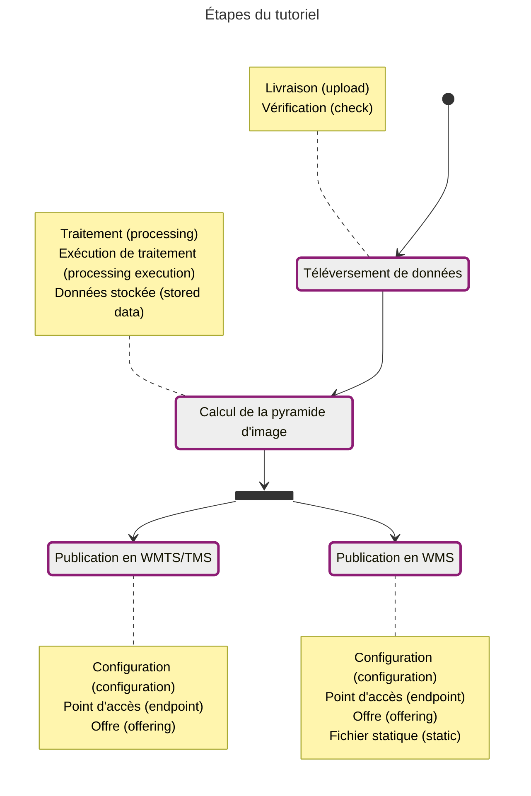
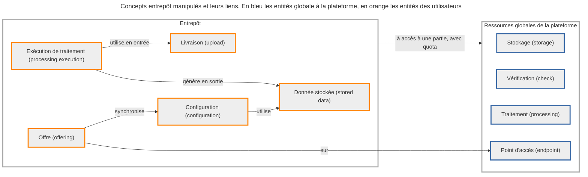

# Alimentation et diffusion simple

Le but de ce tutoriel va être de diffuser des données raster (images géoréférencées) en WMTS/TMS et WMS. Les concepts de l'entrepôt manipulés lors de chaque étape sont détaillés dans les notes, avec le terme français et celui technique entre parenthèse.

## Données du tutoriel

Les données de l'exemple sont une image SCAN 1000 sur la Corse, au format [TIFF](public/data/tutoriels/raster/alimentation-diffusion-simple/scan1000_corse.tif) avec un [TFW](public/data/tutoriels/raster/alimentation-diffusion-simple/scan1000_corse.tfw) pour le géo-référencement.

{.fr-responsive-img .frx-border-img .frx-img-contained}

