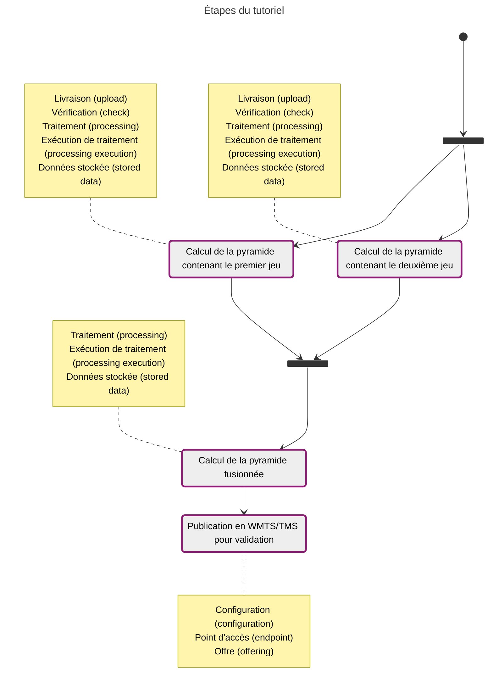

L'avantage de ce mode de fonctionnement est que les générations des pyramides indépendantes peuvent se faire en parallèle. Il n'y a pas de modifications de données et celles-ci ne sont pas dupliquées. En revanche, une dépendance est ajoutée entre les données, ce qui va empêcher la suppression des données référencées (les pyramides utilisées dans la composition).



## Gestion du premier jeu de données

- Création de la livraison

??? POST "{{ urls.api_entrepot }}/datastores/{datastore}/uploads"

```title="Contenu"
{{ urls.api_entrepot }}/datastores/{datastore}/uploads
```

```json
{
    "description": "SCAN 1000 Nord Corse",
    "name": "SCAN 1000 Nord Corse",
    "type": "RASTER",
    "srs": "EPSG:2154"
}
```

???
<br>

- Livraison des fichiers : [scan1000_corse_nord.tif](/data/tutoriels/raster/alimentation-maj/scan1000_corse_nord.tif)
- Fermeture de la livraison
- Création de l'exécution de traitement : il est important de préciser que l'on veut générer et stocker les masques. Ces derniers vont être indispensables pour que la fusion évite la perte de données.

??? POST "{{ urls.api_entrepot }}/datastores/{datastore}/processings/executions"

```title="Contenu"
{{ urls.api_entrepot }}/datastores/{datastore}/processings/executions
```

```json
{
    "processing": "{{ ids.processings['raster-to-pyramid'] }}",
    "inputs": {
        "upload": ["{upload Corse Nord}"]
    },
    "output": {
        "stored_data": {
            "name": "SCAN 1000 Nord Corse",
            "storage_tags": ["PYRAMIDE"]
        }
    },
    "parameters": {
        "tms": "PM",
        "compression": "jpg",
        "interpolation": "bicubic",
        "mask": true
    }
}
```

???
<br>

- Lancement de l'exécution : ID de la données stockée `{stored data Corse Nord}`

Il n'est pas nécessaire d'attendre la fin de ce traitement pour lancer celui sur le deuxième jeu.

## Gestion du deuxième jeu de données

- Création de la livraison

??? POST "{{ urls.api_entrepot }}/datastores/{datastore}/uploads"

```title="Contenu"
{{ urls.api_entrepot }}/datastores/{datastore}/uploads
```

```json
{
    "description": "SCAN 1000 Sud Corse",
    "name": "SCAN 1000 Sud Corse",
    "type": "RASTER",
    "srs": "EPSG:2154"
}
```

???
<br>

- Livraison des fichiers : [scan1000_corse_sud.tif](/data/tutoriels/raster/alimentation-maj/scan1000_corse_sud.tif)
- Fermeture de la livraison
- Création de l'exécution de traitement : il est important de préciser que l'on veut générer et stocker les masques. Ces derniers vont être indispensables pour que la fusion évite la perte de données.

??? POST "{{ urls.api_entrepot }}/datastores/{datastore}/processings/executions"

```title="Contenu"
{{ urls.api_entrepot }}/datastores/{datastore}/processings/executions
```

```json
{
    "processing": "{{ ids.processings['raster-to-pyramid'] }}",
    "inputs": {
        "upload": ["{upload Corse Sud}"]
    },
    "output": {
        "stored_data": {
            "name": "SCAN 1000 Sud Corse",
            "storage_tags": ["PYRAMIDE"]
        }
    },
    "parameters": {
        "tms": "PM",
        "compression": "jpg",
        "interpolation": "bicubic",
        "mask": true
    }
}
```

???
<br>

- Lancement de l'exécution : ID de la données stockée `{stored data Corse Sud}`

## Génération de la pyramide fusionnée

Lorsque les deux pyramides indépendantes sont générées :

- Récupération du traitement qui nous intéresse : ID `{{ ids.processings['pyramids-to-pyramid'] }}`

??? GET "{{ urls.api_entrepot }}/datastores/{datastore}/processings/{{ ids.processings['pyramids-to-pyramid'] }}"

```title="Contenu"
{{ urls.api_entrepot }}/datastores/{datastore}/processings/{{ ids.processings['pyramids-to-pyramid'] }}
```

```json
{
    "name": "Fusion de pyramides raster",
    "description": "Ce traitement permet de générer une pyramide raster par composition de plusieurs pyramides indépendantes. Seules les dalles présentes dans plusieurs entrées seront recalculées. Celles présentes dans une seule entrée seront référencées. La pyramide en sortie a donc des dépendances avec celles en entrée.",
    "input_types": {
        "upload": [],
        "stored_data": ["ROK4-PYRAMID-RASTER"]
    },
    "output_type": {
        "stored_data": "ROK4-PYRAMID-RASTER",
        "storage": ["S3"]
    },
    "parameters": [
        {
            "name": "parallelization",
            "description": "Le niveau de parallélisation du calcul (nombre de scripts parallèles, nombre de threads)",
            "mandatory": false,
            "default_value": 1
        },
        {
            "name": "top",
            "description": "Niveau du haut de la pyramide en sortie : ce sera par défaut le plus haut de toutes les pyramides en entrée",
            "mandatory": false
        },
        {
            "name": "bottom",
            "description": "Niveau du bas de la pyramide en sortie : ce sera par défaut le plus bas de toutes les pyramides en entrée",
            "mandatory": false
        },
        {
            "name": "bbox",
            "description": "Étendue géographique sur laquelle sera générée la pyramide : ce sera par défaut l'union des étendues de toutes les pyramides en entrée",
            "mandatory": false
        }
    ],
    "_id": "{{ ids.processings['pyramids-to-pyramid'] }}",
    "required_checks": []
}
```

???
<br>

- Création de l'exécution de traitement (on s'appuie sur les valeurs par défaut des paramètres)

??? POST "{{ urls.api_entrepot }}/datastores/{datastore}/processings/executions"

```title="Contenu"
{{ urls.api_entrepot }}/datastores/{datastore}/processings/executions
```

```json
{
    "processing": "{{ ids.processings['pyramids-to-pyramid'] }}",
    "inputs": {
        "stored_data": ["{stored data Corse Nord}", "{stored data Corse Sud}"]
    },
    "output": {
        "stored_data": {
            "name": "SCAN 1000 Corse",
            "storage_tags": ["PYRAMIDE"]
        }
    },
    "parameters": {}
}
```

???
<br>

- Lancement de l'exécution
- À la fin, on peut voir que notre nouvelle pyramide a deux dépendances : elle utilise nos deux pyramides indépendantes, qu'on ne pourra plus supprimer.

??? GET "{{ urls.api_entrepot }}/datastores/{datastore}/stored_data/{stored data Corse}/dependencies"

```title="Contenu"
{{ urls.api_entrepot }}/datastores/{datastore}/stored_data/{stored data Corse}/dependencies
```

```json
{
    "used_by": [],
    "use": [
        {
            "name": "SCAN 1000 Nord Corse",
            "_id": "{stored data Corse Nord}"
        },
        {
            "name": "SCAN 1000 Sud Corse",
            "_id": "{stored data Corse Sud}"
        }
    ]
}
```

???
<br>

En publiant notre pyramide fusionnée, on retrouve bien la Corse en entier.

{.fr-responsive-img .frx-border-img .frx-img-contained}
