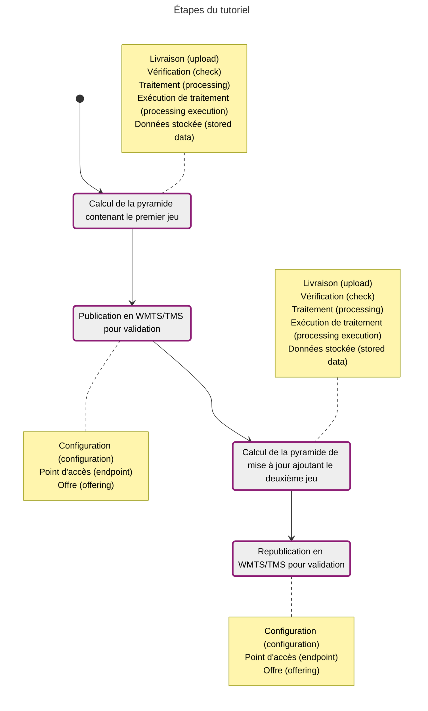

Une mise à jour par chaînage va créer une nouvelle donnée stockée. Le nouveau contenu sera ajouté et les anciennes données seront référencées.

L'avantage est qu'il n'y a pas de modifications des anciennes données et que celles ci ne sont pas dupliquées. En revanche, une dépendance est ajoutée entre les données, ce qui va empêcher la suppression des données référencées (les anciennes données).



## Gestion du premier jeu de données

### Calcul de la pyramide

On a notre permier jeu de donnée, la pyramide calculée se fera dans les même conditions que dans le [tutoriel de diffusion de données raster](../../alimentation-diffusion-raster).

* Création de la livraison

??? POST "{{ urls.api_entrepot }}/datastores/{datastore}/uploads"

``` title="Contenu" 
{{ urls.api_entrepot }}/datastores/{datastore}/uploads
```

```json
{
    "description": "SCAN 1000 Nord Corse",
    "name": "SCAN 1000 Nord Corse",
    "type": "RASTER",
    "srs": "EPSG:2154"
}
```
??? 
<br>

* Livraison des fichiers : [scan1000_corse_nord.tif](/data/tutoriels/raster/alimentation-maj/scan1000_corse_nord.tif)
* Fermeture de la livraison
* Création de l'exécution de traitement

??? POST "{{ urls.api_entrepot }}/datastores/{datastore}/processings/executions"

``` title="Contenu" 
{{ urls.api_entrepot }}/datastores/{datastore}/processings/executions
```

```json
{
    "processing": "{{ ids.processings['raster-to-pyramid'] }}",
    "inputs": {
        "upload": [
            "{upload Corse Nord}"
        ]
    },
    "output": {
        "stored_data": {
            "name": "SCAN 1000 Nord Corse",
            "storage_tags": ["PYRAMIDE"]
        }
    },
    "parameters": {
        "tms": "PM",
        "compression": "jpg",
        "interpolation": "bicubic"
    }
}
```
???
<br>
* Lancement de l'exécution : ID de la données stockée `{stored data Corse Nord}`

### Diffusion

* Création de la configuration WMTS-TMS : ID `{configuration}`

??? POST "{{ urls.api_entrepot }}/datastores/{datastore}/configurations"

``` title="Contenu" 
{{ urls.api_entrepot }}/datastores/{datastore}/configurations
```

```json
{
    "type": "WMTS-TMS",
    "name": "SCAN 1000 Nord Corse",
    "layer_name": "scan1000_corse",
    "metadata": [
        {
            "format": "application/xml",
            "url": "https://geoservices.ign.fr/sites/default/files/2021-07/IGNF_SCAN1000r_2-1.xml",
            "type": "ISO19115:2003"
        }
    ],
    "type_infos": {
        "title": "SCAN 1000 Nord Corse",
        "abstract": "Données SCAN 1000 sur le Nord de la Corse",
        "keywords": [
            "Tutoriel", "Raster", "Mise à jour"
        ],
        "used_data": [
            {
                "bottom_level": "10",
                "top_level": "0",
                "stored_data": "{stored data Corse Nord}"
            }
        ]
    },
    "getfeatureinfo": {
        "stored_data": true
    }
}
```
???
<br>

* Création de l'offre : ID `{offering}`

On met tout de suite comme `layer_name` le nom cible : lorsque l'on mettra à jour la diffusion, on ne pourra plus le changer.


## Gestion du deuxième jeu de données

### Calcul de la pyramide

* Création de la livraison

??? POST "{{ urls.api_entrepot }}/datastores/{datastore}/uploads"

``` title="Contenu" 
{{ urls.api_entrepot }}/datastores/{datastore}/uploads
```

```json
{
    "description": "SCAN 1000 Sud Corse",
    "name": "SCAN 1000 Sud Corse",
    "type": "RASTER",
    "srs": "EPSG:2154"
}
```
???
<br>

* Livraison des fichiers : [scan1000_corse_sud.tif](/data/tutoriels/raster/alimentation-maj/scan1000_corse_sud.tif)
* Fermeture de la livraison
* Création de l'exécution de traitement : on a ici deux données en entrée, la nouvelle zone livrée, ainsi que la pyramide ne contenant que le Nord de la Corse

??? POST "{{ urls.api_entrepot }}/datastores/{datastore}/processings/executions"

``` title="Contenu" 
{{ urls.api_entrepot }}/datastores/{datastore}/processings/executions
```

```json
{
    "processing": "{{ ids.processings['raster-to-pyramid'] }}",
    "inputs": {
        "upload": [
            "{upload Corse Sud}"
        ],
        "stored_data": [
            "{stored data Corse Nord}"
        ]
    },
    "output": {
        "stored_data": {
            "name": "SCAN 1000 Corse complète",
            "storage_tags": ["PYRAMIDE"]
        }
    },
    "parameters": {}
}
```
???
<br>

* Lancement de l'exécution : ID de la données stockée `{stored data Corse}`
* À la fin, on peut voir que notre nouvelle pyramide a une dépendance : elle utilise notre première pyramide, qu'on ne pourra plus supprimer

??? GET "{{ urls.api_entrepot }}/datastores/{datastore}/stored_data/{stored data Corse}/dependencies"

``` title="Contenu" 
{{ urls.api_entrepot }}/datastores/{datastore}/stored_data/{stored data Corse}/dependencies
```

```json
{
    "used_by": [],
    "use": [
        {
            "name": "SCAN 1000 Nord Corse",
            "_id": "{stored data Corse Nord}"
        }
    ]
}
```
???
<br>

### Diffusion

* Mise à jour de la configuration WMTS-TMS : on change le titre, le résumé et surtout la donnée stockée utilisée. À ce stade, la diffusion n'a pas encore été mise à jour
 
??? PUT "{{ urls.api_entrepot }}/datastores/{datastore}/configurations/{configuration}"

``` title="Contenu" 
{{ urls.api_entrepot }}/datastores/{datastore}/configurations/{configuration}
```

```json
{
    "type": "WMTS-TMS",
    "name": "SCAN 1000 Corse complète",
    "layer_name": "scan1000_corse",
    "metadata": [
        {
            "format": "application/xml",
            "url": "https://geoservices.ign.fr/sites/default/files/2021-07/IGNF_SCAN1000r_2-1.xml",
            "type": "ISO19115:2003"
        }
    ],
    "type_infos": {
        "title": "SCAN 1000 Corse complète",
        "abstract": "Données SCAN 1000 sur toute la Corse",
        "keywords": [
            "Tutoriel", "Raster", "Mise à jour"
        ],
        "used_data": [
            {
                "bottom_level": "10",
                "top_level": "0",
                "stored_data": "{stored data Corse}"
            }
        ]
    },
    "getfeatureinfo": {
        "stored_data": true
    }
}
```
???
<br>

* Synchronisation de l'offre : cette action va renvoyer les informations auprès des serveurs de diffusion pour prendre en compte les modifications. Cela permet de conserver l'offre et son identifiant, ce qui est intéressant lorsque des restrictions d'accès ont été définies 

??? PUT "{{ urls.api_entrepot }}/datastores/{datastore}/offerings/{offering}"

``` title="Contenu" 
{{ urls.api_entrepot }}/datastores/{datastore}/offerings/{offering}
```
???
<br>

{.fr-responsive-img .frx-border-img .frx-img-contained}
