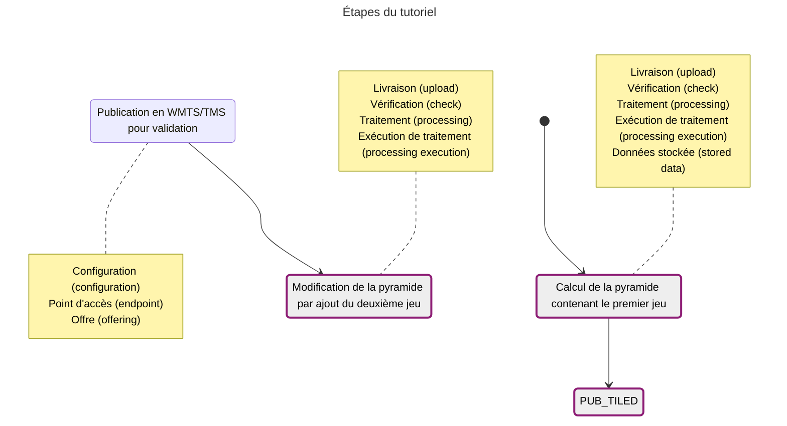

L'avantage de la mise à jour par injection, c'est qu'il n'est pas nécessaire de reconfigurer la diffusion : les flux sont mis à jour "à chaud".

En revanche, la modification n'étant pas reversible, on peut détériorer la pyramide et le flux si les données livrées ne sont pas valides.



## Initialisation de la pyramide et des flux

### Calcul de la pyramide

* Création de la livraison

??? POST "{{ urls.api_entrepot }}/datastores/{datastore}/uploads"

``` title="Contenu" 
{{ urls.api_entrepot }}/datastores/{datastore}/uploads
```

```json
{
    "description": "SCAN 1000 Nord Corse",
    "name": "SCAN 1000 Nord Corse",
    "type": "RASTER",
    "srs": "EPSG:2154"
}
```
???
<br>

* Livraison des fichiers : [scan1000_corse_nord.tif](/data/tutoriels/raster/alimentation-maj/scan1000_corse_nord.tif)
* Fermeture de la livraison
* Création de l'exécution de traitement :

??? POST "{{ urls.api_entrepot }}/datastores/{datastore}/processings/executions"

``` title="Contenu" 
{{ urls.api_entrepot }}/datastores/{datastore}/processings/executions
```

```json
{
    "processing": "{{ ids.processings['raster-to-pyramid'] }}",
    "inputs": {
        "upload": [
            "{upload Corse Nord}"
        ]
    },
    "output": {
        "stored_data": {
            "name": "SCAN 1000 Corse par injection",
            "storage_tags": ["PYRAMIDE"]
        }
    },
    "parameters": {
        "tms": "PM",
        "compression": "jpg",
        "interpolation": "bicubic"
    }
}
```
???
<br>

* Lancement de l'exécution
* Les informations sur notre donnée stockées sont :
    - ID `{stored data Corse}`
    - taille : 4 967 972 octets
    - étendue : 7.70943739,42.08814213 10.2673901,43.12553835

### Diffusion

* Création de la configuration WMTS-TMS

??? POST "{{ urls.api_entrepot }}/datastores/{datastore}/configurations"

``` title="Contenu" 
{{ urls.api_entrepot }}/datastores/{datastore}/configurations
```

```json
{
    "type": "WMTS-TMS",
    "name": "SCAN 1000 Corse",
    "layer_name": "scan1000_corse_injection",
    "metadata": [
        {
            "format": "application/xml",
            "url": "https://geoservices.ign.fr/sites/default/files/2021-07/IGNF_SCAN1000r_2-1.xml",
            "type": "ISO19115:2003"
        }
    ],
    "type_infos": {
        "title": "SCAN 1000 Corse",
        "abstract": "Données SCAN 1000 sur la Corse, alimenté par injection",
        "keywords": [
            "Tutoriel", "Raster", "Mise à jour", "Injection"
        ],
        "used_data": [
            {
                "bottom_level": "10",
                "top_level": "0",
                "stored_data": "{stored data Corse}"
            }
        ]
    },
    "getfeatureinfo": {
        "stored_data": true
    }
}
```
???
<br>

* Création de l'offre

On met tout de suite les informations cible, le but étant de ne pas avoir à modifier la diffusion à chaque mise à jour.

{.fr-responsive-img .frx-border-img .frx-img-contained}


## Ajout du deuxième jeu de données

### Modification de la pyramide

* Création de la livraison

??? POST "{{ urls.api_entrepot }}/datastores/{datastore}/uploads"

``` title="Contenu" 
{{ urls.api_entrepot }}/datastores/{datastore}/uploads
```

```json
{
    "description": "SCAN 1000 Sud Corse",
    "name": "SCAN 1000 Sud Corse",
    "type": "RASTER",
    "srs": "EPSG:2154"
}
```
???
<br>

* Livraison des fichiers : [scan1000_corse_sud.tif](/data/tutoriels/raster/alimentation-maj/scan1000_corse_sud.tif)
* Fermeture de la livraison
* Création de l'exécution de traitement : on renseigne en sortie la pyramide déjà existante, pour signifier qu'on souhaite la modifier

??? POST "{{ urls.api_entrepot }}/datastores/{datastore}/processings/executions"

``` title="Contenu" 
{{ urls.api_entrepot }}/datastores/{datastore}/processings/executions
```

```json
{
"processing": "{{ ids.processings['raster-to-pyramid'] }}",
"inputs": {
    "upload": [
    "{upload Corse Sud}"
    ]
},
"output": {
        "stored_data": {
            "id": "{stored data Corse}"
        }
    },
    "parameters": {}
}
```
???
<br>

* Lancement de l'exécution
* Les informations sur notre donnée stockées sont maintenant :
    - taille : 5 102 292 octets
    - étendue : 7.55821978,41.22153919 10.2673901,43.12553835

### Visualisation

Sans action supplémentaire sur la diffusion, on peut voir nos données mises à jour.
