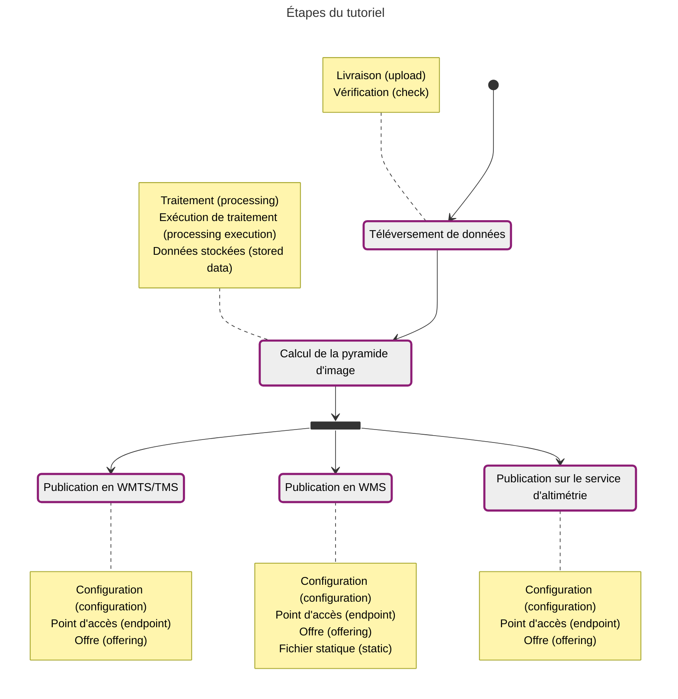
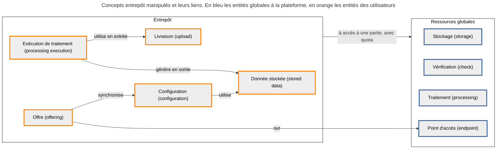



Le but de ce tutoriel est de diffuser des données raster (images géoréférencées) de type MNT (canal flottant) en WMTS/TMS, WMS et sur le service d'altimétrie. Les concepts de l'entrepôt manipulés lors de chaque étape sont détaillés dans les notes, avec le terme français et celui technique entre parenthèses.

## Données du tutoriel

Les données de l'exemple sont constituées d'une dalle kilométrique MNT issue du LidarHD (50 cm de résolution), au format Geotiff :

{{ component("download", {
    title: "[GeoTIFF] LHD_FXX_0932_6453_MNT_0M50_LAMB93_IGN69.tif",
    href: "/data/tutoriels/raster/mnt/LHD_FXX_0932_6453_MNT_0M50_LAMB93_IGN69.tif",
    detail: "TIFF - 15.3 Mo"
}) }}

On pourra traiter de la même manière la dalle kilométrique correspondante :

{{ component("download", {
    title: "[MNS] LHD_FXX_0932_6453_MNS_0M50_LAMB93_IGN69.tif",
    href: "/data/tutoriels/raster/mnt/LHD_FXX_0932_6453_MNS_0M50_LAMB93_IGN69.tif",
    detail: "TIFF - 15.3 Mo"
}) }}
