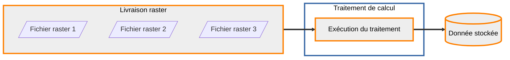



## Calcul de la pyramide raster MNT

Les données déposées sur la plateforme sont systématiquement transformées et stockées sur des espaces dédiés pour pouvoir être diffusées. Dans le cas des données raster, ce stockage est une pyramide d'images (la donnée est calculée dans plusieurs résolutions) sur du stockage S3. L'entité qui correspond à cette donnée pérenne est une donnée stockée.

Pour transformer la donnée livrée en donnée stockée, des traitements sont mis à disposition de l'entrepôt.



### Consultation des traitements disponibles

??? GET "{{ urls.api_entrepot }}/datastores/{datastore}/processings"

```title="Contenu"
{{ urls.api_entrepot }}/datastores/{datastore}/processings
```

```json
{{ "public/data/tutoriels/alimentation-diffusion-simple/globales/production/processings.json" | readFILE | safe }}
```

???
<br>

### Consultation du traitement qui nous intéresse

Le détail sur un traitement permet de voir les types de données attendus en entrée (livrées ou stockées), les types de données produits en sortie, ainsi que les paramètres et les vérifications requises pour les livraisons en entrée.

??? GET "{{ urls.api_entrepot }}/datastores/{datastore}/processings/{{ ids.processings['raster-to-pyramid'] }}"

```title="Contenu"
{{ urls.api_entrepot }}/datastores/{datastore}/processings/{{ ids.processings['raster-to-pyramid'] }}
```

```json
{
    "name": "Calcul de pyramide raster",
    "description": "Génération ou mise à jour d'une pyramide de tuiles raster à partir d'une livraison d'images géo-référencées",
    "input_types": {
        "upload": ["RASTER"],
        "stored_data": ["ROK4-PYRAMID-RASTER"]
    },
    "output_type": {
        "stored_data": "ROK4-PYRAMID-RASTER",
        "storage": ["S3"]
    },
    "parameters": [
        {
            "name": "tms",
            "description": "Tile Matrix Set, grille de définition des tuiles. Dans le cas d'une génération initiale, il est obligatoire",
            "mandatory": false,
            "constraints": {
                "enum": ["PM", "4326", "LAMB93_10cm", "LAMB93_50cm"],
                "type": "string"
            }
        },
        {
            "name": "width",
            "description": "Nombre de tuiles dans une dalle, dans le sens de la largeur",
            "mandatory": false,
            "default_value": 16,
            "constraints": {
                "type": "integer",
                "maximum": 32,
                "minimum": 8
            }
        },
        {
            "name": "parallelization",
            "description": "Nombre de scripts d'écriture des dalles en parallèle",
            "mandatory": false,
            "default_value": 1,
            "constraints": {
                "type": "integer",
                "maximum": 4,
                "minimum": 1
            }
        },
        {
            "name": "compression",
            "description": "Compression des données dans les tuiles",
            "mandatory": false,
            "constraints": {
                "enum": ["jpg", "png", "zip", "jpg90"],
                "type": "string"
            }
        },
        {
            "name": "height",
            "description": "Nombre de tuiles dans une dalle, dans le sens de la hauteur",
            "mandatory": false,
            "default_value": 16,
            "constraints": {
                "type": "integer",
                "maximum": 32,
                "minimum": 8
            }
        },
        {
            "name": "interpolation",
            "description": "Interpolation",
            "mandatory": false,
            "constraints": {
                "enum": ["nn", "linear", "bicubic"],
                "type": "string"
            }
        },
        {
            "name": "bottom",
            "description": "Niveau du bas de la pyramide. Attention à ne pas sur-échantillonner les données utilisées. En ne précisant pas de niveau, le traitement prendra le niveau de la grille dont lé résolution est la plus proche des images livrées",
            "mandatory": false,
            "constraints": {
                "type": "string"
            }
        },
        {
            "name": "top",
            "description": "Niveau du haut de la pyramide. Par défaut, on remonte jusqu'au niveau le plus haut de la grille",
            "mandatory": false,
            "constraints": {
                "type": "string"
            }
        },
        {
            "name": "mask",
            "description": "Écriture des masques de données dans la pyramide en sortie",
            "mandatory": false,
            "default_value": false,
            "constraints": {
                "type": "boolean"
            }
        }
    ],
    "_id": "{{ ids.processings['raster-to-pyramid'] }}",
    "required_checks": [
        {
            "name": "Vérification raster",
            "description": "La vérification raster contrôle que les fichiers sont bien lisibles et en extraie le géoréférencement",
            "_id": "{{ ids.checks.vector }}"
        },
        {
            "name": "Vérification standard",
            "description": "La vérification standard contrôle les signatures MD5 fournies",
            "_id": "{{ ids.checks.standard }}"
        }
    ]
}
```

???
<br>

### Configuration d'une exécution de ce traitement

On distingue le traitement, qui est une ressource de la plateforme mise à disposition de l'entrepôt, et son exécution. Une exécution appartient à un entrepôt et prend en entrée ainsi qu'en sortie des données spécifiques.

??? POST "{{ urls.api_entrepot }}/datastores/{datastore}/processings/executions"

```title="Contenu"
{{ urls.api_entrepot }}/datastores/{datastore}/processings/executions
```

```json
{
    "processing": "{{ ids.processings['raster-to-pyramid'] }}",
    "inputs": {
        "upload": ["{upload MNT}"]
    },
    "output": {
        "stored_data": {
            "name": "MNT LidarHD",
            "storage_tags": ["PYRAMIDE"]
        }
    },
    "parameters": {
        "tms": "LAMB93_50cm",
        "compression": "zip",
        "interpolation": "nn",
        "mask": true
    }
}
```

```json
{
    "processing": {
        "name": "Calcul ou mise à jour de pyramide raster",
        "_id": "{{ ids.processings['raster-to-pyramid'] }}"
    },
    "status": "CREATED",
    "creation": "2023-05-22T09:15:50.353341276Z",
    "inputs": {
        "upload": [
            {
                "type": "RASTER",
                "name": "Dalle MNT LidarHD",
                "status": "CLOSED",
                "srs": "EPSG:2154",
                "_id": "{upload MNT}"
            }
        ],
        "stored_data": []
    },
    "output": {
        "stored_data": {
            "name": "SCAN1000 de la Corse",
            "type": "ROK4-PYRAMID-RASTER",
            "status": "CREATED",
            "_id": "{stored data MNT}"
        }
    },
    "parameters": {
        "interpolation": "nn",
        "width": 16,
        "tms": "LAMB93_50cm",
        "compression": "zip",
        "parallelization": 1,
        "mask": false,
        "height": 16
    },
    "_id": "{execution MNT}"
}
```

???
<br>

:::warning Points d'attentions
On précise une étiquette de stockage pour la donnée en sortie. Selon la configuration de votre entrepôt, il est possible que vous ayez accès à plusieurs stockages de type S3. Ce sont les étiquettes qui vont permettre de choisir le stockage S3 cible.

    On utilise le TMS `LAMB93_50cm` qui a le même système de coordonnée que l'image livrée, ainsi qu'un niveau à la même résolution (50cm). En choisissant une interpolation `nn`, on s'assure d'avoir un niveau de pyramide parfaitement calé sur les données sources, sans réechantillonnage, donc avec des valeurs d'origine. Les niveaux supérieurs eux seront calculé en moyennant les pixels 4 par 4. En ajoutant les masques, on évite de prendre en compte le nodata dans cette moyenne.
:::

### Déclenchement de cette exécution

??? POST "{{ urls.api_entrepot }}/datastores/{datastore}/processings/executions/{execution MNT}/launch"

```title="Contenu"
{{ urls.api_entrepot }}/datastores/{datastore}/processings/executions/{execution MNT}/launch
```

???
<br>

### Consultation de l'état de l'exécution

Une exécution va avoir les statuts dans l'ordre suivant :

- CREATED : créée mais non lancée
- WAITING : lancée mais pas encore pris en charge par le cluster de calcul
- PROGRESS : en cours d'exécution sur le cluster de calcul
- SUCCESS ou FAILURE : terminé

??? GET "{{ urls.api_entrepot }}/datastores/{datastore}/processings/executions/{execution MNT}"

```title="Contenu"
{{ urls.api_entrepot }}/datastores/{datastore}/processings/executions/{execution MNT}
```

```json
{
    "processing": {
        "name": "Calcul ou mise à jour de pyramide raster",
        "_id": "{{ ids.processings['raster-to-pyramid'] }}"
    },
    "status": "PROGRESS",
    "creation": "2023-09-15T13:53:49.189608Z",
    "launch": "2023-09-15T13:58:55.500014Z",
    "start": "2023-09-15T13:59:05.796898Z",
    "inputs": {
        "upload": [
            {
                "type": "RASTER",
                "name": "Dalle MNT LidarHD",
                "status": "CLOSED",
                "srs": "EPSG:2154",
                "_id": "{upload MNT}"
            }
        ],
        "stored_data": []
    },
    "output": {
        "stored_data": {
            "name": "MNT LidarHD",
            "type": "ROK4-PYRAMID-RASTER",
            "status": "GENERATING",
            "_id": "{stored data MNT}"
        }
    },
    "parameters": {
        "interpolation": "nn",
        "width": 16,
        "tms": "LAMB93_50cm",
        "compression": "zip",
        "parallelization": 1,
        "mask": false,
        "height": 16
    },
    "_id": "{execution}"
}
```

???
<br>

## Consultation de la donnée stockée en sortie

À la fin du traitement, des informations concernant la donnée finale sont remontées afin d'apparaître au niveau de l'API (taille, étendue, système de coordonnées et niveaux).

??? GET "{{ urls.api_entrepot }}/datastores/{datastore}/stored_data/{stored data MNT}"

```title="Contenu"
{{ urls.api_entrepot }}/datastores/{datastore}/stored_data/{stored data MNT}
```

```json
{
    "name": "MNT LidarHD",
    "type": "ROK4-PYRAMID-RASTER",
    "srs": "IGNF:LAMB93",
    "contact": "contact@ign.fr",
    "extent": {
        "type": "Polygon",
        "coordinates": [
            [
                [5.96481676, 45.12825517],
                [5.96481676, 45.13691567],
                [5.95162868, 45.13691567],
                [5.95162868, 45.12825517],
                [5.96481676, 45.12825517]
            ]
        ]
    },
    "last_event": {
        "title": "Génération",
        "date": "2023-09-15T13:58:55.474016",
        "initiator": {
            "_id": "{user}"
        }
    },
    "tags": {},
    "storage": {
        "type": "S3",
        "labels": ["PARTENAIRE", "PYRAMIDE", "PERF"]
    },
    "size": 14817315,
    "status": "GENERATED",
    "_id": "{stored data MNT}",
    "type_infos": {
        "tms": "LAMB93_50cm",
        "levels": ["11", "12", "13", "14", "15", "16", "17", "18", "0", "1", "2", "3", "4", "5", "6", "7", "8", "9", "10"],
        "channels_format": "FLOAT32",
        "channels_number": 1,
        "compression": "ZIP",
        "nodata_value": "-99999"
    }
}
```

???
<br>

## Nettoyage de la livraison

Maintenant que la donnée a été stockée de manière pérenne, on peut supprimer la livraison et son contenu :

??? DELETE "{{ urls.api_entrepot }}/datastores/{datastore}/uploads/{upload MNT}"

```title="Contenu"
{{ urls.api_entrepot }}/datastores/{datastore}/uploads/{upload MNT}
```

???
<br>

## Calcul de la pyramide MNS

Toutes ces étapes peuvent être répétées avec la dalle :

{{ component("download", {
    title: "[GeoTIFF] LHD_FXX_0932_6453_MNS_0M50_LAMB93_IGN69.tif",
    href: "/data/tutoriels/raster/mnt/LHD_FXX_0932_6453_MNS_0M50_LAMB93_IGN69.tif",
    detail: "TIFF - 15.3 Mo"
}) }}
, dans une livraison à part. Cela permettra d'exploiter les deux données pour enrichir les services.
