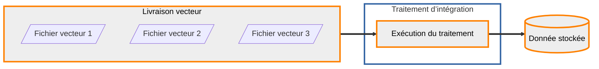

### Intégration en base

Les données déposées sur la plateforme sont systématiquement transformées et stockées sur des espaces dédiés pour pouvoir être diffusées. Dans le cas des données vecteur, ce stockage est un schéma sur des serveurs PostgreSQL. L’entité qui correspond à cette donnée pérenne est une donnée stockée.

Pour transformer la donnée livrée en donnée stockée, des traitements sont mis à disposition de l’entrepôt.



#### Consultation des traitements disponibles

???? GET "{{ urls.api_entrepot }}/datastores/{datastore}/processings"
```plain
{{ urls.api_entrepot }}/datastores/{datastore}/processings
```
??? Corps de réponse JSON
```json
{{ "public/data/tutoriels/alimentation-diffusion-simple/globales/production/processings.json" | readFILE | safe }}
```
???
????
<br>

#### Consultation du traitement qui nous intéresse

Le détail sur un traitement permet de voir les types de données (livrées ou stockées) attendus en entrée, le type de donnée en sortie, les paramètres et les vérifications requises pour les livraisons en entrée.

???? GET "{{ urls.api_entrepot }}/datastores/{datastore}/processings/{{ ids.processings['vector_to_db'] }}"
```plain
{{ urls.api_entrepot }}/datastores/{datastore}/processings/{{ ids.processings['vector_to_db'] }}
```
??? Corps de réponse JSON
```json
{
    "name": "Intégration de données vecteur livrées en base",
    "description": "Ce traitement permet de stocker dans les bases de données PostgreSQL de la plateforme des données vecteur livrées. Les formats pris en charge sont le CSV, le Shapefile, le Geopackage et le GeoJSON. Il est également possible de préciser un autre système afin de réaliser une reprojection à l’intégration",
    "input_types": {
        "upload": ["VECTOR"],
        "stored_data": []
    },
    "output_type": {
        "stored_data": "VECTOR-DB",
        "storage": ["POSTGRESQL"]
    },
    "parameters": [
        {
            "name": "srs",
            "description": "Système de coordonnées cible",
            "mandatory": false
        }
    ],
    "_id": "{{ ids.processings['vector_to_db'] }}",
    "required_checks": [
        {
            "name": "Vérification vecteur",
            "description": "La vérification vecteur contrôle que les fichiers sont bien lisibles et en extraie l’étendue",
            "_id": "{{ ids.checks.vector }}"
        },
        {
            "name": "Vérification standard",
            "description": "La vérification standard contrôle les signatures MD5 fournies",
            "_id": "{{ ids.checks.standard }}"
        }
    ]
}
```
???
????
<br>

#### Configuration d’une exécution de ce traitement

On distingue le traitement, ressource de la plateforme mise à disposition de l’entrepôt, et son exécution. Une exécution appartient à un entrepôt et a en entrée et en sortie des données spécifiques.

???? POST "{{ urls.api_entrepot }}/datastores/{datastore}/processings/executions"
```plain
{{ urls.api_entrepot }}/datastores/{datastore}/processings/executions
```
??? Corps de requête JSON
```json
{
    "processing": "{{ ids.processings['vector_to_db'] }}",
    "inputs": {
        "upload": ["{upload}"]
    },
    "output": {
        "stored_data": {
            "name": "Pays et éco-régions",
            "storage_tags": ["VECTEUR"]
        }
    },
    "parameters": {
        "srs": "EPSG:3857"
    }
}
```
???
??? Corps de réponse JSON
```json
{
    "processing": {
        "name": "Intégration de données vecteur livrées en base",
        "_id": "{{ ids.processings['vector_to_db'] }}"
    },
    "status": "CREATED",
    "creation": "2023-05-10T14:57:08.832176082Z",
    "inputs": {
        "upload": [
            {
                "type": "VECTOR",
                "name": "Données mondiales",
                "status": "CLOSED",
                "srs": "EPSG:4326",
                "_id": "{upload}"
            }
        ],
        "stored_data": []
    },
    "output": {
        "stored_data": {
            "name": "Pays et éco-régions",
            "type": "VECTOR-DB",
            "status": "CREATED",
            "_id": "{stored data}"
        }
    },
    "parameters": [
        {
            "name": "srs",
            "value": "EPSG:3857"
        }
    ],
    "_id": "{execution}"
}
```
???
??? Plus d’aide sur la configuration de l’exécution du traitement d’intégration vecteur
Description des paramètres en entrée :
- `inputs`/`upload` : Il s’agit ici d’une liste (présence des caractères « `[ ]` ») qui prend comme valeur au moins un identifiant entrepôt de **livraison** (voir étape précédente).
- `output`/`stored_data`/`name` : Le nom défini ici est un nommage libre.

    **Cette information n’est lisible que par un autre utilisateur membre de cet entrepôt, pas par l’utilisateur final. Vous êtes donc invité à renseigner ici des informations parlantes pour vous - producteur de donnée.**

    Cette information est modifiable après coup.
- `output`/`stored_data`/`storage_tags` : Il s’agit ici d’une liste (présence des caractères « `[ ]` ») qui prend comme valeur au moins un tag associé au stockage qui va accueillir la donnée de sortie.

    Vous pouvez retrouver ces tags via la route `GET /datastores/{datastore}/storages` (rubrique « Entrepôt » du swagger) dans l’attribut de réponse `labels` associé à chaque stockage.

    Pour une donnée vecteur en entrée, seul le stockage PostgreSQL est accessible, ce qui correspond au label, donc au `storage_tag` : `VECTEUR`.
- `parameters`/`srs` : ce paramètre optionnel permet de faire faire à la Géoplateforme une reprojection des données au moment de leur intégration. Dans l’exemple du tutoriel : on livre une donnée en EPSG:4326 et ici avec le paramètre `"srs": "EPSG:3857"`, elle sera donc re-projetée par la Géoplateforme en projection Google Mercator et stockée sous cette projection.

:::info
Comme pour la livraison il vous est possible de configurer l’envoi d’un courriel automatique à la fin du traitement.

Pour ce faire, il suffit d’ajouter l’élément JSON ci-dessous après l’élément `parameters` dans le corps de requête de déclaration d’exécution.
```json
"callback": {
    "type": "email",
    "to_address": [
        "example@mail.fr"
    ]
}
```
Vous êtes invités à vous référer au swagger pour avoir les détails et options complètes sur cette partie.
:::
???
????
<br>

#### Déclenchement de cette exécution

??? POST "{{ urls.api_entrepot }}/datastores/{datastore}/processings/executions/{execution}/launch"
```plain
{{ urls.api_entrepot }}/datastores/{datastore}/processings/executions/{execution}/launch
```
???
<br>

:::warning
Les noms des tables et des champs sont « standardisés » lors de l’intégration en base pour éviter tout souci d’utilisation par les applications : pas de majuscules, pas d’accent, pas de tirets.
:::

#### Consultation de l’état de l’exécution

Une exécution va avoir les statuts dans l’ordre suivant :
- `CREATED` : créée mais non lancée
- `WAITING` : lancée mais pas encore prise en charge par le <span lang="en">_cluster_</span> de calcul
- `PROGRESS` : en cours d’exécution sur le <span lang="en">_cluster_</span> de calcul
- `SUCCESS` ou `FAILURE` : terminé

<br>

???? GET "{{ urls.api_entrepot }}/datastores/{datastore}/processings/executions/{execution}"
```plain
{{ urls.api_entrepot }}/datastores/{datastore}/processings/executions/{execution}
```
??? Corps de réponse JSON
```json
{
    "processing": {
        "name": "Intégration de données vecteur livrées en base",
        "_id": "{{ ids.processings['vector_to_db'] }}"
    },
    "status": "PROGRESS",
    "creation": "2023-05-10T14:57:08.832176Z",
    "launch": "2023-05-10T14:59:23.787740Z",
    "inputs": {
        "upload": [
            {
                "type": "VECTOR",
                "name": "Données mondiales",
                "status": "CLOSED",
                "srs": "EPSG:4326",
                "_id": "{upload}"
            }
        ],
        "stored_data": []
    },
    "output": {
        "stored_data": {
            "name": "Pays et éco-régions",
            "type": "VECTOR-DB",
            "status": "GENERATING",
            "_id": "{stored data}"
        }
    },
    "parameters": [
        {
            "name": "srs",
            "value": "EPSG:3857"
        }
    ],
    "_id": "{execution}"
}
```
???
????
<br>

### Consultation de la donnée stockée en sortie

À la fin du traitement, des informations concernant la donnée finale sont remontées afin d’apparaître au niveau de l’API (taille, étendue, système de coordonnées, tables et attributs).

???? GET "{{ urls.api_entrepot }}/datastores/{datastore}/stored_data/{stored data}"
```plain
{{ urls.api_entrepot }}/datastores/{datastore}/stored_data/{stored data}
```
??? Corps de réponse JSON
```json
{
    "name": "Pays et éco-régions",
    "type": "VECTOR-DB",
    "srs": "EPSG:3857",
    "contact": "email",
    "extent": {
        "type": "Polygon",
        "coordinates": []
    },
    "last_event": {
        "title": "Génération",
        "date": "2023-05-10T17:23:26.795112",
        "initiator": {
            "last_name": "Lopper",
            "first_name": "Dave",
            "_id": "{user}"
        }
    },
    "tags": {},
    "storage": {
        "type": "POSTGRESQL",
        "labels": []
    },
    "size": 5906432,
    "status": "GENERATED",
    "_id": "{stored data}",
    "type_infos": {
        "relations": [
            {
                "name": "ecoregions",
                "type": "TABLE",
                "attributes": ["ogc_fid", "id", "eco_name", "biome_name", "realm", "nnh", "nnh_name", "color", "color_bio", "color_nnh", "geom"],
                "primary_key": ["ogc_fid"]
            },
            {
                "name": "pays",
                "type": "TABLE",
                "attributes": ["ogc_fid", "id", "fips", "iso2", "iso3", "un", "name", "area", "pop2005", "region", "subregion", "lon", "lat", "geom"],
                "primary_key": ["ogc_fid"]
            }
        ]
    }
}
```
???
??? Plus d’aide sur l’identification de la donnée stockée de sortie
Dès le lancement de l’exécution du traitement, dans le corps de réponse ou à chaque interrogation de la requête d’état d’exécution vous disposez dans le corps de réponse de ces requêtes de l’élément JSON :
```json
"output": {
    "stored_data": {
        "name": "Pays et éco-régions",
        "type": "VECTOR-DB",
        "status": "GENERATING",
        "_id": "{stored data}"
    }
}
```
Ce qui vous donne l’élément `_id` à isoler pour identifier ensuite votre `stored_data` de sortie.

:::info
La `stored_data` de sortie n’est exploitable et interrogeable qu’une fois l’exécution du traitement terminée avec succès.
:::
???
????
<br>

### Nettoyage de la livraison

Maintenant que la donnée a été stockée de manière pérenne, on peut supprimer la livraison et son contenu :

??? DELETE "{{ urls.api_entrepot }}/datastores/{datastore}/uploads/{upload}"
```plain
{{ urls.api_entrepot }}/datastores/{datastore}/uploads/{upload}
```
???

:::warning
La livraison n’a qu’un rôle temporaire, le temps que les données soient transformées et stockées dans leur format pérenne sur la plateforme. Les fichiers déposés ne sont pas ceux utilisés par les services de diffusion.

La livraison doit impérativement être supprimée après la réalisation des étapes « traitement ».
:::