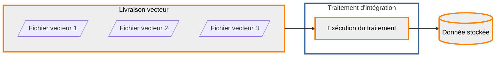

## Intégration en base

Les données déposées sur la plateforme sont systématiquement transformées et stockées sur des espaces dédiés pour pouvoir être diffusées. Dans le cas des données vecteur, ce stockage est un schéma sur des serveurs PostgreSQL. L'entité qui correspond à cette donnée pérenne est une donnée stockée.

Pour transformer la donnée livrée en donnée stockée, des traitements sont mis à disposition de l'entrepôt.



### Consultation des traitements disponibles

??? GET "{{ urls.api_entrepot }}/datastores/{datastore}/processings"

```title="Contenu"
{{ urls.api_entrepot }}/datastores/{datastore}/processings
```

```json
{{ "public/data/tutoriels/alimentation-diffusion-simple/globales/production/processings.json" | readFILE | safe }}
```

???
<br>

### Consultation du traitement qui nous intéresse

Le détail sur un traitement permet de voir les types de données (livrées ou stockées) attendus en entrée, le type de donnée en sortie, les paramètres et les vérifications requises pour les livraisons en entrée.

??? GET "{{ urls.api_entrepot }}/datastores/{datastore}/processings/{{ ids.processings['vector-to-db'] }}"

```title="Contenu"
{{ urls.api_entrepot }}/datastores/{datastore}/processings/{{ ids.processings['vector-to-db'] }}
```

```json
{
    "name": "Intégration de données vecteur livrées en base",
    "description": "Ce traitement permet de stocker dans les bases de données PostgreSQL de la plateforme des données vecteurs livrées. Les formats pris en charge sont le CSV, le Shapefile, le Geopackage et le GeoJSON. Il est également possible de préciser un autre système afin de réaliser une reprojection à l'intégration",
    "input_types": {
        "upload": ["VECTOR"],
        "stored_data": []
    },
    "output_type": {
        "stored_data": "VECTOR-DB",
        "storage": ["POSTGRESQL"]
    },
    "parameters": [
        {
            "name": "srs",
            "description": "Système de coordonnées cible",
            "mandatory": false
        }
    ],
    "_id": "{{ ids.processings['vector-to-db'] }}",
    "required_checks": [
        {
            "name": "Vérification vecteur",
            "description": "La vérification vecteur contrôle que les fichiers sont bien lisibles et en extraie l'étendue",
            "_id": "{{ ids.checks.vector }}"
        },
        {
            "name": "Vérification standard",
            "description": "La vérification standard contrôle les signatures MD5 fournies",
            "_id": "{{ ids.checks.standard }}"
        }
    ]
}
```

???
<br>

### Configuration d'une exécution de ce traitement

On distingue le traitement, ressource de la plateforme mise à disposition de l'entrepôt, et son exécution. Une exécution appartient à un entrepôt et a en entrée et en sortie des données spécifiques.

??? POST "{{ urls.api_entrepot }}/datastores/{datastore}/processings/executions"

```title="Contenu"
{{ urls.api_entrepot }}/datastores/{datastore}/processings/executions
```

```json
{
    "processing": "{{ ids.processings['vector-to-db'] }}",
    "inputs": {
        "upload": ["{upload}"]
    },
    "output": {
        "stored_data": {
            "name": "Pays et éco-régions",
            "storage_tags": ["VECTEUR"]
        }
    },
    "parameters": {
        "srs": "EPSG:3857"
    }
}
```

```json
{
    "processing": {
        "name": "Intégration de données vecteur livrées en base",
        "_id": "{{ ids.processings['vector-to-db'] }}"
    },
    "status": "CREATED",
    "creation": "2023-05-10T14:57:08.832176082Z",
    "inputs": {
        "upload": [
            {
                "type": "VECTOR",
                "name": "Données mondiales",
                "status": "CLOSED",
                "srs": "EPSG:4326",
                "_id": "{upload}"
            }
        ],
        "stored_data": []
    },
    "output": {
        "stored_data": {
            "name": "Pays et éco-régions",
            "type": "VECTOR-DB",
            "status": "CREATED",
            "_id": "{stored data}"
        }
    },
    "parameters": [
        {
            "name": "srs",
            "value": "EPSG:3857"
        }
    ],
    "_id": "{execution}"
}
```

???
<br>

### Déclenchement de cette exécution

??? POST "{{ urls.api_entrepot }}/datastores/{datastore}/processings/executions/{execution}/launch"

```title="Contenu"
{{ urls.api_entrepot }}/datastores/{datastore}/processings/executions/{execution}/launch
```

???
<br>

:::warning "Attention"

    Les noms des tables et des champs sont "standardisés" lors de l'intégration en base pour éviter tout souci d'utilisation par les applications : pas de majuscules, pas d'accent, pas de tirets.

:::

### Consultation de l'état de l'exécution

Une exécution va avoir les statuts dans l'ordre suivant :

- CREATED : créée mais non lancée
- WAITING : lancée mais pas encore pris en charge par le cluster de calcul
- PROGRESS : en cours d'exécution sur le cluster de calcul
- SUCCESS ou FAILURE : terminé

??? GET "{{ urls.api_entrepot }}/datastores/{datastore}/processings/executions/{execution}"

```title="Contenu"
{{ urls.api_entrepot }}/datastores/{datastore}/processings/executions/{execution}
```

```json
{
    "processing": {
        "name": "Intégration de données vecteur livrées en base",
        "_id": "{{ ids.processings['vector-to-db'] }}"
    },
    "status": "PROGRESS",
    "creation": "2023-05-10T14:57:08.832176Z",
    "launch": "2023-05-10T14:59:23.787740Z",
    "inputs": {
        "upload": [
            {
                "type": "VECTOR",
                "name": "Données mondiales",
                "status": "CLOSED",
                "srs": "EPSG:4326",
                "_id": "{upload}"
            }
        ],
        "stored_data": []
    },
    "output": {
        "stored_data": {
            "name": "Pays et éco-régions",
            "type": "VECTOR-DB",
            "status": "GENERATING",
            "_id": "{stored data}"
        }
    },
    "parameters": [
        {
            "name": "srs",
            "value": "EPSG:3857"
        }
    ],
    "_id": "{execution}"
}
```

???
<br>

## Consultation de la donnée stockée en sortie

À la fin du traitement, des informations concernant la donnée finale sont remontées afin d'apparaître au niveau de l'API (taille, étendue, système de coordonnées, tables et attributs).

??? GET "{{ urls.api_entrepot }}/datastores/{datastore}/stored_data/{stored data}"

```title="Contenu"
{{ urls.api_entrepot }}/datastores/{datastore}/stored_data/{stored data}
```

```json
{
    "name": "Pays et éco-régions",
    "type": "VECTOR-DB",
    "srs": "EPSG:3857",
    "contact": "email",
    "extent": {
        "type": "Polygon",
        "coordinates": []
    },
    "last_event": {
        "title": "Génération",
        "date": "2023-05-10T17:23:26.795112",
        "initiator": {
            "last_name": "Lopper",
            "first_name": "Dave",
            "_id": "{user}"
        }
    },
    "tags": {},
    "storage": {
        "type": "POSTGRESQL",
        "labels": []
    },
    "size": 5906432,
    "status": "GENERATED",
    "_id": "{stored data}",
    "type_infos": {
        "relations": [
            {
                "name": "ecoregions",
                "type": "TABLE",
                "attributes": ["ogc_fid", "id", "eco_name", "biome_name", "realm", "nnh", "nnh_name", "color", "color_bio", "color_nnh", "geom"],
                "primary_key": ["ogc_fid"]
            },
            {
                "name": "pays",
                "type": "TABLE",
                "attributes": ["ogc_fid", "id", "fips", "iso2", "iso3", "un", "name", "area", "pop2005", "region", "subregion", "lon", "lat", "geom"],
                "primary_key": ["ogc_fid"]
            }
        ]
    }
}
```

???
<br>

## Nettoyage de la livraison

Maintenant que la donnée a été stockée de manière pérenne, on peut supprimer la livraison et son contenu :

??? DELETE "{{ urls.api_entrepot }}/datastores/{datastore}/uploads/{upload}"

```title="Contenu"
{{ urls.api_entrepot }}/datastores/{datastore}/uploads/{upload}
```

???
<br>
