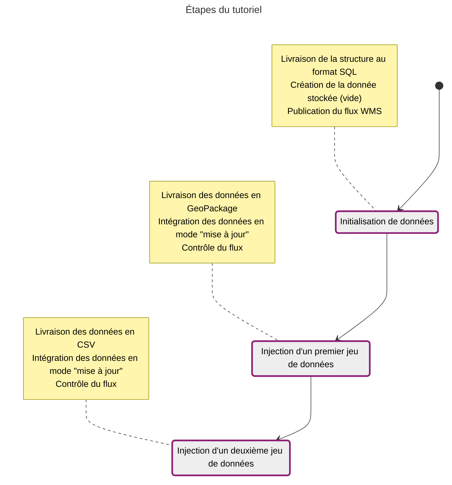

Le but de ce tutoriel va être de gérer une donnée vecteur mise à jour par livraisons successives. La diffusion sera configurée au début et le contenu consultable sera mis à jour "à chaud". Nous allons également exploiter une vue pour permettre une diffusion limitée des données.

Les descriptions des étapes se limitent aux nouveautés fonctionnelles du tutoriel. Il est conseillé de commencer par le tutoriel de
<a
id="link-1"
href="../alimentation-diffusion"
target="\_self"
class="fr-link fr-icon-arrow-right-line fr-link--icon-right"> diffusion vecteur</a>

.

## Données du tutoriel

Les données de l'exemple sont les <a title="installations classées pour la protection de l'environnement" id="link-2" href="https://www.georisques.gouv.fr/donnees/bases-de-donnees/installations-industrielles" target="_blank" rel="noopener external" class="fr-link">installations classées pour la protection de l'environnement</a> (source Géorisques) :

- Le SQL définissant une table `installation` et une vue `installation_autorisation` ne montrant que les lignes où l'attribut `lib_regime` est à `Autorisation`. Il n'y a pas de données. La vérification vecteur sur la Géoplateforme n'autorise pas la livraison de contenu en SQL.
  
  {{ component("download", {
      title: "Télécharger installation-init.sql",
      href: "/data/tutoriels/alimentation-maj/installation-init.sql",
      detail: "SQL - 455o"
  }) }}

- Un premier lot de données (département des Ardennes). On livre les données à ajouter dans la table, pas la vue.
  {{ component("download", {
      title: "Télécharger installation.gpkg",
      href: "/data/tutoriels/alimentation-maj/installation.gpkg",
      detail: "GPKG - 360Ko"
  }) }}
  {{ component("download", {
      title: "Télécharger installation.csv",
      href: "/data/tutoriels/alimentation-maj/installation.csv",
      detail: "CSV - 661Ko"
  }) }}
  {{ component("download", {
      title: "Télécharger installation.csvt",
      href: "/data/tutoriels/alimentation-maj/installation.csvt",
      detail: "CSVT - 84o"
  }) }}

- avec un deuxième lot de données (département du Doubs).
  {{ component("download", {
      title: "Télécharger installation.delete (CSV de suppression)",
      href: "/data/tutoriels/alimentation-maj/installation.delete",
      detail: "CSV - 45o"
  }) }}
  et un
  {{ component("download", {
      title: "Télécharger installation.update (CSV de modification)",
      href: "/data/tutoriels/alimentation-maj/installation.update",
      detail: "CSV - 187o"
  }) }}
