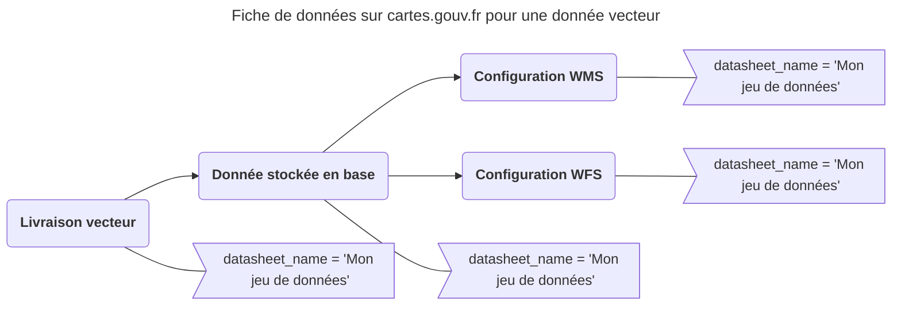



Afin de retrouver vos données sur les différents tableaux de bord de [cartes.gouv.fr](https://cartes.gouv.fr/tableau-de-bord), il est nécessaire d'ajouter des étiquettes spécifiques sur vos entités entrepôt.

## La fiche de données

Le concept principal sur cartes.gouv.fr est la fiche de données. Elle regroupe la livraison, les données stockées construites à partir d'elle (directement comme l'intégration ou indirectement comme une pyramide), ainsi que les configurations de ses différentes diffusions et une métadonnée.

Afin de matérialiser cette notion dans l'entrepôt, les entités suivantes vont porter le tag `datasheet_name`, dont la valeur est un nom humain (accents et espaces acceptés) : 

* La livraison
??? POST "{{ urls.api_entrepot }}/datastores/{datastore}/uploads/{upload}/tags"
```title="Contenu"
{{ urls.api_entrepot }}/datastores/{datastore}/uploads/{upload}/tags
```

```json
{
    "datasheet_name": "Mon jeu de données"
}
```
???

* La donnée stockée
??? POST "{{ urls.api_entrepot }}/datastores/{datastore}/stored_data/{stored data}/tags"
```title="Contenu"
{{ urls.api_entrepot }}/datastores/{datastore}/stored_data/{stored data}/tags
```

```json
{
    "datasheet_name": "Mon jeu de données"
}
```
???

* Les configurations
??? POST "{{ urls.api_entrepot }}/datastores/{datastore}/configurations/{configuration}/tags"
```title="Contenu"
{{ urls.api_entrepot }}/datastores/{datastore}/configurations/{configuration}/tags
```

```json
{
    "datasheet_name": "Mon jeu de données"
}
```
???



Une fois cet étiquetage réalisé, on peut retrouver notre fiche de données dans la liste des données de l'entrepôt à l'URL `https://cartes.gouv.fr/entrepot/{datastore}/donnees` :

{.fr-responsive-img .frx-border-img .frx-img-contained}

Et la fiche elle même à l'adresse `https://cartes.gouv.fr/entrepot/{datastore}/donnees/Mon%20jeu%20de%20donn%C3%A9es`, ou le nom de la fiche est rendu compatible avec une utilisation dans une URL.

## La vignette

Il est possible d'avoir une vignette associée à la fiche de données, sous forme d'une annexe. Le fichier utilisé dans cet exemple est [vignette.png](/img/guides-producteur/compatibilites-cartes-gouv/alimentation/vignette.png). On associe à l'annexe directement les labels nécessaires et on la publie automatiquement.

??? POST "{{ urls.api_entrepot }}/datastores/{datastore}/annexes"
```title="Contenu"
{{ urls.api_entrepot }}/datastores/{datastore}/annexes
```

{{ component("table", {
    headers: ["Corps de requête Multipart"],
    data: [
        ["file = `<vignette.png>`"],
        ["paths = vignettes/jeu-de-donnees.png"],
        ["file = `true`"],
        ["file = `type=thumbnail,datasheet_name=Mon jeu de données`"]
    ]
}) }}  


```json
{
    "paths": [
        "/vignettes/jeu-de-donnees.png"
    ],
    "size": 39597,
    "mime_type": "image/png",
    "published": true,
    "labels": [
        "type=thumbnail",
        "datasheet_name=Mon jeu de données"
    ],
    "_id": "{annexe}"
}
```
???

{.fr-responsive-img .frx-border-img .frx-img-contained}

:::warning
    Ajoutée ainsi, et sans autre action sur cartes.gouv.fr, la vignette est associée à la fiche de données dans le back-office mais pas encore dans le catalogue. Pour cela, il faut que la vignette soit également ajoutée à la métadonnée.
:::

## La visualisation

L'interface cartes.gouv.fr permet de visualiser vos données dès lors qu'elles sont publiées sur les endpoints publics de la Géoplateforme. Pour des flux raster comme le WMS, le style est appliqué côté serveur. Le portail n'a donc pas besoin d'informations supplémentaires et affiche les images générées par le serveur telles quelles.

{.fr-responsive-img .frx-border-img .frx-img-contained}

Mais pour une donnée vecteur publiée en WFS, la représentation de base peut ne pas être satisfaisante :

{.fr-responsive-img .frx-border-img .frx-img-contained}

Pour améliorer ce rendu, il est possible de préciser quel style appliquer côté client. On va téléverser un SLD ressemblant à celui utilisé pour la diffusion WMS en tant qu'annexe, le symbole `diamond` n'étant pas géré par le visualisateur. Il est aussi possible d'utiliser un style au format QML.

??? POST "{{ urls.api_entrepot }}/datastores/{datastore}/annexes"
```title="Contenu"
{{ urls.api_entrepot }}/datastores/{datastore}/annexes
```

{{ component("table", {
    headers: ["Corps de requête Multipart"],
    data: [
        ["file = `<jeu-de-donnees.sld>`"],
        ["paths = styles/jeu-de-donnees.sld"],
        ["published = `true`"]
    ]
}) }}


```json
{
    "paths": [
        "/styles/jeu-de-donnees.sld"
    ],
    "size": 4391,
    "mime_type": "application/octet-stream",
    "published": true,
    "_id": "{annexe}"
}
```
???

Nous allons maintenant décrire les styles à associer à chaque table de notre configuration WFS. Il est possible de préciser plusieurs styles pour une même table, pour donner le choix. C'est une donnée au format JSON qui a le format suivant :

```json
[
    {
        "name": "nom du style 1",
        "current": true,
        "layers": [
            {
                "name": "nom de la table 1",
                "annexe_id": "identifant de l'annexe",
                "url": "url complète de l'annexe"
            },
            {
                "name": "nom de la table 2",
                "annexe_id": "identifant de l'annexe",
                "url": "url complète de l'annexe"
            }
        ]
    },
    {
        "name": "nom du style 2",
        "layers": ["..."]
    }
]
```

Dans cet exemple, nous avons un seul style pour une seule table. On aura donc la donnée JSON suivante :

```json
[
    {
        "name": "Style par défaut",
        "current": true,
        "layers": [
            {
                "name": "installation:installation",
                "annexe_id": "{annexe}",
                "url": "{{ urls.annexes }}/{technical_name}/styles/jeu-de-donnees.sld"
            }
        ]
    }
]
```

:::warning
    Il faut bien préciser le layer_name et le nom de la table dans le nom de la couche : `<layer_name>:<table name>`
:::

Il suffit manitenant de stocker cette information dans la propriété `extra` de la configuration sous la clé `styles` et elle sera détectée et utilisée par cartes.gouv.fr.

??? PATCH "{{ urls.api_entrepot }}/datastores/{datastore}/configuration/{configuration}"
```title="Contenu"
{{ urls.api_entrepot }}/datastores/{datastore}/configuration/{configuration}
```

```json
{
    "extra": {
        "styles": [
            {
                "name": "Style par défaut",
                "current": true,
                "layers": [
                    {
                        "name": "installation:installation",
                        "annexe_id": "{annexe}",
                        "url": "{{ urls.annexes }}/{technical_name}/styles/jeu-de-donnees.sld"
                    }
                ]
            }
        ]
    }
}
```
???

On retrouve désormais une visualisation plus personnalisée, avec la possibilité de gérer les styles dans le panneau à droite.

{.fr-responsive-img .frx-border-img .frx-img-contained}

## L'historique de génération

Pour avoir des informations sur les exécutions qui ont calculé les données stockées, il est nécessaire d'ajouter des étiquettes supplémentaires :

* Sur la livraison
??? POST "{{ urls.api_entrepot }}/datastores/{datastore}/uploads/{upload}/tags"
```title="Contenu"
{{ urls.api_entrepot }}/datastores/{datastore}/uploads/{upload}/tags
```

```json
{
    "proc_int_id": "{execution}"
    "vectordb_id": "{stored data}"
}
```
???

* Sur la donnée stockée
??? POST "{{ urls.api_entrepot }}/datastores/{datastore}/stored_data/{stored data}/tags"
```title="Contenu"
{{ urls.api_entrepot }}/datastores/{datastore}/stored_data/{stored data}/tags
```

```json
{
    "upload_id": "{upload}"
    "proc_int_id": "{execution}"
}
```
???

Cela va avoir comme effet d'avoir un onglet pour le rapport de génération dans les détails de la donnée stockée.

{.fr-responsive-img .frx-border-img .frx-img-contained}

{.fr-responsive-img .frx-border-img .frx-img-contained}


## Les documents éditoriaux

Si vous souhaitez que vos documents annexes aux données soient associés à une fiche de données, il faut tout d'abord leur ajouter les labels `type=document` et `datasheet_name=Mon jeu de données`.

??? POST "{{ urls.api_entrepot }}/datastores/{datastore}/annexes"
```title="Contenu"
{{ urls.api_entrepot }}/datastores/{datastore}/annexes
```
{{ component("table", {
    headers: ["Corps de requête Multipart"],
    data: [
        ["file = `<document.pdf>`"],
        ["paths = docs/document.pdf"],
        ["published = `true`"],
        ["labels = `type=document,datasheet_name=Mon jeu de données`"]
    ]
}) }}

```json
{
    "paths": [
        "/docs/document.pdf"
    ],
    "size": 776825,
    "mime_type": "application/pdf",
    "published": true,
    "labels": [
        "type=document",
        "datasheet_name=Mon jeu de données"
    ],
    "_id": "{annexe}"
}
```
???

Il faut ensuite tenir à jour l'annexe qui liste ces documents. Une annexe avec les labels `type=document-list` et `datasheet_name=Mon jeu de données` a été automatiquement ajouté par cartes.gouv.fr lors de la détection de la fiche de données. Nous allons devoir la remplacer avec le nouveau contenu.

Cette annexe est un tableau JSON au contenu suivant (vide pour le moment) :

```json
[
    {
        "type": "file",
        "name": "<nom>",
        "description": "<description>",
        "id": "<ID de l'annexe>",
        "url": "<URL publique de l'annexe>"
    },
    {
        "type": "link",
        "name": "<nom>",
        "description": "<description>",
        "id": "6570f0aa-72fc-487d-836c-2da3f549d352",
        "url": "<URL d'un document externe>"
    }
]
```

Ici, nous avons un document, ce qui donne le fichier suivant à téléverser en tant qu'annexe :

```json
[
    {
        "type": "file",
        "name": "Mon document PDF",
        "description": "Mon document PDF que je veux voir sur cartes.gouv.fr",
        "id": "{annexe}",
        "url": "{{ urls.annexes }}/{technical_name}/docs/document.pdf"
    }
]
```

??? PUT "{{ urls.api_entrepot }}/datastores/{datastore}/annexes/{annexe document-list de la fiche de données}"  
```title="Contenu"
{{ urls.api_entrepot }}/datastores/{datastore}/annexes/{annexe document-list de la fiche de données}
```
{{ component("table", {
    headers: ["Corps de requête Multipart"],
    data: [
        ["file = `<documents.json>`"]
    ]
}) }}

```json
{
    "paths": [
        "/documents/Mon jeu de données.json"
    ],
    "size": 348,
    "mime_type": "application/json",
    "published": true,
    "labels": [
        "type=document-list",
        "datasheet_name=Mon jeu de données"
    ],
    "_id": "{annexe document-list de la fiche de données}"
}
```
???

Notre document est maintenant bien visible dans le tableau de bord de la fiche de données.

{.fr-responsive-img .frx-border-img .frx-img-contained}

:::warning
    Ajouté ainsi, le document est visible sur cartes.gouv.fr dans le back office mais n'est pas visible sur la fiche catalogue tant que le document n'est pas référencé dans la métadonnée.
:::

## La métadonnée

La métadonnée associée à cette fiche de données est générée automatiquement par cartes.gouv.fr, à partir des informations des entités entrepôt mais aussi d'informations demandées par formulaire. Pour que la métadonnée soit construite comme cartes.gouv.fr l'attend, deux possibilités : utiliser l'interface de cartes.gouv.fr ou utiliser le moteur de génération de ce dernier.

L'unique métadonnée va contenir toutes les informations sur l'ensemble des services présents sur la fiche de données, les documents associés et la vignette.

La métadonnée est l'entité qui rend visible la fiche de données sur le catalogue.

### Via l'interface de cartes.gouv.fr

Dans l'onglet `Services` de la page de la fiche de données, nous allons pouvoir modifier les informations de publication au niveau de chaque service.

{.fr-responsive-img .frx-border-img .frx-img-contained}

De nombreux champs sont pré-remplis avec les informations de la donnée utilisée par le service, mais il est possible de le modifier. Il y a 5 étapes à suivre. Lors de l'étape 3, il faut renseigner "Identificateur de ressource unique". Cet identifiant permettra d'accéder à la métadonnée sur le catalogue public.

Lors de la validation, une métadonnée est téléversée dans l'entrepôt et publiée sur le catalogue public. Avec l'identifiant unique, vous pouvez consulter la métadonnée sur le service CSW avec la requête [GetRecordById]({{ urls.open.csw }}?REQUEST=GetRecordById&SERVICE=CSW&VERSION=2.0.2&ID={identifiant unique}) ou sur le [catalogue de cartes.gouv.fr](https://cartes.gouv.fr/catalogue/dataset/{identifiant unique}).

### Via des outils en ligne de commande

:construction: À venir :construction:
