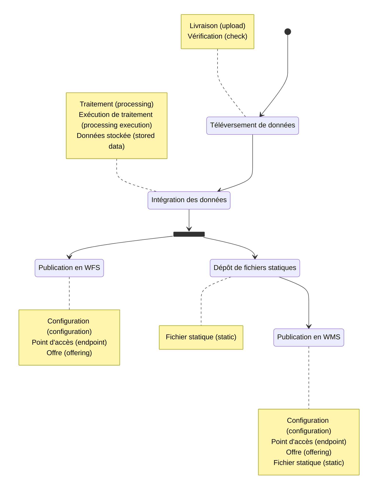

Le but de ce tutoriel va être de diffuser des données vecteur en WFS et WMS. Les concepts de l'entrepôt manipulés lors de chaque étape sont détaillés dans les notes, avec le terme français et celui technique entre parenthèse.



## Données du tutoriel

Les données de l'exemple sont deux tables, les pays et régions écologiques mondiales, au format Geopackage, téléchargeable [ici](/data/tutoriels/alimentation-diffusion-simple/monde.gpkg).


## Téléversement des données

### Livrer les données

La livraison est une entité qui permet de déposer un ensemble de fichiers de données au sein de l'entrepôt. Une livraison et son contenu seront toujours utilisés comme un tout.

La livraison n'a qu'un rôle temporaire, le temps que les données soient transformées et stockées dans leur format pérenne sur la plateforme. Les fichiers déposés ne sont pas ceux utilisés par les services de diffusion.

**Déclarer la livraison**

??? POST /datastores/{datastore}/uploads

Requête : `POST /datastores/{datastore}/uploads`

**Corps de requête JSON**

```json
{
    "description": "Données mondiales : pays et éco-régions",
    "name": "Données mondiales",
    "type": "VECTOR",
    "srs": "EPSG:4326"
}
```

**Corps de réponse JSON**

```json
{
    "name": "Données mondiales",
    "description": "Données mondiales : pays et éco-régions",
    "type": "VECTOR",
    "visibility": "PRIVATE",
    "status": "OPEN",
    "srs": "EPSG:4326",
    "contact": "contact@ign.fr",
    "size": 0,
    "last_event": {
        "title": "Création",
        "date": "2023-05-10T14:42:29.004734134",
        "initiator": {
            "last_name": "Lopper",
            "first_name": "Dave",
            "_id": "{user}"
        }
    },
    "_id": "{upload}"
}
```
???

<br/>


**Téléverser un fichier**

Les formats de fichier vecteur gérés sont :

* Geopackage
* GeoJSON
* Shapefile
* CSV
  * Si la géométrie est dans une colonne, cette dernière doit avoir comme nom `json`, `geom`, `the_geom`, `wkb` ou `wkt`
  * Si la donnée est ponctuelle, les coordonnées peuvent être dans deux colonnes nommées :
    * `lon`, `x`, `longitude`
    * `lat`, `y`, `latitude`
* SQL. Les instructions autorisées sont les suivantes, sans préciser de nom de schéma :
  * `CREATE TABLE`
  * `CREATE VIEW`
  * `CREATE INDEX`
  * `CREATE SEQUENCE`
  * `ALTER TABLE`
  * `ALTER SEQUENCE` 

??? POST /datastores/{datastore}/uploads/{upload}/data?path=data/monde.gpkg

**Corps de requête Multipart**

* file = `<monde.gpkg>`

???

<br/>

**Contrôler le contenu**

Afin de vérifier que tous les fichiers ont bien été déposés et leur éventuelle arborescence :

??? GET /datastores/{datastore}/uploads/{upload}/tree

**Corps de réponse JSON**

```json
[
    {
        "type": "DIRECTORY",
        "name": "data",
        "size": 11153408,
        "children": [
            {
                "type": "FILE",
                "name": "monde.gpkg",
                "size": 11153408
            }
        ]
    }
]
```

???

<br/>

### Terminer la livraison

Terminer la livraison va consister à retirer les droits en écriture sur les données déposées afin qu'elles puissent être traitées sans conflit. Des vérifications vont s'exécuter, lire les données livrées et détecter d'éventuels problème qui auraient mis en échec les traitements à suivre.

**Fermeture**

```plain
POST /datastores/{datastore}/uploads/{upload}/close
```

**Consultation des vérifications sur ma livraison**

Plusieurs vérifications peuvent tourner sur une mếme livraison, celles ci ne faisant que lire les données déposées.

??? GET /datastores/{datastore}/uploads/{upload}/checks

**Corps de réponse JSON**

```json
{
    "asked": [
        {
            "check": {
                "name": "Vérification vecteur",
                "_id": "66ed8a1b-93d9-4fe9-a413-ab93d31b2964"
            },
            "_id": "{execution}"
        },
        {
            "check": {
                "name": "Vérification standard",
                "_id": "ecb00ba0-eb42-427e-8418-f5d8a30e84ec"
            },
            "_id": "{execution}"
        }
    ],
    "in_progress": [],
    "passed": [],
    "failed": []
}
```

???

<br/>

Lorsque toutes les vérifications seront passées, la livraison passera en statut CLOSED et la réponse à l'appel précédent sera :

??? GET /datastores/{datastore}/uploads/{upload}/checks

**Corps de réponse JSON**

```json
{
    "asked": [],
    "in_progress": [],
    "passed": [
        {
            "check": {
                "name": "Vérification vecteur",
                "_id": "66ed8a1b-93d9-4fe9-a413-ab93d31b2964"
            },
            "_id": "{execution}"
        },
        {
            "check": {
                "name": "Vérification standard",
                "_id": "ecb00ba0-eb42-427e-8418-f5d8a30e84ec"
            },
            "_id": "{execution}"
        }
    ],
    "failed": []
}
```

???

<br/>

## Intégration des données

### Intégration en base

Les données déposées sur la plateforme sont systématiquement transformées et stockées sur des espaces dédiés pour pouvoir être diffusées. Dans le cas des données vecteur, ce stockage est un schéma sur des serveurs PostgreSQL. L'entité qui correspond à cette donnée pérenne est une donnée stockée.

Pour transformer la donnée livrée en donnée stockée, des traitements sont mis à disposition de l'entrepôt.

#### Consultation des traitements disponibles

??? GET /datastores/{datastore}/processings

**Corps de réponse JSON**

```json
[
    {
        "name": "Intégration de données vecteur livrées en base",
        "description": "Ce traitement permet de stocker dans les bases de données PostgreSQL de la plateforme des données vecteurs livrées. Les formats pris en charge sont le CSV, le Shapefile, le Geopackage et le GeoJSON. Il est également possible de préciser un autre système afin de réaliser une reprojection à l'intégration",
        "_id": "0de8c60b-9938-4be9-aa36-9026b77c3c96"
    },
    {
        "name": "Recopie d'une archive livrée",
        "description": "Génération ou mise à jour d'une donnée stockée ARCHIVE à partir d'une archive livrées. Si un fichier livré existait déjà dans la donnée en sortie, celui ci va écraser l'ancienne version",
        "_id": "12cdc646-3976-4f18-b273-f34fca37e2a6"
    },
    {
        "name": "Calcul de pyramide raster",
        "description": "Génération ou mise à jour d'une pyramide de tuiles raster à partir d'une livraison d'images géo-référencées",
        "_id": "2ae50661-986c-4f47-a3f0-e380417b522c"
    },
    {
        "name": "Calcul ou mise à jour de pyramide raster par moissonnage WMS",
        "description": "Il n'y a pas besoin de donnée en entrée. Sont fournis en paramètres toutes les informations sur le service WMS et le jeu de données à moissonner, ainsi que la zone sur laquelle faire le moissonnage",
        "_id": "6a54dc92-fc93-4c8e-9f02-046bf889550e"
    },
    {
        "name": "Fusion de pyramides raster",
        "description": "Ce traitement permet de générer une pyramide raster par composition de plusieurs pyramides indépendantes. Seules les dalles présentes dans plusieurs entrées seront recalculées. Celles présentes dans une seule entrée seront référencées. La pyramide en sortie a donc des dépendances avec celles en entrée.",
        "_id": "7cdca031-9e86-4804-8764-9b1d783b087d"
    },
    {
        "name": "Calcul de pyramide vecteur",
        "description": "Génération ou mise à jour d'une pyramide de tuiles vectorielles à partir d'une donnée vecteur en base",
        "_id": "aa5f9391-0bdb-4b97-9209-fcde351b82f6"
    }
]
```

???

<br/>

#### Consultation du traitement qui nous intéresse

Le détail sur un traitement permet de voir les types de données (livrées ou stockées) attendus en entrée, le type de donnée en sortie, les paramètres et les vérifications requises pour les livraisons en entrée.

??? GET /datastores/{datastore}/processings/0de8c60b-9938-4be9-aa36-9026b77c3c96

**Corps de réponse JSON**

```json
{
    "name": "Intégration de données vecteur livrées en base",
    "description": "Ce traitement permet de stocker dans les bases de données PostgreSQL de la plateforme des données vecteurs livrées. Les formats pris en charge sont le CSV, le Shapefile, le Geopackage et le GeoJSON. Il est également possible de préciser un autre système afin de réaliser une reprojection à l'intégration",
    "input_types": {
        "upload": [
            "VECTOR"
        ],
        "stored_data": []
    },
    "output_type": {
        "stored_data": "VECTOR-DB",
        "storage": [
            "POSTGRESQL"
        ]
    },
    "parameters": [
        {
            "name": "srs",
            "description": "Système de coordonnées cible",
            "mandatory": false
        }
    ],
    "_id": "0de8c60b-9938-4be9-aa36-9026b77c3c96",
    "required_checks": [
        {
            "name": "Vérification vecteur",
            "description": "La vérification vecteur contrôle que les fichiers sont bien lisibles et en extraie l'étendue",
            "_id": "66ed8a1b-93d9-4fe9-a413-ab93d31b2964"
        },
        {
            "name": "Vérification standard",
            "description": "La vérification standard contrôle les signatures MD5 fournies",
            "_id": "ecb00ba0-eb42-427e-8418-f5d8a30e84ec"
        }
    ]
}
```
???

<br/>

#### Configuration d'une exécution de traitement

On distingue le traitement, ressource de la plateforme mise à disposition de l'entrepôt, et son exécution. Une exécution appartient à un entrepôt et a en entrée et en sortie des données spécifiques

??? POST /datastores/{datastore}/processings/executions

**Corps de requête JSON**

```json
{
    "processing": "0de8c60b-9938-4be9-aa36-9026b77c3c96",
    "inputs": {
        "upload": [
            "{upload}"
        ]
    },
    "output": {
        "stored_data": {
            "name": "Pays et éco-régions",
            "storage_tags": ["VECTEUR"]
        }
    },
    "parameters": {
        "srs": "EPSG:3857"
    }
}
```

**Corps de réponse JSON**

```json
{
    "processing": {
        "name": "Intégration de données vecteur livrées en base",
        "_id": "0de8c60b-9938-4be9-aa36-9026b77c3c96"
    },
    "status": "CREATED",
    "creation": "2023-05-10T14:57:08.832176082Z",
    "inputs": {
        "upload": [
            {
                "type": "VECTOR",
                "name": "Données mondiales",
                "status": "CLOSED",
                "srs": "EPSG:4326",
                "_id": "{upload}"
            }
        ],
        "stored_data": []
    },
    "output": {
        "stored_data": {
            "name": "Pays et éco-régions",
            "type": "VECTOR-DB",
            "status": "CREATED",
            "_id": "{stored data}"
        }
    },
    "parameters": [
        {
            "name": "srs",
            "value": "EPSG:3857"
        }
    ],
    "_id": "{execution}"
}
```

???

<br/>

#### Déclenchement de cette exécution

```plain
POST /datastores/{datastore}/processings/executions/{execution}/launch
```

:::warning
Les noms des tables et des champs sont "standardisés" lors de l'intégration en base pour éviter tout souci d'utilisation par les applications : pas de majuscules, pas d'accent, pas de tirets.
:::

#### Consultation de l'état de l'exécution

Une exécution va avoir les statuts dans l'ordre suivant :

* `CREATED` : créée mais non lancée
* `WAITING` : lancée mais pas encore pris en charge par le cluster de calcul
* `PROGRESS` : en cours d'exécution sur le cluster de calcul
* `SUCCESS` ou `FAILURE` : terminé

??? GET /datastores/{datastore}/processings/executions/{execution}

**Corps de réponse JSON**

```json
{
    "processing": {
        "name": "Intégration de données vecteur livrées en base",
        "_id": "0de8c60b-9938-4be9-aa36-9026b77c3c96"
    },
    "status": "PROGRESS",
    "creation": "2023-05-10T14:57:08.832176Z",
    "launch": "2023-05-10T14:59:23.787740Z",
    "inputs": {
        "upload": [
            {
                "type": "VECTOR",
                "name": "Données mondiales",
                "status": "CLOSED",
                "srs": "EPSG:4326",
                "_id": "{upload}"
            }
        ],
        "stored_data": []
    },
    "output": {
        "stored_data": {
            "name": "Pays et éco-régions",
            "type": "VECTOR-DB",
            "status": "GENERATING",
            "_id": "{stored data}"
        }
    },
    "parameters": [
        {
            "name": "srs",
            "value": "EPSG:3857"
        }
    ],
    "_id": "{execution}"
}
```

???

<br/>

#### Consultation de la donnée stockée en sortie

À la fin du traitement, des informations concernant la donnée finale sont remontées afin d'apparaître au niveau de l'API (taille, étendue, système de coordonnées, tables et attributs).

??? GET /datastores/{datastore}/stored_data/{stored data}

**Corps de réponse JSON**

```json
{
    "name": "Pays et éco-régions",
    "type": "VECTOR-DB",
    "visibility": "PRIVATE",
    "srs": "EPSG:3857",
    "contact": "email",
    "extent": {
        "type": "Polygon",
        "coordinates": [

        ]
    },
    "last_event": {
        "title": "Génération",
        "date": "2023-05-10T17:23:26.795112",
        "initiator": {
            "last_name": "Lopper",
            "first_name": "Dave",
            "_id": "{user}"
        }
    },
    "tags": {},
    "storage": {
        "type": "POSTGRESQL",
        "labels": []
    },
    "size": 5906432,
    "status": "GENERATED",
    "_id": "{stored data}",
    "type_infos": {
        "relations": [
            {
                "name": "ecoregions",
                "type": "TABLE",
                "attributes": [
                    "ogc_fid",
                    "id",
                    "eco_name",
                    "biome_name",
                    "realm",
                    "nnh",
                    "nnh_name",
                    "color",
                    "color_bio",
                    "color_nnh",
                    "geom"
                ],
                "primary_key": [
                    "ogc_fid"
                ]
            },
            {
                "name": "pays",
                "type": "TABLE",
                "attributes": [
                    "ogc_fid",
                    "id",
                    "fips",
                    "iso2",
                    "iso3",
                    "un",
                    "name",
                    "area",
                    "pop2005",
                    "region",
                    "subregion",
                    "lon",
                    "lat",
                    "geom"
                ],
                "primary_key": [
                    "ogc_fid"
                ]
            }
        ]
    }
}
```

???

<br/>

#### Nettoyage de la livraison

Maintenant que la donnée a été stockée de manière pérenne, on peut supprimer la livraison et son contenu :

```plain
DELETE /datastores/{datastore}/uploads/{upload}
```

### Publication en WFS

### Dépôt de fichiers statiques

### Publication en WMS

### Diffusion en tuiles vectorielles à la volée

### Diffusion en tuiles vectorielles précalculées

### Alimentation avec FME
