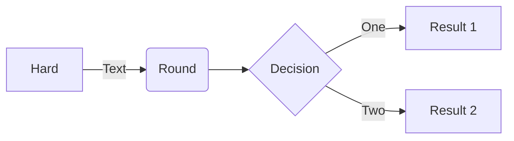

# Composants

Les composants que vous pouvez utiliser dans une documentation provenant de `codegouvfr/eleventy-dsfr`, ceux-ci sont documentés avec des exemples directement sur le site de démonstration https://codegouvfr.github.io/eleventy-dsfr/

Ces composants sont basés sur le Système de Design de l'Etat, veuillez vous-y référer en cas de doute sur l'utilisation d'un composant. Notamment dans quel contexte il peut ou ne peut pas être utilisé.

Enfin, n'hésitez pas à faire remonter des besoins via les issues : https://github.com/IGNF/cartes.gouv.fr-documentation/issues/new/choose

## Accordéon

Exemple : https://codegouvfr.github.io/eleventy-dsfr/fr/blog/accordeon/

Référence : https://www.systeme-de-design.gouv.fr/elements-d-interface/composants/accordeon/

## Alerte

Exemple : https://codegouvfr.github.io/eleventy-dsfr/fr/blog/alerte/

Référence : https://www.systeme-de-design.gouv.fr/elements-d-interface/composants/alerte

### Carte

Exemple : https://codegouvfr.github.io/eleventy-dsfr/fr/blog/carte/

Référence : https://www.systeme-de-design.gouv.fr/elements-d-interface/composants/carte

### Citation

Exemple : https://codegouvfr.github.io/eleventy-dsfr/fr/blog/citation/

Référence : https://www.systeme-de-design.gouv.fr/elements-d-interface/composants/citation

### Evènement

_Cette possibilité de eleventy-dsfr n'est pas utilisée._

### Fil d'ariane

Le composant fil d'ariane est utilisé sur la majorité des pages du site de documentation, il a été implémenté dans les gabarits.

Pour qu'il soit effectivement présent sur une page, il faut prêter attention au remplissage de la section `segments` du cartouche, qui doit contenir le noms (`title`) et liens ()`url`) des pages "parentes".

Exemple : https://codegouvfr.github.io/eleventy-dsfr/fr/blog/fil-d-ariane/

Référence : https://www.systeme-de-design.gouv.fr/elements-d-interface/composants/fil-d-ariane

### Mise en avant

Exemple : https://codegouvfr.github.io/eleventy-dsfr/fr/blog/mise-en-avant/

Référence : https://www.systeme-de-design.gouv.fr/elements-d-interface/composants/mise-en-avant

### Retour en haut de page

Exemple : https://codegouvfr.github.io/eleventy-dsfr/fr/blog/retour-en-haut-de-page/

### Schéma

Il est possible d'ajouter des illustrations raster (png, jpeg) ou vecteur (svg) ou d'utiliser la syntaxe `mermaid` pour insérer des schémas.

NB : Le cartouche du fichier doit contenir : `mermaid: true` pour que le js de mermaid qui effectue la transformation du schéma en SVG soit inclus avec la page.

````md

````

### Tableau

Exemple : https://codegouvfr.github.io/eleventy-dsfr/fr/blog/tableau/

Référence : https://www.systeme-de-design.gouv.fr/elements-d-interface/composants/tableau

### Tuile

Exemple : https://codegouvfr.github.io/eleventy-dsfr/fr/blog/tuile/

Référence : https://www.systeme-de-design.gouv.fr/elements-d-interface/composants/tuile
