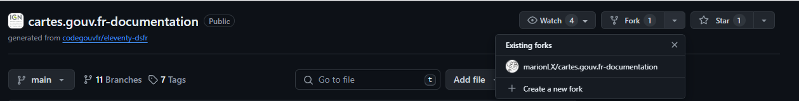

# Installation de l'environnement de travail

Cette documentation s'adresse aussi bien aux développeurs qu'aux rédacteurs qui souhaitent installer le site localement.

Pour les rédacteurs, cette documentation est technique mais vous permet de visualiser vos modifications et nouveaux articles dans un navigateur avant de les proposer en les poussant sur github.com.

## Prérequis

Pour disposer d'un environnement de travail confortable, il est recommandé de disposer des logiciels suivants :

- **Visual Studio Code** (https://code.visualstudio.com/download) comme éditeur pour tous les langages utilisés par le site, notamment le markdown (mais vous pouvez utiliser un autre éditeur si vous préférez)
- **NodeJS** (https://nodejs.org/en/download/prebuilt-installer) pour pouvoir construire le site localement sur votre poste de travail et le prévisualiser.
- **Git** (https://gitforwindows.org/, lien pour Windows) pour interagir avec le dépôt de code et github.com.

Git et NodeJS sont indispensables pour aller plus loin dans l'installation.

## Installation

Sous Windows, après avoir installé _Git for Windows_, vous devriez avoir accès au clic droit dans l'explorateur à un menu contextuel "Git Bash here" qui vous permet de lancer une invite de commande qui est très adaptée à l'utilisation de Git et offre une bonne coloration syntaxique. Il est recommandé de la préférer à l'invite de commande par défaut de Windows.


Les lignes de commandes qui suivent pourront être copiées, puis collées (`maj+Inser`) et executées (`Entrée`) dans l'invite de commande qui a été ouverte.

### Dupliquer le dépôt (fork)

Il faut dupliquer le projet sur votre espace GitHub afin de pouvoir faire les changements de votre côté, les prévisualiser, puis les soumettre au dépôt principal.

Dans le coin supérieur droit de la page, cliquez sur `Dupliquer` ou `Fork` puis `Create a new fork`.



Dans le champ `Description`, vous pouvez taper la description de votre duplication. Si vous le souhaitez, sélectionnez Copier la branche PAR DÉFAUT uniquement.

Cliquez sur `Créer une duplication`.

Votre clone du dépôt sera disponible sous l'URL https://github.com/{votre_pseudo_github}/cartes.gouv.fr-documentation. Vous bénéficiez alors d'un espace de travail qui vous est propre. Vous pourrez choisir de soumettre au dépôt principal seulement les éléments que vous choisissez.


Dans la suite `IGNF/cartes.gouv.fr-documentation` sera appelé le dépôt principal et `{nom_utilisateur_github}/cartes.gouv.fr-documentation` sera appelé "votre dépôt" ou "votre fork".

### Cloner le dépôt sur votre ordinateur

Page d'explications : https://docs.github.com/fr/pull-requests/collaborating-with-pull-requests/working-with-forks/fork-a-repo

Clonez le dépôt (ou votre fork du dépôt, ce qui est préférable) sur votre poste de travail dans un nouveau dossier nommé `cartes.gouv.fr-documentation` :

```bash
git clone https://github.com/{votre_pseudo_github}/cartes.gouv.fr-documentation
```

(en cas de problème, vérifiez votre configuration réseau. Si vous travaillez derrière un proxy, vérifiez par exemple vos variables d'environnement utilisateur HTTP_PROXY et HTTPS_PROXY. Demandez à votre DSI si vous ne les connaissez pas)

Déplacez vous dans le dossier que vous venez de créer :

```bash
cd cartes.gouv.fr-documentation
```

_Ce dossier est la "copie locale" de votre dépôt_

### Créer une branche

Il est chaudement recommandé d'effectuer des modifications sur une branche autre que la branche principale de votre dépôt (branche `main`). Ceci afin de vous permettre d'effectuer plusieurs modifications indépendantes en même temps et de faciliter la synchronisation de votre fork avec les dépôt principal.

Identifiez le périmètre des modifications que vous allez effectuer et donner un nom de branche parlant. Créer une branche nommée "nouvelle-branche" avec la commande :

```bash
git checkout -b "nouvelle-branche"
```

_N.B. : Cette commande est un raccourci qui vous place directement sur la branche nouvellement créée_

Le dossier de votre copie locale du dépôt correspond à la branche en question. Il n'y a pas de duplication du dossier lors d'une création de branche.

Dans la console _Git Bash_, le nom de la branche sur laquelle vous êtes apparait entre parenthèses après le chemin du dossier.

Quelques commandes utiles :

```sh
# Pour changer de branche
git checkout nom_de_la_branche

# Par exemple revenir à la branche principale
git checkout main

# Pour lister les branches existantes sur votre copie locale (la branche sur laquelle on est est en surbrillance)
git branch -l
```

### Installer les dépendances

```bash
npm install
```

Cette commande créé un sous-dossier `node_modules` dans lequel vont s'installer toutes les dépendances du projet, conformément à ce qui est décrit dans les fichiers `package.json` et `package-lock.json`.

### Exécuter Eleventy pour construire le site

```bash
npm run build
```

**Eleventy** est le logiciel utilisé pour construire le site. Il transforme les fichiers _markdown_ ou _nunjucks_ du dossier `content` en pages html à l'aide des gabarits du dossier `_includes`. Ensuite **Pagefind** indexe le contenu de ces pages pour que le moteur de recherche du site soit fonctionnel.

A l'issu de cette commande, le dossier `_site` est rempli ou modifié avec un contenu HTML, visualisable dans un navigateur.

_N.B. : Ces commandes sont exécutables quelle que soit la branche sur laquelle vous êtes situé._

### Déployer en local

```bash
npm start
```

Cette commande rend le site disponible à l'adresse `http://localhost:8080/fr/` et reste active, à l'écoute des changements que vous effectuez dans le projet.

**:sparkles: Vous avez maintenant réussi à déployer le site en local :sparkles:**

:warning: Il est normal que la page d'accueil soit une erreur 404. La page d'accueil réelle et correctement fléchée lors des déploiements en production est `/fr`.

Le site est ainsi maintenu à jour en même temps que vous modifiez des fichiers. Mais les contenus modifiés ne sont pas indexés pour la recherche et il peut arriver que certaines modifications ne soient pas immédiatement prises en compte. Dans ce cas, arrêtez le site (`Ctrl+C`) et relancez les 2 commandes précédentes : `npm run build` puis `npm start`.

Les développeurs peuvent exécuter un [mode de débogage](https://www.11ty.dev/docs/debugging/).

## Récupération des mises à jour

Si vous n'avez pas effectué de modification sur votre fork ou sa copie locale depuis un moment, le dépôt principal a peut-être changé. Dans ce cas il vous faut mettre à jour les 2.

### Mettre à jour votre fork

Rendez vous sur la page de votre fork. Github affiche au dessus de la liste des dossiers et fichiers l'état de synchronisation de votre fork.

Si votre fork a du retard sur le dépôt principal, vous pouvez cliquer sur le bouton **"Sync fork"** directement.

### Mettre à jour votre copie locale

Placez vous avec Git Bash dans le dossier de votre copie.

Placez vous sur la branche principale si vous n'y êtes pas déjà :

```sh
git checkout main
```

Récupérez les changements :

```sh
git pull
```

Si vous avez des modifications locale non enregistrées et que la commande `git pull` vous en informe, il faut mettre de côté les modifications locales avec la commande `git stash`, puis exécuter le `git pull` et enfin réappliquer les modifications locales avec `git stash apply`.

---

Votre dépôt local est installé et à jour, vous pouvez maintenant :

- [Rédiger du contenu](redacteur.md)
- [Soumettre vos modifications](commit.md)
