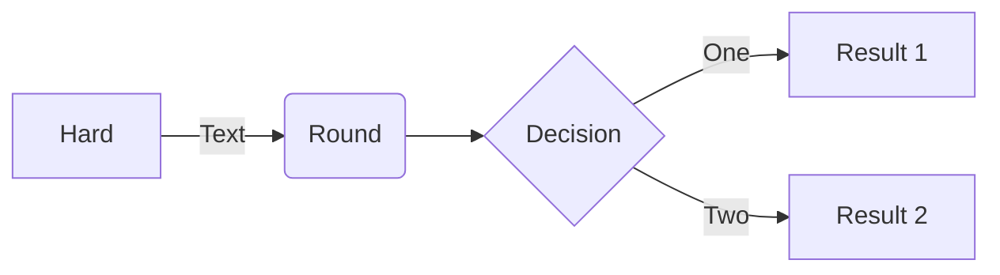

## Syntaxe Markdown pour Eleventy

Le contenu des pages du site est écrit dans les fichiers markdown à la suite du [cartouche](./cartouche.md).

L'essentiel du contenu est écrit en syntaxe markdown de base qui permet d'écrire :

- des paragraphes
- des titres et sous-titres (lignes commençant par 2 `##.` ou plus)
- du texte en gras `**texte**` ou en italique `*texte*`
- des listes
- des [liens hypertextes](#les-liens)
- des [images](#les-images)

Référence : https://codegouvfr.github.io/eleventy-dsfr/fr/blog/md-cheatsheet/

Bases d'écriture : https://commonmark.org/help/

Cette syntaxe markdown de base ne suffit pas pour écrire des contenus riches en profitant de toutes les possibilités offertes par le Système de design de l'État (DSFR). C'est pourquoi des [composants](#composants) supplémentaires ont été créés pour étendre les possibilités.

## Les liens

La syntaxe markdown de base est la suivante :

```md
[texte du lien](cible du lien)
```

La cible du lien peut être une URL absolue (commençant par `https://...`) ou relative (vers une autre page du site). Dans ce cas il très facile de faire une erreur de chemin et la prévisualisation du site permet de vérifier que le lien fonctionne.

## Les images

Les images sont à déposer dans un dossier de `public/img/` en utilisant une arborescence similaire à celle de `content`.

Par exemple si la page que vous écrivez est dans `content/fr/tutoriels/decouverte`, les images sont à placer dans `public/img/tutoriels/decouverte`.

Les images sont à nommer en minuscule (y compris l'extension), sans espaces (utilisez des tirets) ni caractères spéciaux et surtout avec un nom parlant.

Par exemple `creation-fiche.png` plutôt que `image-2.png`.

Les images doivent être adaptées à un usage écran. Au maximum, sur un gabarit qui n'a pas de menu latéral, elles peuvent occuper une largeur de **1200px**. Inutile de mettre des images plus grandes.

Enfin le DSFR conseille des images avec des ratios précis, avec une préférence pour le 16:9.

En 16:9 une image de 1200px de large fera 675px de hauteur par exemple.

Une fois l'image créée dans le dossier public, elle peut être insérée dans le contenu de cette façon :

```md

```

Le contenu devant être accessible, il est obligatoire de renseigner le texte alternatif de l'image.

## Détails typographiques

Quelques points d'attention pour améliorer la qualité des pages en général.

### Espaces insécables

On ne maitrise pas la résolution d'écran du visiteur final du site. La largeur de son écran (ou de la fenêtre de son navigateur) va générer des passages à la ligne que l'on ne peut pas maitriser totalement.

Pour éviter les sauts de ligne avant les caractères de ponctuation double : `:`, `!`, `;`, `?` ; il est sage de les précéder d'un espace insécable, et donc d'écrire : `fin de la question&nbsp;?` plutôt que `fin de la question ?`. Dans le navigateur, `&nbsp;` n'est pas visible et constitue un espace insécable, qui ne peut pas être remplacé par un passage à la ligne.

### Majuscules accentuées

Faire l'effort d'utiliser des majuscules accentuées même si le clavier azerty ne facilite pas la tâche. Par exemple pour écrire _État_ plutôt que _Etat_.

### Apostrophes

Utiliser de préférence une apostrophe `’` plutôt qu'une simple quote `'`. En tout cas éviter de mélanger les 2 sur une page.

### Guillemets

Utiliser des guillemets français `«` et `»`(alt+174 et alt+175) et comme ce sont des symboles de ponctuation doubles, ajoutez des espaces insécables pour garantir qu'aucun saut de ligne ne viendra couper juste après les guillemets ouvrants ou juste après le guillemets fermants. Exemple

```md
«&nbsp;le texte entre guillemets&nbsp;»
```

## Composants

Les composants que vous pouvez utiliser dans une documentation provenant de `codegouvfr/eleventy-dsfr`, ceux-ci sont documentés avec des exemples directement sur le site de démonstration https://codegouvfr.github.io/eleventy-dsfr/

Ces composants sont basés sur le Système de Design de l'État, veuillez vous-y référer en cas de doute sur l'utilisation d'un composant. Notamment dans quel contexte il peut ou ne peut pas être utilisé.

Enfin, n'hésitez pas à faire remonter des besoins via les issues : https://github.com/IGNF/cartes.gouv.fr-documentation/issues/new/choose

### Accordéon

Exemple : https://codegouvfr.github.io/eleventy-dsfr/fr/blog/accordeon/

Référence : https://www.systeme-de-design.gouv.fr/elements-d-interface/composants/accordeon/

### Alerte

Exemple : https://codegouvfr.github.io/eleventy-dsfr/fr/blog/alerte/

Référence : https://www.systeme-de-design.gouv.fr/elements-d-interface/composants/alerte

### Carte

Exemple : https://codegouvfr.github.io/eleventy-dsfr/fr/blog/carte/

Référence : https://www.systeme-de-design.gouv.fr/elements-d-interface/composants/carte

### Citation

Exemple : https://codegouvfr.github.io/eleventy-dsfr/fr/blog/citation/

Référence : https://www.systeme-de-design.gouv.fr/elements-d-interface/composants/citation

### Evènement

_Cette possibilité de eleventy-dsfr n'est pas utilisée._

### Mise en avant

Exemple : https://codegouvfr.github.io/eleventy-dsfr/fr/blog/mise-en-avant/

Référence : https://www.systeme-de-design.gouv.fr/elements-d-interface/composants/mise-en-avant

### Retour en haut de page

Exemple : https://codegouvfr.github.io/eleventy-dsfr/fr/blog/retour-en-haut-de-page/

### Schéma

Il est possible d'ajouter des illustrations raster (png, jpeg) ou vecteur (svg) ou d'utiliser la syntaxe `mermaid` pour insérer des schémas.

NB : Le cartouche du fichier doit contenir : `mermaid: true` pour que le js de mermaid qui effectue la transformation du schéma en SVG soit inclus avec la page.

````md

````

### Tableau

Exemple : https://codegouvfr.github.io/eleventy-dsfr/fr/blog/tableau/

Référence : https://www.systeme-de-design.gouv.fr/elements-d-interface/composants/tableau

### Tuile

Exemple : https://codegouvfr.github.io/eleventy-dsfr/fr/blog/tuile/

Référence : https://www.systeme-de-design.gouv.fr/elements-d-interface/composants/tuile

## Les balises HTML

Il est possible d'utiliser des balises HTML au milieu du contenu markdown.

Cela peut s'avérer nécessaire dans des cas très particuliers. Par exemple pour gérer finement les espacements entre les blocs de contenu.
