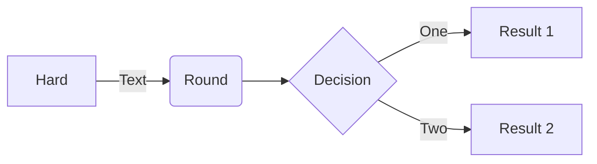

# Documentation rédacteur 

## Installer le projet et le déployer localement

Installer le projet localement pour prévisualiser les modifications que vous effectuez est recommandé.

Voir [la documentation d'installation](installation.md).

### Prévisualisation sur VS Code

A la suite de l'installation de VS Code, vous pouvez prévisualiser l'écriture de contenu de plusieurs facons. Néanmoins, cette prévisualisation n'englobera pas les composants DSFR. Il faudra déployer le site en local pour avoir une image complète de prévisualisation.

#### Dans la même fenêtre 

`crtl+k` puis `V` ou cliquer sur le bouton de prévisualisation


#### Dans un autre onglet de VS Code

`Ctrl + Shift + V`

](image-5.png)


## Soumettre une contribution

Pour soumettre une demande ou un problème concernant le site de la documentation : voir [CONTRIBUTING.md](../CONTRIBUTING.md).

## Structure

Tout le contenu du site se trouve dans le répertoire `content`. En tant que rédacteur, aucune modification n'est généralement nécessaire dans d'autres répertoires.

A date, le site de la documentation n'est pas traduit en anglais et seule  la partie en français `content/fr/` est enrichie. 

Le contenu de la barre de navigation principale n'est pas directement déterminée par l'arborescence des dossiers et fichiers mais par le contenu des cartouches de chaque fichier.
Il est toutefois conseillé d'avoir une arborescence qui correspond à cette navigation pour faciliter le repérage.

Documentation : https://codegouvfr.github.io/eleventy-dsfr/fr/blog/navigation/

## Syntaxe Markdown

Référence : https://codegouvfr.github.io/eleventy-dsfr/fr/blog/md-cheatsheet/

Bases d'écriture : https://commonmark.org/help/

## Composants

Les composants provenant de `codegouvfr/eleventy-dsfr` sont documentés avec des exemples directement sur le site de démonstration https://codegouvfr.github.io/eleventy-dsfr/

Les composants ajoutés pour les besoins de la documentation de cartes.gouv.fr sont expliqués plus en détail ci-dessous.

N'hésitez pas à faire remonter des besoins via les issues : https://github.com/IGNF/cartes.gouv.fr-documentation/issues/new/choose

### Accordéon

Exemple : https://codegouvfr.github.io/eleventy-dsfr/fr/blog/accordeon/

Référence : https://www.systeme-de-design.gouv.fr/elements-d-interface/composants/accordeon/

### Alerte

```md

{{ component("alert", {
    type: "info",
    title: "Titre de l'info",
    description: "<p>Le contenu de l'alerte</p>"
}) }}
```

Si le type est omis, l'alerte sera de type `info`.

Si le title est absent, il s'agira d'une alerte de petite taille, plus discrète.

Les alertes ne peuvent pas avoir de bouton de fermeture.

Référence : https://www.systeme-de-design.gouv.fr/elements-d-interface/composants/alerte

### Carte

Exemple : https://codegouvfr.github.io/eleventy-dsfr/fr/blog/carte/

Référence : https://www.systeme-de-design.gouv.fr/elements-d-interface/composants/carte

### Citation

Exemple : https://codegouvfr.github.io/eleventy-dsfr/fr/blog/citation/

Référence : https://www.systeme-de-design.gouv.fr/elements-d-interface/composants/citation

### Evènement

_Cette possibilité de eleventy-dsfr n'est pas utilisée._

### Fil d'ariane

Exemple : https://codegouvfr.github.io/eleventy-dsfr/fr/blog/fil-d-ariane/

Référence : https://www.systeme-de-design.gouv.fr/elements-d-interface/composants/fil-d-ariane

### Mise en avant

Exemple : https://codegouvfr.github.io/eleventy-dsfr/fr/blog/mise-en-avant/

Référence : https://www.systeme-de-design.gouv.fr/elements-d-interface/composants/mise-en-avant

### Onglets

_(à venir)_

Référence : https://www.systeme-de-design.gouv.fr/elements-d-interface/composants/onglet

### Retour en haut de page

Exemple : https://codegouvfr.github.io/eleventy-dsfr/fr/blog/retour-en-haut-de-page/

### Schéma

Il est possible d'ajouter des illustrations raster (png, jpeg) ou vecteur (svg) ou d'utiliser la syntaxe `mermaid` pour insérer des schémas.

NB : Le cartouche du fichier doit contenir : `mermaid: true` pour que le js de mermaid qui effectue la transformation du schéma en SVG soit inclus avec la page.

````md

````

### Tableau

Exemple : https://codegouvfr.github.io/eleventy-dsfr/fr/blog/tableau/

Référence : https://www.systeme-de-design.gouv.fr/elements-d-interface/composants/tableau

### Tuile

Exemple : https://codegouvfr.github.io/eleventy-dsfr/fr/blog/tuile/

Référence : https://www.systeme-de-design.gouv.fr/elements-d-interface/composants/tuile
