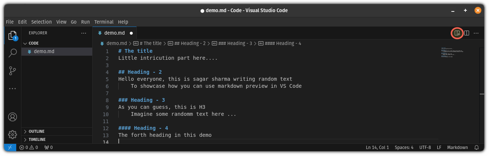
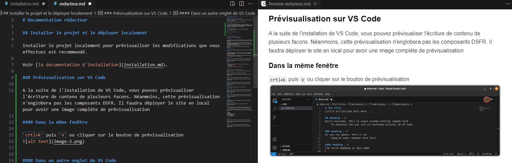

# Documentation rédacteur

## Installer le projet et le déployer localement

Installer le projet localement pour prévisualiser les modifications que vous effectuez est recommandé.

Voir [la documentation d'installation](installation.md).

### Prévisualisation sur VS Code

A la suite de l'installation de VS Code, vous pouvez prévisualiser l'écriture de contenu de plusieurs facons. Néanmoins, cette prévisualisation n'englobera pas les composants DSFR. Il faudra déployer le site en local pour avoir une image complète de prévisualisation.

#### Dans la même fenêtre

`crtl+k` puis `V` ou cliquer sur le bouton de prévisualisation

#### Dans un autre onglet de VS Code

`Ctrl + Shift + V`

](img/image-5.png)

## Soumettre une contribution

Pour soumettre une demande ou un problème concernant le site de la documentation : voir [CONTRIBUTING.md](../CONTRIBUTING.md).

## Structure

### Arborescence des dossiers

Tout le contenu du site se trouve dans le dossier `content`, sous forme de fichiers au format markdown (.md). Les fichiers de ce dossier sont ensuite transformés en pages HTML dans le dossier `_site` qui est absent du dépôt car généré seulement pour le déploiement.

Les fichiers qui ne nécessitent pas de transformation pour être affichés dans un navigateur web se trouvent dans le répertoire `public`. C'est ici notamment que se trouvent les images qui illustrent la documentation.

En tant que rédacteur, vous n'aurez généralement pas de modification à effectuer hors de ces 2 dossiers :

- `content` et même uniquement `content/fr/` pour le contenu en français
- `public`

Le contenu de la barre de navigation principale n'est pas directement déterminée par l'arborescence des dossiers et fichiers mais par le contenu des cartouches de chaque fichier.
Il est toutefois conseillé d'avoir une arborescence qui correspond à cette navigation pour faciliter le repérage.

Documentation : https://codegouvfr.github.io/eleventy-dsfr/fr/blog/navigation/

### Structure d'un fichier Markdown

Les fichiers markdown sont des fichiers au format texte, modifiables avec un logiciel éditeur de texte comme le _Bloc note_, _Notepad++_ ou _VS Code_ (conseillé).

Le texte est découpé en 2 parties :

- [Une _en-tête_ ou _cartouche_](markdown/cartouche.md) qui contient les métadonnées de la page du site correspondant à ce texte
- [Le corps du texte](markdown/syntaxe.md)

## Rédiger un tutoriel

### Création d'un tutoriel

Créer un fichier `index.md` dans un dossier propre au tutoriel dans le dossier `content/fr/tutoriels/`

### Respect du système de design de l'État

Se référer au système de design de l'État (DSFR) afin de le respecter. Notamment à propos des couleurs permises et des différents composants disponibles à utiliser.

Système de design de l'État : https://www.systeme-de-design.gouv.fr/

### Gestion des espacements

Veiller à espacer les différents composants afin d'avoir un rendu facilement lisible. Le DSFR est restrictif sur les espacements, il propose des classes pour les effectuer :

- `.fr-mt-1w` margin top de 1w
- `.fr-mb-1w` margin bottom de 1w
- `.fr-my-1w` margin top et bottom de 1w

### Gestion des images

Faire attention au formatage des images, une image `.PNG` ne sera pas reconnu contrairement à une image `.png`.

Stocker les images avec des noms explicites dans un dossier propre au tutoriel dans le dossier `public/img/tutoriels/`.

### Prettier

Désactiver Prettier car il peut causer des mauvaises modifications en Markdown.
